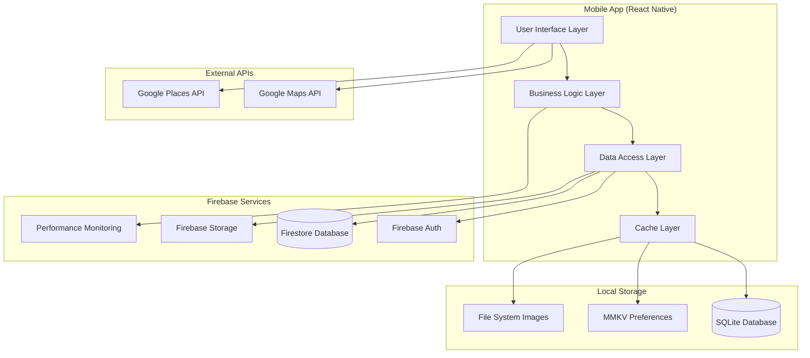
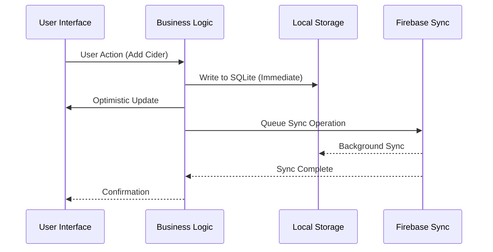

# Cider Dictionary: System Architecture Overview

## Executive Summary

The Cider Dictionary is a React Native mobile application designed as a personal cider collection and experience tracking tool. Built with an offline-first, Firebase-integrated architecture, it enables rapid cider logging (30-second target) while providing comprehensive analytics and collection insights. The system is optimized for single-user operation within Firebase free tier constraints.

## System Context

### Business Context
- **Primary User**: Individual cider enthusiasts tracking personal collections
- **Use Case**: Real-time cider logging in social settings (pubs, festivals, tastings)
- **Core Value**: Transform casual cider drinking into informed collection building
- **Scaling**: Personal-scale (up to 100 ciders, 500+ experiences per user)

### Technical Context
- **Platform**: Cross-platform mobile (iOS/Android) via React Native
- **Deployment**: Firebase-hosted backend with Expo managed workflow
- **Operating Model**: Offline-first with background synchronization
- **Cost Model**: Zero monthly operating costs (free tier only)

## High-Level System Architecture



## Core Architectural Principles

### 1. Offline-First Design
- **Local Database Primary**: SQLite serves as primary data store
- **Firebase Secondary**: Cloud storage for backup and multi-device sync
- **Optimistic Updates**: UI updates immediately, sync happens in background
- **Graceful Degradation**: Full functionality available offline

### 2. Progressive Disclosure Architecture
- **Layered Complexity**: UI adapts from quick entry (4 fields) to comprehensive (50+ fields)
- **Component Hierarchy**: Nested form components supporting multiple complexity levels
- **Data Structure**: Flexible schema accommodating optional detailed characteristics
- **User Experience**: 30-second quick entry expands to detailed analysis when desired

### 3. Performance-First Implementation
- **Sub-200ms Response**: All user interactions complete within performance target
- **60fps Animations**: Smooth transitions and feedback throughout application
- **Memory Efficiency**: Optimized data structures and component lifecycle management
- **Bundle Optimization**: Code splitting and lazy loading for faster startup

### 4. Cost-Conscious Design
- **Free Tier Compliance**: Architecture designed to stay within Firebase free limits
- **Usage Monitoring**: Built-in tracking to prevent unexpected charges
- **Efficient Queries**: Firestore read/write optimization patterns
- **Local-First Processing**: Minimize server-side computations

## Technology Stack

### Frontend Layer
```yaml
react_native:
  version: "0.72+"
  framework: "Expo SDK 49+"
  language: "TypeScript 5.0+"

navigation:
  library: "@react-navigation/native"
  pattern: "Stack + Bottom Tab"
  deep_linking: true

state_management:
  global_state: "zustand"
  server_state: "@tanstack/react-query"
  local_persistence: "zustand/middleware/persist"

ui_components:
  library: "react-native-elements"
  theming: "styled-components"
  forms: "react-hook-form + zod"
  animations: "react-native-reanimated"

data_visualization:
  charts: "victory-native"
  maps: "@react-native-google-maps/maps"
```

### Backend Services
```yaml
firebase:
  authentication: "Firebase Auth"
  database: "Firestore"
  storage: "Firebase Storage"
  monitoring: "Firebase Performance"

local_storage:
  database: "expo-sqlite"
  preferences: "react-native-mmkv"
  file_cache: "expo-file-system"

external_apis:
  maps: "Google Maps API"
  places: "Google Places API"
  geolocation: "expo-location"
```

### Development Tools
```yaml
development:
  ide: "VS Code + React Native Tools"
  debugging: "Flipper + React Native Debugger"
  testing: "Jest + React Native Testing Library"
  e2e: "Detox"

build_deployment:
  ci_cd: "GitHub Actions"
  app_distribution: "Expo Application Services"
  code_quality: "ESLint + Prettier + TypeScript"
```

## Component Architecture Overview

### Layer Architecture
```
┌─────────────────────────────────────────────────────────┐
│ Presentation Layer (React Native Components)           │
├─────────────────────────────────────────────────────────┤
│ Business Logic Layer (Custom Hooks + Services)         │
├─────────────────────────────────────────────────────────┤
│ Data Access Layer (Repository Pattern)                 │
├─────────────────────────────────────────────────────────┤
│ Local Storage Layer (SQLite + MMKV + FileSystem)       │
├─────────────────────────────────────────────────────────┤
│ Network Layer (Firebase + Google APIs)                 │
└─────────────────────────────────────────────────────────┘
```

### Primary Components
```yaml
screens:
  collection: "CiderCollectionScreen"
  entry: "QuickEntryScreen + DetailedEntryScreen"
  experience: "ExperienceLogScreen"
  analytics: "AnalyticsScreen"
  search: "SearchDiscoveryScreen"

shared_components:
  forms: "ProgressiveDisclosureForm"
  inputs: "ValidatedTextInput, MultiSelectChips"
  visualization: "AnalyticsChart, MapView"
  feedback: "LoadingState, ErrorBoundary"

business_logic:
  hooks: "useCiderCollection, useExperiences, useAnalytics"
  services: "SyncService, AnalyticsService, SearchService"
  utils: "ValidationUtils, CalculationUtils, FormattingUtils"
```

## Data Architecture

### Data Flow Pattern


### Storage Strategy
```yaml
local_primary:
  purpose: "Immediate access, offline capability"
  technology: "SQLite + MMKV"
  data: "All user data, preferences, images"

firebase_secondary:
  purpose: "Backup, multi-device sync"
  technology: "Firestore + Firebase Storage"
  data: "Synced user data, optimized for free tier"

caching_layer:
  purpose: "Performance optimization"
  technology: "React Query + Zustand"
  data: "Computed analytics, search indices, UI state"
```

## Performance Architecture

### Response Time Targets
```yaml
critical_paths:
  app_startup: "< 3 seconds (cold start)"
  quick_entry: "< 30 seconds (end-to-end)"
  search_results: "< 200ms (local SQLite)"
  analytics_load: "< 500ms (cached calculations)"
  sync_operation: "< 5 seconds (background)"

optimization_strategies:
  ui_responsiveness: "Optimistic updates, skeleton loading"
  data_access: "SQLite indexing, efficient queries"
  computation: "Memoized calculations, background processing"
  network: "Batched Firebase operations, retry logic"
```

### Memory Management
```yaml
strategies:
  component_lifecycle: "Proper cleanup, useEffect dependencies"
  image_handling: "Lazy loading, compression, caching"
  data_structures: "Normalized state, selective updates"
  background_processing: "Web Workers for heavy calculations"
```

## Security Architecture

### Authentication & Authorization
```yaml
authentication:
  provider: "Firebase Auth"
  methods: ["email/password", "Google OAuth"]
  session: "Persistent login with refresh tokens"

authorization:
  model: "Single-user ownership"
  firestore_rules: "User can only access own data"
  local_security: "No cross-user data leakage"
```

### Data Protection
```yaml
encryption:
  local_data: "SQLite encryption (if sensitive)"
  network: "HTTPS for all communications"
  firebase: "Built-in encryption at rest"

privacy:
  data_ownership: "User owns all personal data"
  export_capability: "JSON/CSV export available"
  deletion: "Complete data removal on account deletion"
```

## Scalability Considerations

### User Scale Limits
```yaml
collection_size:
  target: "100 ciders, 500+ experiences"
  performance: "Maintains < 200ms response times"
  storage: "< 100MB local database"

firebase_usage:
  reads: "< 1,000 per day per user"
  writes: "< 100 per day per user"
  storage: "< 50MB per user"
```

### Growth Accommodation
```yaml
horizontal_scaling:
  approach: "Firebase auto-scaling"
  limitations: "Free tier constraints"
  monitoring: "Usage alerts at 80% limits"

vertical_scaling:
  approach: "Optimized queries, efficient indexing"
  limitations: "Mobile device constraints"
  monitoring: "Performance metrics via Firebase"
```

## Integration Points

### External Service Integration
```yaml
google_maps:
  usage: "Venue location, collection visualization"
  optimization: "Cached results, minimal API calls"
  fallback: "Manual address entry if API unavailable"

firebase_services:
  authentication: "User identity management"
  firestore: "Data backup and sync"
  storage: "Image hosting and management"
  performance: "App performance monitoring"
```

### Third-Party Libraries
```yaml
critical_dependencies:
  navigation: "@react-navigation (stable, well-maintained)"
  state: "zustand (lightweight, TypeScript-first)"
  forms: "react-hook-form (performance optimized)"
  database: "expo-sqlite (Expo maintained)"

evaluation_criteria:
  bundle_size: "Minimal impact on app size"
  maintenance: "Active development, security updates"
  documentation: "Comprehensive, up-to-date docs"
  typescript: "Full TypeScript support"
```

## Deployment Architecture

### Development Workflow
```yaml
environments:
  development: "Expo Go app, Firebase dev project"
  staging: "TestFlight/Internal Testing, Firebase staging"
  production: "App Store/Play Store, Firebase production"

ci_cd_pipeline:
  code_quality: "ESLint, Prettier, TypeScript compilation"
  testing: "Unit tests, integration tests, E2E tests"
  build: "Expo build service, automated signing"
  deployment: "Automated to staging, manual to production"
```

### Monitoring & Observability
```yaml
performance_monitoring:
  tool: "Firebase Performance"
  metrics: "App startup, screen transitions, network requests"
  alerting: "Performance regression detection"

error_tracking:
  tool: "Firebase Crashlytics"
  coverage: "JavaScript errors, native crashes"
  reporting: "Real-time error alerts"

usage_analytics:
  tool: "Firebase Analytics"
  privacy: "No personally identifiable information"
  purpose: "Feature usage optimization"
```

## Quality Assurance

### Testing Strategy
```yaml
unit_testing:
  framework: "Jest + React Native Testing Library"
  coverage: "> 80% for business logic"
  focus: "Data transformations, calculations, utilities"

integration_testing:
  framework: "React Native Testing Library"
  coverage: "Component interactions, data flow"
  focus: "Form validation, state updates, API calls"

e2e_testing:
  framework: "Detox"
  coverage: "Critical user journeys"
  focus: "Quick entry, search, analytics generation"
```

### Performance Validation
```yaml
load_testing:
  approach: "Automated tests with large datasets"
  metrics: "Response times, memory usage, battery impact"
  criteria: "All operations < 200ms with 100 ciders"

usability_testing:
  approach: "Manual testing, user feedback"
  metrics: "30-second quick entry achievement"
  criteria: "Intuitive navigation, error recovery"
```

## Risk Assessment & Mitigation

### Technical Risks
```yaml
firebase_limitations:
  risk: "Free tier usage exceeded"
  mitigation: "Built-in monitoring, usage optimization"
  fallback: "Local-only mode with export capability"

offline_sync_conflicts:
  risk: "Data conflicts from concurrent edits"
  mitigation: "Last-write-wins with conflict detection"
  fallback: "Manual conflict resolution UI"

performance_degradation:
  risk: "Large datasets impact responsiveness"
  mitigation: "Virtualized lists, pagination, indexing"
  fallback: "Data archiving and pruning features"
```

### Operational Risks
```yaml
third_party_dependencies:
  risk: "Breaking changes in external libraries"
  mitigation: "Version pinning, gradual upgrades"
  fallback: "Vendor evaluation and migration plans"

app_store_policies:
  risk: "App rejection due to policy changes"
  mitigation: "Regular policy compliance review"
  fallback: "Alternative distribution channels"
```

## Success Metrics

### Performance Metrics
```yaml
response_times:
  target: "95% of interactions < 200ms"
  measurement: "Firebase Performance monitoring"

user_experience:
  target: "30-second quick entry achievement rate > 90%"
  measurement: "User testing and analytics"

reliability:
  target: "99.9% uptime for offline functionality"
  measurement: "Error tracking and user reports"
```

### Business Metrics
```yaml
user_engagement:
  target: "Regular usage (> 1 entry per week)"
  measurement: "Firebase Analytics"

data_quality:
  target: "< 5% duplicate entries"
  measurement: "Automated data analysis"

feature_adoption:
  target: "Progressive disclosure usage > 30%"
  measurement: "Feature usage analytics"
```

## Future Architecture Considerations

### Scalability Pathways
```yaml
paid_tier_migration:
  trigger: "Firebase free tier limits approached"
  changes: "Cost monitoring, usage optimization"
  timeline: "User-driven based on collection growth"

multi_device_support:
  trigger: "User requests for tablet/web access"
  changes: "Enhanced sync capabilities, responsive design"
  timeline: "Phase 2 development consideration"

social_features:
  trigger: "User requests for sharing/comparing"
  changes: "Privacy controls, selective sharing"
  timeline: "Phase 3 development consideration"
```

### Technology Evolution
```yaml
react_native_updates:
  approach: "Gradual version updates, testing compatibility"
  considerations: "Performance improvements, new capabilities"

firebase_alternatives:
  evaluation: "Supabase, AWS Amplify, self-hosted options"
  criteria: "Cost, performance, feature parity"

ai_integration:
  opportunities: "Cider recommendation, automatic categorization"
  constraints: "Privacy requirements, processing costs"
```

This system architecture overview provides the foundation for all subsequent architecture documents, establishing the core principles, technology choices, and structural patterns that guide the detailed implementation guidance in the remaining architecture documentation.