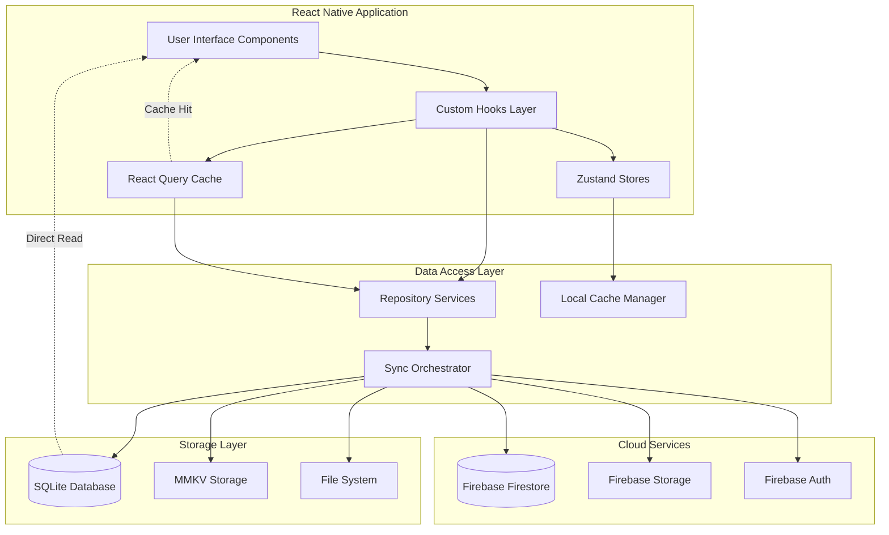

# Cider Dictionary: Data Flow Architecture

## Executive Summary

This document defines the comprehensive data flow architecture for the Cider Dictionary application, implementing an offline-first pattern with Zustand for global state management and React Query for server state caching. The architecture ensures sub-200ms response times while maintaining data consistency across local SQLite storage and Firebase cloud synchronization.

## Data Flow Principles

### 1. Offline-First Data Flow
- **Local Primary**: SQLite database serves as the primary data source
- **Optimistic Updates**: UI updates immediately from local data
- **Background Sync**: Firebase synchronization happens asynchronously
- **Conflict Resolution**: Last-write-wins with user notification for conflicts

### 2. State Management Strategy
- **Zustand**: Global application state (UI state, user preferences, app state)
- **React Query**: Server state with intelligent caching (Firebase data)
- **SQLite**: Persistent offline storage with immediate read/write
- **MMKV**: High-performance key-value storage for preferences

### 3. Performance-Driven Architecture
- **Selective Subscriptions**: Components only subscribe to needed state slices
- **Memoized Computations**: Heavy calculations cached with automatic invalidation
- **Virtual Scrolling**: Large lists rendered efficiently
- **Progressive Loading**: Data loaded incrementally based on user needs

## Data Flow Architecture Overview



## State Management Architecture

### Zustand Store Design

#### 1. User State Store
```typescript
interface UserStore {
  // Authentication State
  user: User | null;
  isAuthenticated: boolean;
  authLoading: boolean;

  // User Preferences
  preferences: UserPreferences;

  // App State
  isOnline: boolean;
  lastSyncTime: Date | null;
  syncInProgress: boolean;

  // Actions
  setUser: (user: User | null) => void;
  updatePreferences: (preferences: Partial<UserPreferences>) => void;
  setOnlineStatus: (isOnline: boolean) => void;
  setSyncStatus: (inProgress: boolean, lastSync?: Date) => void;
}

// Implementation Pattern
const useUserStore = create<UserStore>()(
  devtools(
    persist(
      (set, get) => ({
        // Initial State
        user: null,
        isAuthenticated: false,
        authLoading: false,
        preferences: getDefaultPreferences(),
        isOnline: true,
        lastSyncTime: null,
        syncInProgress: false,

        // Actions with Optimistic Updates
        setUser: (user) => {
          set({ user, isAuthenticated: !!user, authLoading: false });
          if (user) {
            // Trigger preference sync
            syncPreferences(user.id, get().preferences);
          }
        },

        updatePreferences: (newPreferences) => {
          const updated = { ...get().preferences, ...newPreferences };
          set({ preferences: updated });

          // Immediate local persistence
          saveToMMKV('user_preferences', updated);

          // Background Firebase sync
          if (get().isOnline && get().user) {
            queueSync('preferences', updated);
          }
        },
      }),
      {
        name: 'user-store',
        storage: createJSONStorage(() => MMKV),
        partialize: (state) => ({
          preferences: state.preferences,
          lastSyncTime: state.lastSyncTime,
        }),
      }
    )
  )
);
```

#### 2. Collection State Store
```typescript
interface CollectionStore {
  // Collection State
  selectedCider: CiderMasterRecord | null;
  filterState: FilterState;
  sortState: SortState;
  searchQuery: string;

  // UI State
  currentScreen: string;
  bottomSheetVisible: boolean;
  selectedExperience: Experience | null;

  // Quick Entry State
  quickEntryDefaults: QuickEntryDefaults;
  lastUsedVenue: Venue | null;

  // Actions
  setSelectedCider: (cider: CiderMasterRecord | null) => void;
  updateFilter: (filter: Partial<FilterState>) => void;
  updateSort: (sort: SortState) => void;
  setSearchQuery: (query: string) => void;
  setQuickEntryDefaults: (defaults: Partial<QuickEntryDefaults>) => void;
}

// Advanced State Update Pattern
const useCollectionStore = create<CollectionStore>()((set, get) => ({
  selectedCider: null,
  filterState: getDefaultFilters(),
  sortState: { field: 'createdAt', direction: 'desc' },
  searchQuery: '',
  currentScreen: 'collection',
  bottomSheetVisible: false,
  selectedExperience: null,
  quickEntryDefaults: getDefaultQuickEntry(),
  lastUsedVenue: null,

  setSelectedCider: (cider) => {
    set({ selectedCider: cider });

    // Analytics tracking
    if (cider) {
      trackEvent('cider_selected', {
        ciderId: cider.id,
        ciderName: cider.name,
        source: get().currentScreen,
      });
    }
  },

  updateFilter: (filter) => {
    const newFilter = { ...get().filterState, ...filter };
    set({ filterState: newFilter });

    // Clear search when filters change
    if (get().searchQuery) {
      set({ searchQuery: '' });
    }

    // Persist filter preferences
    saveToMMKV('collection_filters', newFilter);
  },
}));
```

### React Query Integration

#### 1. Cider Collection Queries
```typescript
// Custom hook for cider collection with offline support
export const useCiderCollection = () => {
  const { user } = useUserStore();
  const { filterState, sortState, searchQuery } = useCollectionStore();

  return useQuery({
    queryKey: ['ciders', user?.id, filterState, sortState, searchQuery],
    queryFn: async () => {
      // Always query from local SQLite first
      const localCiders = await ciderRepository.getAll({
        userId: user!.id,
        filters: filterState,
        sort: sortState,
        search: searchQuery,
      });

      // Return immediately for offline-first UX
      return localCiders;
    },
    enabled: !!user,
    staleTime: 1000 * 60 * 5, // 5 minutes
    gcTime: 1000 * 60 * 30, // 30 minutes
    refetchOnWindowFocus: false,
    // Background refetch from Firebase
    refetchInterval: () => {
      const isOnline = useUserStore.getState().isOnline;
      return isOnline ? 1000 * 60 * 10 : false; // 10 minutes if online
    },
  });
};

// Optimistic mutation for adding ciders
export const useAddCider = () => {
  const queryClient = useQueryClient();
  const { user } = useUserStore();

  return useMutation({
    mutationFn: async (newCider: CreateCiderRequest) => {
      // Immediate local save
      const savedCider = await ciderRepository.create({
        ...newCider,
        userId: user!.id,
        id: generateUUID(),
        createdAt: new Date(),
        updatedAt: new Date(),
      });

      // Queue for Firebase sync
      syncQueue.enqueue({
        type: 'CREATE_CIDER',
        data: savedCider,
        userId: user!.id,
      });

      return savedCider;
    },
    onMutate: async (newCider) => {
      // Cancel outgoing refetches
      await queryClient.cancelQueries({
        queryKey: ['ciders', user!.id],
      });

      // Snapshot previous value
      const previousCiders = queryClient.getQueryData(['ciders', user!.id]);

      // Optimistically update cache
      queryClient.setQueryData(
        ['ciders', user!.id],
        (old: CiderMasterRecord[] = []) => [
          ...old,
          {
            ...newCider,
            id: generateUUID(),
            userId: user!.id,
            createdAt: new Date(),
            updatedAt: new Date(),
          },
        ]
      );

      return { previousCiders };
    },
    onError: (err, newCider, context) => {
      // Rollback on error
      queryClient.setQueryData(
        ['ciders', user!.id],
        context?.previousCiders
      );
    },
    onSuccess: (savedCider) => {
      // Invalidate and refetch
      queryClient.invalidateQueries({
        queryKey: ['ciders', user!.id],
      });

      // Update analytics
      queryClient.invalidateQueries({
        queryKey: ['analytics', user!.id],
      });
    },
  });
};
```

#### 2. Experience Logging Queries
```typescript
export const useExperiences = (ciderId?: string) => {
  const { user } = useUserStore();

  return useQuery({
    queryKey: ['experiences', user?.id, ciderId],
    queryFn: async () => {
      return await experienceRepository.getAll({
        userId: user!.id,
        ciderId,
      });
    },
    enabled: !!user,
    staleTime: 1000 * 60 * 2, // 2 minutes
  });
};

export const useAddExperience = () => {
  const queryClient = useQueryClient();
  const { user } = useUserStore();

  return useMutation({
    mutationFn: async (newExperience: CreateExperienceRequest) => {
      // Enhanced experience with auto-calculated fields
      const experience = {
        ...newExperience,
        id: generateUUID(),
        userId: user!.id,
        pricePerMl: calculatePricePerMl(
          newExperience.price,
          newExperience.containerSize
        ),
        timestamp: new Date(),
      };

      // Immediate local save
      await experienceRepository.create(experience);

      // Update cider's timesTried counter
      await ciderRepository.incrementTimesTried(newExperience.ciderId);

      // Queue for sync
      syncQueue.enqueue({
        type: 'CREATE_EXPERIENCE',
        data: experience,
        userId: user!.id,
      });

      return experience;
    },
    onSuccess: (savedExperience) => {
      // Invalidate related queries
      queryClient.invalidateQueries({
        queryKey: ['experiences', user!.id],
      });
      queryClient.invalidateQueries({
        queryKey: ['ciders', user!.id],
      });
      queryClient.invalidateQueries({
        queryKey: ['analytics', user!.id],
      });
      queryClient.invalidateQueries({
        queryKey: ['venues', user!.id],
      });
    },
  });
};
```

## Data Synchronization Patterns

### 1. Sync Queue Architecture
```typescript
interface SyncOperation {
  id: string;
  type: 'CREATE_CIDER' | 'UPDATE_CIDER' | 'DELETE_CIDER' |
        'CREATE_EXPERIENCE' | 'UPDATE_EXPERIENCE' | 'DELETE_EXPERIENCE';
  data: any;
  userId: string;
  timestamp: Date;
  retryCount: number;
  maxRetries: number;
}

class SyncQueue {
  private queue: SyncOperation[] = [];
  private isProcessing = false;
  private retryDelay = 1000; // Start with 1 second

  async enqueue(operation: Omit<SyncOperation, 'id' | 'retryCount'>) {
    const syncOp: SyncOperation = {
      ...operation,
      id: generateUUID(),
      retryCount: 0,
      maxRetries: 3,
    };

    // Save to local queue persistence
    await this.saveQueueToDB();
    this.queue.push(syncOp);

    // Process immediately if online
    if (networkMonitor.isOnline() && !this.isProcessing) {
      this.processQueue();
    }
  }

  async processQueue() {
    if (this.isProcessing || this.queue.length === 0) return;

    this.isProcessing = true;
    useUserStore.getState().setSyncStatus(true);

    while (this.queue.length > 0 && networkMonitor.isOnline()) {
      const operation = this.queue[0];

      try {
        await this.executeSyncOperation(operation);
        this.queue.shift(); // Remove successful operation
        this.retryDelay = 1000; // Reset delay on success
      } catch (error) {
        operation.retryCount++;

        if (operation.retryCount >= operation.maxRetries) {
          // Move to failed operations log
          await this.logFailedOperation(operation);
          this.queue.shift();
        } else {
          // Exponential backoff
          await this.delay(this.retryDelay * Math.pow(2, operation.retryCount));
        }
      }
    }

    this.isProcessing = false;
    useUserStore.getState().setSyncStatus(false, new Date());
    await this.saveQueueToDB();
  }

  private async executeSyncOperation(operation: SyncOperation) {
    switch (operation.type) {
      case 'CREATE_CIDER':
        await firebaseService.createCider(operation.data);
        break;
      case 'UPDATE_CIDER':
        await firebaseService.updateCider(operation.data.id, operation.data);
        break;
      case 'CREATE_EXPERIENCE':
        await firebaseService.createExperience(operation.data);
        break;
      // Additional cases...
    }
  }
}
```

### 2. Conflict Resolution Strategy
```typescript
interface ConflictResolution {
  strategy: 'last_write_wins' | 'user_choice' | 'merge';
  field?: string;
  localValue: any;
  remoteValue: any;
  timestamp: Date;
}

class ConflictResolver {
  async resolveConflicts(
    localData: any,
    remoteData: any,
    entityType: string
  ): Promise<any> {
    const conflicts: ConflictResolution[] = [];

    // Compare timestamp for simple last-write-wins
    if (localData.updatedAt > remoteData.updatedAt) {
      return localData; // Local is newer
    }

    if (remoteData.updatedAt > localData.updatedAt) {
      // Remote is newer, but check for concurrent edits
      if (this.hasConcurrentEdits(localData, remoteData)) {
        return await this.handleConcurrentEdit(localData, remoteData);
      }
      return remoteData;
    }

    // Same timestamp - merge strategy
    return this.mergeData(localData, remoteData);
  }

  private hasConcurrentEdits(local: any, remote: any): boolean {
    const timeDiff = Math.abs(
      local.updatedAt.getTime() - remote.updatedAt.getTime()
    );
    return timeDiff < 5000; // 5 seconds threshold
  }

  private async handleConcurrentEdit(local: any, remote: any) {
    // For cider data, prefer local user input over remote
    const merged = {
      ...remote,
      ...local,
      updatedAt: new Date(),
      conflictResolved: true,
      conflictDetails: {
        localTimestamp: local.updatedAt,
        remoteTimestamp: remote.updatedAt,
        resolvedAt: new Date(),
      },
    };

    // Notify user of conflict resolution
    showNotification({
      type: 'info',
      title: 'Data Sync Conflict Resolved',
      message: `Your local changes for "${local.name}" were preserved.`,
    });

    return merged;
  }
}
```

## Analytics Data Flow

### 1. Real-time Analytics Computation
```typescript
// Analytics hook with memoized calculations
export const useCollectionAnalytics = () => {
  const { data: ciders = [] } = useCiderCollection();
  const { data: experiences = [] } = useExperiences();

  return useQuery({
    queryKey: ['analytics', 'collection', ciders, experiences],
    queryFn: () => calculateCollectionAnalytics(ciders, experiences),
    enabled: ciders.length > 0,
    staleTime: 1000 * 60 * 10, // 10 minutes
    select: (data) => {
      // Memoize expensive calculations
      return {
        ...data,
        chartData: generateChartData(data),
        completenessScore: calculateCompleteness(data),
        recommendations: generateRecommendations(data),
      };
    },
  });
};

// Background analytics computation
const calculateCollectionAnalytics = async (
  ciders: CiderMasterRecord[],
  experiences: Experience[]
) => {
  const analytics = {
    // Basic stats
    totalCiders: ciders.length,
    totalExperiences: experiences.length,
    averageRating: calculateAverageRating(ciders),

    // Category distributions
    styleDistribution: calculateStyleDistribution(ciders),
    abvDistribution: calculateABVDistribution(ciders),
    sweetnessDistribution: calculateSweetnessDistribution(ciders),

    // Spending analysis
    totalSpent: calculateTotalSpent(experiences),
    averagePricePerMl: calculateAveragePricePerMl(experiences),
    mostExpensive: findMostExpensive(experiences),
    bestValue: findBestValue(experiences),

    // Venue analysis
    venueStats: calculateVenueStats(experiences),
    topVenues: findTopVenues(experiences),

    // Time-based analysis
    monthlyTrends: calculateMonthlyTrends(experiences),
    weeklyPatterns: calculateWeeklyPatterns(experiences),

    // Collection completeness
    completeness: calculateCollectionCompleteness(ciders),
    missingCategories: findMissingCategories(ciders),

    // Performance metrics
    calculationTime: Date.now(),
  };

  // Cache computed results locally
  await analyticsRepository.saveComputedAnalytics(analytics);

  return analytics;
};
```

### 2. Venue Analytics Data Flow
```typescript
export const useVenueAnalytics = () => {
  const { data: experiences = [] } = useExperiences();

  return useQuery({
    queryKey: ['analytics', 'venues', experiences],
    queryFn: async () => {
      // Group experiences by venue
      const venueMap = new Map<string, Experience[]>();
      experiences.forEach(exp => {
        const key = `${exp.venue.name}-${exp.venue.address}`;
        if (!venueMap.has(key)) {
          venueMap.set(key, []);
        }
        venueMap.get(key)!.push(exp);
      });

      // Calculate venue statistics
      const venueAnalytics = Array.from(venueMap.entries()).map(([venueKey, venueExps]) => {
        const venue = venueExps[0].venue;
        return {
          venue,
          totalVisits: venueExps.length,
          totalSpent: venueExps.reduce((sum, exp) => sum + exp.price, 0),
          averagePrice: venueExps.reduce((sum, exp) => sum + exp.price, 0) / venueExps.length,
          averagePricePerMl: venueExps.reduce((sum, exp) => sum + exp.pricePerMl, 0) / venueExps.length,
          firstVisit: new Date(Math.min(...venueExps.map(exp => exp.timestamp.getTime()))),
          lastVisit: new Date(Math.max(...venueExps.map(exp => exp.timestamp.getTime()))),
          uniqueCiders: new Set(venueExps.map(exp => exp.ciderId)).size,
          averageRating: venueExps.reduce((sum, exp) => sum + (exp.ciderRating || 0), 0) / venueExps.length,
        };
      });

      return {
        venues: venueAnalytics.sort((a, b) => b.totalVisits - a.totalVisits),
        totalVenues: venueAnalytics.length,
        mostVisited: venueAnalytics[0],
        mostExpensive: venueAnalytics.sort((a, b) => b.averagePricePerMl - a.averagePricePerMl)[0],
        bestValue: venueAnalytics.sort((a, b) => a.averagePricePerMl - b.averagePricePerMl)[0],
      };
    },
    staleTime: 1000 * 60 * 5, // 5 minutes
  });
};
```

## Search and Discovery Data Flow

### 1. Instant Search Implementation
```typescript
export const useInstantSearch = () => {
  const [query, setQuery] = useState('');
  const [debouncedQuery] = useDebounce(query, 150);
  const { data: ciders = [] } = useCiderCollection();

  const searchResults = useMemo(() => {
    if (!debouncedQuery || debouncedQuery.length < 2) {
      return ciders;
    }

    // Create search index on first search
    const searchIndex = createSearchIndex(ciders);

    // Execute fuzzy search
    return executeSearch(searchIndex, debouncedQuery);
  }, [debouncedQuery, ciders]);

  return {
    query,
    setQuery,
    results: searchResults,
    isSearching: query !== debouncedQuery,
    hasResults: searchResults.length > 0,
  };
};

// Search index creation with performance optimization
const createSearchIndex = (ciders: CiderMasterRecord[]) => {
  return ciders.map(cider => ({
    id: cider.id,
    searchableText: `${cider.name} ${cider.brand} ${cider.tasteTags?.join(' ') || ''}`.toLowerCase(),
    cider,
  }));
};

// Fuzzy search implementation
const executeSearch = (index: any[], query: string) => {
  const normalizedQuery = query.toLowerCase();
  const results = [];

  for (const item of index) {
    const score = calculateSearchScore(item.searchableText, normalizedQuery);
    if (score > 0.3) { // Minimum relevance threshold
      results.push({
        ...item.cider,
        searchScore: score,
      });
    }
  }

  return results.sort((a, b) => b.searchScore - a.searchScore);
};
```

## Performance Optimization Patterns

### 1. Component State Synchronization
```typescript
// Selective state subscription pattern
export const useCiderCard = (ciderId: string) => {
  // Only subscribe to specific cider data
  const cider = useCollectionStore(
    useCallback(
      (state) => state.ciders?.find(c => c.id === ciderId),
      [ciderId]
    )
  );

  // Subscribe to related experiences with React Query
  const { data: experiences } = useQuery({
    queryKey: ['experiences', ciderId],
    queryFn: () => experienceRepository.getByCiderId(ciderId),
    staleTime: 1000 * 60 * 5,
  });

  // Memoized derived state
  const derivedData = useMemo(() => ({
    lastTasted: experiences?.[0]?.timestamp,
    averagePrice: experiences?.reduce((sum, exp) => sum + exp.price, 0) / (experiences?.length || 1),
    favoriteVenue: findMostFrequentVenue(experiences),
  }), [experiences]);

  return { cider, experiences, ...derivedData };
};
```

### 2. Data Prefetching Strategy
```typescript
// Prefetch related data based on user behavior
export const usePrefetchStrategy = () => {
  const { data: ciders } = useCiderCollection();
  const queryClient = useQueryClient();

  useEffect(() => {
    if (ciders?.length > 0) {
      // Prefetch analytics for collection
      queryClient.prefetchQuery({
        queryKey: ['analytics', 'collection'],
        queryFn: () => calculateCollectionAnalytics(ciders, []),
        staleTime: 1000 * 60 * 10,
      });

      // Prefetch experiences for recently viewed ciders
      const recentCiders = ciders
        .sort((a, b) => b.updatedAt.getTime() - a.updatedAt.getTime())
        .slice(0, 5);

      recentCiders.forEach(cider => {
        queryClient.prefetchQuery({
          queryKey: ['experiences', cider.id],
          queryFn: () => experienceRepository.getByCiderId(cider.id),
          staleTime: 1000 * 60 * 5,
        });
      });
    }
  }, [ciders, queryClient]);
};
```

## Error Handling and Recovery

### 1. Data Integrity Patterns
```typescript
// Data validation middleware
const validateDataIntegrity = async (data: any, entityType: string) => {
  const schema = getValidationSchema(entityType);
  const result = schema.safeParse(data);

  if (!result.success) {
    throw new DataIntegrityError(
      `Invalid ${entityType} data`,
      result.error.issues
    );
  }

  return result.data;
};

// Automatic data recovery
const recoverFromDataCorruption = async (entityType: string) => {
  try {
    // Attempt to restore from last known good backup
    const backup = await getLastValidBackup(entityType);
    if (backup) {
      await restoreFromBackup(backup);
      return true;
    }

    // If no backup, reinitialize with empty state
    await initializeEmptyState(entityType);
    return false;
  } catch (error) {
    // Log error and continue with degraded functionality
    logError('Data recovery failed', error);
    return false;
  }
};
```

### 2. Graceful Degradation
```typescript
// Progressive data loading with fallbacks
export const useRobustDataLoader = <T>(
  queryKey: QueryKey,
  queryFn: () => Promise<T>,
  fallbackData?: T
) => {
  const query = useQuery({
    queryKey,
    queryFn,
    retry: 3,
    retryDelay: (attempt) => Math.min(1000 * 2 ** attempt, 30000),
    onError: (error) => {
      // Log error but don't crash the app
      logError('Query failed', error);

      // Show user-friendly error message
      showErrorNotification('Unable to load data. Using cached version.');
    },
  });

  // Return fallback data if query fails
  return {
    ...query,
    data: query.data ?? fallbackData,
    isError: query.isError && !fallbackData,
  };
};
```

This data flow architecture provides a robust foundation for the Cider Dictionary application, ensuring optimal performance, data consistency, and user experience across all application features while maintaining the offline-first principles that are critical to the application's success.