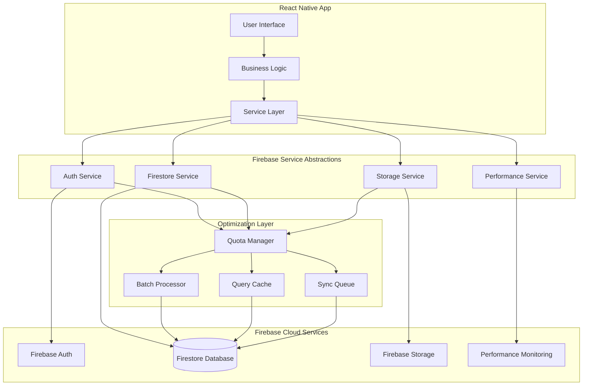

# Cider Dictionary: Firebase Integration Architecture

## Executive Summary

The Firebase Integration Architecture defines a comprehensive service abstraction layer that optimizes Firebase usage for the Cider Dictionary application while maintaining strict free tier compliance. This architecture implements cost monitoring, intelligent batching, query optimization, and graceful degradation patterns to ensure zero monthly operating costs while providing robust cloud capabilities.

## Firebase Services Overview

### Core Firebase Services Integration


## Free Tier Compliance Architecture

### Quota Management System
```typescript
interface FirebaseQuotaManager {
  // Daily usage tracking
  dailyReads: number;
  dailyWrites: number;
  storageUsed: number; // bytes
  bandwidthUsed: number; // bytes

  // Limits configuration
  quotaLimits: QuotaLimits;
  conservationMode: boolean;
  batchQueue: BatchOperation[];

  // Methods
  checkQuotaStatus(): QuotaStatus;
  enterConservationMode(): void;
  canExecuteOperation(operation: FirebaseOperation): boolean;
  scheduleBatchOperation(operation: BatchOperation): void;
}

interface QuotaLimits {
  maxDailyReads: 50000;      // Firestore free tier
  maxDailyWrites: 20000;     // Firestore free tier
  maxStorageGB: 1.0;         // Firestore free tier
  maxBandwidthGB: 10.0;      // Firebase hosting free tier
  warningThreshold: 0.8;     // Trigger conservation at 80%
  criticalThreshold: 0.95;   // Emergency mode at 95%
}

// Implementation
class FirebaseQuotaManagerImpl implements FirebaseQuotaManager {
  private dailyCounters = {
    reads: 0,
    writes: 0,
    storageBytes: 0,
    bandwidthBytes: 0,
    lastReset: new Date(),
  };

  private quotaLimits: QuotaLimits = {
    maxDailyReads: 50000,
    maxDailyWrites: 20000,
    maxStorageGB: 1.0,
    maxBandwidthGB: 10.0,
    warningThreshold: 0.8,
    criticalThreshold: 0.95,
  };

  async checkQuotaStatus(): Promise<QuotaStatus> {
    // Reset counters if new day
    if (this.isNewDay()) {
      await this.resetDailyCounters();
    }

    // Load current usage from Firebase
    const currentUsage = await this.getCurrentUsage();
    this.updateCounters(currentUsage);

    // Calculate usage percentages
    const readUsage = this.dailyCounters.reads / this.quotaLimits.maxDailyReads;
    const writeUsage = this.dailyCounters.writes / this.quotaLimits.maxDailyWrites;

    // Determine quota status
    const maxUsage = Math.max(readUsage, writeUsage);

    if (maxUsage >= this.quotaLimits.criticalThreshold) {
      return QuotaStatus.CRITICAL;
    } else if (maxUsage >= this.quotaLimits.warningThreshold) {
      return QuotaStatus.WARNING;
    } else {
      return QuotaStatus.NORMAL;
    }
  }

  async enterConservationMode(): Promise<void> {
    this.conservationMode = true;

    // Reduce background sync frequency
    this.adjustSyncIntervals(ConservationLevel.HIGH);

    // Increase cache retention times
    this.extendCacheLifetime(86400000); // 24 hours

    // Batch operations more aggressively
    this.increaseBatchSizes();

    // Disable non-essential features
    this.disableAnalyticsSync();
    this.disablePreemptiveLoading();

    // Notify user
    await this.notifyUserOfConservationMode();

    // Log for monitoring
    logger.info('Entered Firebase conservation mode', {
      readsUsed: this.dailyCounters.reads,
      writesUsed: this.dailyCounters.writes,
      timestamp: new Date(),
    });
  }
}
```

### Batch Operation Optimization
```typescript
interface BatchOperation {
  id: string;
  operations: FirebaseOperation[];
  priority: number; // 1-10, 10 is highest
  estimatedCost: QuotaCost;
  batchType: 'READ' | 'WRITE' | 'MIXED';
  scheduledTime: Date;
  maxBatchSize: number;
  retryCount: number;
}

class BatchProcessor {
  private batchQueue: BatchOperation[] = [];
  private processingActive = false;

  async addToBatch(operations: FirebaseOperation[], priority = 5): Promise<string> {
    // Optimize operations for batching
    const optimizedOps = this.optimizeOperations(operations);

    // Create batch operation
    const batch: BatchOperation = {
      id: generateUUID(),
      operations: optimizedOps,
      priority,
      estimatedCost: this.calculateCost(optimizedOps),
      batchType: this.determineBatchType(optimizedOps),
      scheduledTime: new Date(),
      maxBatchSize: 500, // Firestore limit
      retryCount: 0,
    };

    // Add to priority queue
    this.batchQueue.push(batch);
    this.batchQueue.sort((a, b) => b.priority - a.priority);

    // Start processing if not active
    if (!this.processingActive) {
      this.processBatchQueue();
    }

    return batch.id;
  }

  private async processBatchQueue(): Promise<void> {
    this.processingActive = true;

    while (this.batchQueue.length > 0) {
      const quotaStatus = await quotaManager.checkQuotaStatus();

      // Skip non-critical operations in conservation mode
      if (quotaStatus === QuotaStatus.CRITICAL) {
        this.batchQueue = this.batchQueue.filter(batch => batch.priority >= 8);
      } else if (quotaStatus === QuotaStatus.WARNING) {
        this.batchQueue = this.batchQueue.filter(batch => batch.priority >= 6);
      }

      const batch = this.batchQueue.shift();
      if (!batch) break;

      // Check if we can execute this batch
      if (await quotaManager.canExecuteOperation(batch)) {
        try {
          await this.executeBatch(batch);
        } catch (error) {
          await this.handleBatchError(batch, error);
        }
      } else {
        // Reschedule for later
        batch.scheduledTime = new Date(Date.now() + 300000); // 5 minutes
        this.batchQueue.push(batch);
        break; // Stop processing to avoid quota exceeded
      }

      // Delay between batches to respect rate limits
      await this.delay(1000);
    }

    this.processingActive = false;
  }

  private optimizeOperations(operations: FirebaseOperation[]): FirebaseOperation[] {
    // Group by collection for efficient batching
    const collectionGroups = new Map<string, FirebaseOperation[]>();

    operations.forEach(op => {
      const key = op.collection;
      if (!collectionGroups.has(key)) {
        collectionGroups.set(key, []);
      }
      collectionGroups.get(key)!.push(op);
    });

    const optimized: FirebaseOperation[] = [];

    // Optimize each collection group
    collectionGroups.forEach((ops, collection) => {
      // Convert individual reads to multi-get where possible
      const reads = ops.filter(op => op.type === 'READ');
      const writes = ops.filter(op => op.type === 'WRITE');

      if (reads.length > 1) {
        // Combine reads into multi-get operations
        const multiGetOps = this.createMultiGetOperations(collection, reads);
        optimized.push(...multiGetOps);
      } else {
        optimized.push(...reads);
      }

      // Write operations can be batched together
      if (writes.length > 0) {
        optimized.push(...this.optimizeWriteOperations(writes));
      }
    });

    return optimized;
  }
}
```

## Service Abstraction Layer

### Firebase Authentication Service
```typescript
interface AuthService {
  // Authentication methods
  signInWithEmail(email: string, password: string): Promise<User>;
  signInWithGoogle(): Promise<User>;
  signOut(): Promise<void>;

  // User state management
  getCurrentUser(): User | null;
  onAuthStateChanged(callback: (user: User | null) => void): Unsubscribe;

  // Token management
  getIdToken(forceRefresh?: boolean): Promise<string>;
  refreshToken(): Promise<void>;
}

class FirebaseAuthService implements AuthService {
  private auth: FirebaseAuth;
  private quotaManager: FirebaseQuotaManager;

  constructor() {
    this.auth = getAuth();
    this.quotaManager = FirebaseQuotaManager.getInstance();
  }

  async signInWithEmail(email: string, password: string): Promise<User> {
    // Check quota before authentication
    if (!await this.quotaManager.canExecuteOperation({ type: 'AUTH', cost: 1 })) {
      throw new QuotaExceededError('Authentication quota exceeded');
    }

    try {
      const credential = await signInWithEmailAndPassword(this.auth, email, password);

      // Track quota usage
      await this.quotaManager.trackOperation({ type: 'AUTH', cost: 1 });

      // Convert Firebase user to app user
      const user = this.convertFirebaseUser(credential.user);

      // Initialize user preferences
      await this.initializeUserPreferences(user);

      return user;
    } catch (error) {
      // Handle authentication errors gracefully
      throw this.handleAuthError(error);
    }
  }

  async signInWithGoogle(): Promise<User> {
    // Implement Google OAuth with quota tracking
    const provider = new GoogleAuthProvider();

    try {
      const result = await signInWithPopup(this.auth, provider);
      await this.quotaManager.trackOperation({ type: 'AUTH', cost: 1 });

      return this.convertFirebaseUser(result.user);
    } catch (error) {
      throw this.handleAuthError(error);
    }
  }

  onAuthStateChanged(callback: (user: User | null) => void): Unsubscribe {
    return onAuthStateChanged(this.auth, (firebaseUser) => {
      const user = firebaseUser ? this.convertFirebaseUser(firebaseUser) : null;
      callback(user);
    });
  }

  private async initializeUserPreferences(user: User): Promise<void> {
    // Load preferences from Firestore if available
    try {
      const prefsDoc = await this.getDocument(`users/${user.id}/preferences/default`);
      if (prefsDoc.exists()) {
        const preferences = prefsDoc.data() as UserPreferences;
        useUserStore.getState().updatePreferences(preferences);
      }
    } catch (error) {
      // Use default preferences if Firestore fails
      logger.warn('Failed to load user preferences, using defaults', error);
    }
  }
}
```

### Firestore Database Service
```typescript
interface FirestoreService {
  // Document operations
  getDocument(path: string): Promise<DocumentSnapshot>;
  setDocument(path: string, data: any): Promise<void>;
  updateDocument(path: string, data: any): Promise<void>;
  deleteDocument(path: string): Promise<void>;

  // Collection operations
  getCollection(path: string, constraints?: QueryConstraint[]): Promise<QuerySnapshot>;
  addToCollection(path: string, data: any): Promise<string>;

  // Batch operations
  createBatch(): WriteBatch;
  commitBatch(batch: WriteBatch): Promise<void>;

  // Real-time subscriptions
  subscribeToDocument(path: string, callback: (doc: DocumentSnapshot) => void): Unsubscribe;
  subscribeToCollection(path: string, callback: (snapshot: QuerySnapshot) => void): Unsubscribe;
}

class OptimizedFirestoreService implements FirestoreService {
  private firestore: Firestore;
  private queryCache: LRUCache<string, any>;
  private batchProcessor: BatchProcessor;
  private quotaManager: FirebaseQuotaManager;

  constructor() {
    this.firestore = getFirestore();
    this.queryCache = new LRUCache({ max: 1000, ttl: 300000 }); // 5 minute TTL
    this.batchProcessor = new BatchProcessor();
    this.quotaManager = FirebaseQuotaManager.getInstance();

    // Enable offline persistence
    enableNetwork(this.firestore);
  }

  async getDocument(path: string): Promise<DocumentSnapshot> {
    // Check cache first
    const cacheKey = `doc:${path}`;
    const cached = this.queryCache.get(cacheKey);
    if (cached && !this.isStale(cached)) {
      return cached;
    }

    // Check quota
    if (!await this.quotaManager.canExecuteOperation({ type: 'READ', cost: 1 })) {
      // Return cached data if available, even if stale
      if (cached) {
        logger.warn('Returning stale cached data due to quota limits', { path });
        return cached;
      }
      throw new QuotaExceededError('Read quota exceeded');
    }

    try {
      const docRef = doc(this.firestore, path);
      const snapshot = await getDoc(docRef);

      // Cache the result
      this.queryCache.set(cacheKey, snapshot);

      // Track quota usage
      await this.quotaManager.trackOperation({ type: 'READ', cost: 1 });

      return snapshot;
    } catch (error) {
      // Return cached data on error if available
      if (cached) {
        logger.warn('Returning cached data due to Firestore error', { path, error });
        return cached;
      }
      throw error;
    }
  }

  async setDocument(path: string, data: any): Promise<void> {
    // Validate data before sending
    const validatedData = this.validateAndSanitizeData(data);

    // Add to batch processor for optimization
    await this.batchProcessor.addToBatch([
      {
        type: 'SET',
        path,
        data: validatedData,
        collection: this.extractCollection(path),
      }
    ], 7); // High priority for user-initiated writes
  }

  async getCollection(
    path: string,
    constraints: QueryConstraint[] = []
  ): Promise<QuerySnapshot> {
    // Create cache key from path and constraints
    const cacheKey = `collection:${path}:${this.hashConstraints(constraints)}`;
    const cached = this.queryCache.get(cacheKey);

    if (cached && !this.isStale(cached)) {
      return cached;
    }

    // Estimate query cost
    const estimatedCost = this.estimateQueryCost(constraints);

    if (!await this.quotaManager.canExecuteOperation({ type: 'READ', cost: estimatedCost })) {
      if (cached) {
        return cached;
      }
      throw new QuotaExceededError('Read quota exceeded for query');
    }

    try {
      const collectionRef = collection(this.firestore, path);
      const q = constraints.reduce((query, constraint) => constraint(query), collectionRef);

      const snapshot = await getDocs(q);

      // Cache the result
      this.queryCache.set(cacheKey, snapshot);

      // Track actual cost (number of documents read)
      const actualCost = snapshot.docs.length;
      await this.quotaManager.trackOperation({ type: 'READ', cost: actualCost });

      return snapshot;
    } catch (error) {
      if (cached) {
        return cached;
      }
      throw error;
    }
  }

  private validateAndSanitizeData(data: any): any {
    // Remove undefined values (Firestore doesn't allow them)
    const sanitized = JSON.parse(JSON.stringify(data, (key, value) => {
      return value === undefined ? null : value;
    }));

    // Validate data size (Firestore has 1MB limit per document)
    const dataSize = JSON.stringify(sanitized).length;
    if (dataSize > 1000000) { // 1MB in bytes (approximately)
      throw new Error(`Document too large: ${dataSize} bytes`);
    }

    return sanitized;
  }

  private estimateQueryCost(constraints: QueryConstraint[]): number {
    // Base cost of 1 for the query
    let cost = 1;

    // Add estimated cost based on query type
    for (const constraint of constraints) {
      // This is a simplified estimation
      if (constraint.type === 'limit') {
        cost += constraint.limit;
      } else if (constraint.type === 'orderBy') {
        cost += 5; // Index scan cost
      } else if (constraint.type === 'where') {
        cost += 10; // Filter operation cost
      }
    }

    return Math.min(cost, 100); // Cap at reasonable maximum
  }
}
```

### Firebase Storage Service
```typescript
interface StorageService {
  uploadImage(file: File | Blob, path: string): Promise<string>;
  downloadImage(path: string): Promise<string>;
  deleteImage(path: string): Promise<void>;
  getImageMetadata(path: string): Promise<StorageMetadata>;
}

class OptimizedStorageService implements StorageService {
  private storage: FirebaseStorage;
  private quotaManager: FirebaseQuotaManager;
  private compressionService: ImageCompressionService;

  constructor() {
    this.storage = getStorage();
    this.quotaManager = FirebaseQuotaManager.getInstance();
    this.compressionService = new ImageCompressionService();
  }

  async uploadImage(file: File | Blob, path: string): Promise<string> {
    // Check storage quota
    const fileSize = file.size;
    if (!await this.quotaManager.canExecuteStorageOperation(fileSize)) {
      throw new QuotaExceededError('Storage quota exceeded');
    }

    try {
      // Compress image to optimize storage usage
      const compressedFile = await this.compressionService.compress(file, {
        maxSizeMB: 0.5, // 500KB max
        maxWidthOrHeight: 1920,
        useWebWorker: true,
        fileType: 'image/jpeg',
        quality: 0.8,
      });

      // Upload to Firebase Storage
      const storageRef = ref(this.storage, path);
      const uploadTask = uploadBytes(storageRef, compressedFile);

      // Track bandwidth usage
      await this.quotaManager.trackBandwidthUsage(compressedFile.size);

      // Get download URL
      const downloadURL = await getDownloadURL(storageRef);

      // Cache the URL locally
      await this.cacheImageURL(path, downloadURL);

      return downloadURL;
    } catch (error) {
      logger.error('Image upload failed', { path, error });
      throw error;
    }
  }

  async downloadImage(path: string): Promise<string> {
    // Check local cache first
    const cachedURL = await this.getCachedImageURL(path);
    if (cachedURL) {
      return cachedURL;
    }

    // Check bandwidth quota
    if (!await this.quotaManager.canExecuteDownloadOperation()) {
      throw new QuotaExceededError('Bandwidth quota exceeded');
    }

    try {
      const storageRef = ref(this.storage, path);
      const downloadURL = await getDownloadURL(storageRef);

      // Cache for future use
      await this.cacheImageURL(path, downloadURL);

      return downloadURL;
    } catch (error) {
      logger.error('Image download failed', { path, error });
      throw error;
    }
  }

  private async cacheImageURL(path: string, url: string): Promise<void> {
    // Cache URLs locally to reduce Firebase Storage calls
    const cacheKey = `storage_url:${path}`;
    await MMKV.setItem(cacheKey, JSON.stringify({
      url,
      cached_at: Date.now(),
      ttl: 3600000, // 1 hour
    }));
  }

  private async getCachedImageURL(path: string): Promise<string | null> {
    const cacheKey = `storage_url:${path}`;
    const cached = await MMKV.getItem(cacheKey);

    if (cached) {
      const { url, cached_at, ttl } = JSON.parse(cached);
      if (Date.now() - cached_at < ttl) {
        return url;
      }
    }

    return null;
  }
}
```

## Query Optimization Patterns

### Index Strategy
```typescript
// Firestore index configuration for optimal performance
const FIRESTORE_INDEXES = {
  // Cider collection queries
  ciders: {
    // User's cider collection with common filters
    userIdCreatedAt: ['userId', 'createdAt'],
    userIdOverallRating: ['userId', 'overallRating'],
    userIdAbv: ['userId', 'abv'],

    // Search and filtering
    userIdNameBrand: ['userId', 'name', 'brand'],
    userIdTraditionalStyle: ['userId', 'traditionalStyle'],
    userIdSweetnessLevel: ['userId', 'sweetnessLevel'],

    // Analytics queries
    userIdCreatedAtOverallRating: ['userId', 'createdAt', 'overallRating'],
  },

  // Experience collection queries
  experiences: {
    // User's experiences with common sorts
    userIdTimestamp: ['userId', 'timestamp'],
    userIdCiderId: ['userId', 'ciderId'],
    userIdVenueId: ['userId', 'venueId'],

    // Analytics queries
    userIdTimestampPrice: ['userId', 'timestamp', 'price'],
    userIdVenueIdTimestamp: ['userId', 'venueId', 'timestamp'],
  }
};

// Query optimization helper
class QueryOptimizer {
  optimizeQuery(
    collection: string,
    constraints: QueryConstraint[]
  ): QueryConstraint[] {
    // Reorder constraints for optimal index usage
    const optimized = [...constraints];

    // Sort equality filters first, then range filters, then orderBy
    optimized.sort((a, b) => {
      const priority = { where: 1, orderBy: 2, limit: 3 };
      return priority[a.type] - priority[b.type];
    });

    return optimized;
  }

  createOptimalQuery(
    collectionPath: string,
    filters: Record<string, any>,
    sort?: { field: string; direction: 'asc' | 'desc' },
    limit?: number
  ): Query {
    const collectionRef = collection(firestore, collectionPath);
    let query: Query = collectionRef;

    // Add where clauses
    Object.entries(filters).forEach(([field, value]) => {
      if (value !== undefined && value !== null) {
        query = where(query, field, '==', value);
      }
    });

    // Add sorting
    if (sort) {
      query = orderBy(query, sort.field, sort.direction);
    }

    // Add limit
    if (limit) {
      query = limit(query, limit);
    }

    return query;
  }
}
```

## Error Handling and Resilience

### Circuit Breaker Pattern
```typescript
class FirebaseCircuitBreaker {
  private failures = 0;
  private lastFailTime = 0;
  private state: 'CLOSED' | 'OPEN' | 'HALF_OPEN' = 'CLOSED';

  private readonly failureThreshold = 5;
  private readonly recoveryTimeout = 60000; // 1 minute

  async execute<T>(operation: () => Promise<T>): Promise<T> {
    if (this.state === 'OPEN') {
      if (Date.now() - this.lastFailTime > this.recoveryTimeout) {
        this.state = 'HALF_OPEN';
      } else {
        throw new CircuitBreakerOpenError('Firebase circuit breaker is open');
      }
    }

    try {
      const result = await operation();
      this.onSuccess();
      return result;
    } catch (error) {
      this.onFailure();
      throw error;
    }
  }

  private onSuccess(): void {
    this.failures = 0;
    this.state = 'CLOSED';
  }

  private onFailure(): void {
    this.failures++;
    this.lastFailTime = Date.now();

    if (this.failures >= this.failureThreshold) {
      this.state = 'OPEN';
    }
  }
}
```

### Offline Fallback Strategy
```typescript
class OfflineFallbackManager {
  async executeWithFallback<T>(
    operation: () => Promise<T>,
    fallback: () => Promise<T>
  ): Promise<T> {
    try {
      // Check if online and quota available
      if (networkMonitor.isOnline() && await quotaManager.canExecuteOperation()) {
        return await operation();
      } else {
        return await fallback();
      }
    } catch (error) {
      // Firebase operation failed, use fallback
      logger.warn('Firebase operation failed, using fallback', error);
      return await fallback();
    }
  }
}
```

This Firebase Integration Architecture provides a robust, cost-conscious foundation for cloud services while maintaining optimal performance and reliability. The architecture ensures that the application stays within Firebase free tier limits while providing comprehensive functionality through intelligent optimization and graceful degradation patterns.