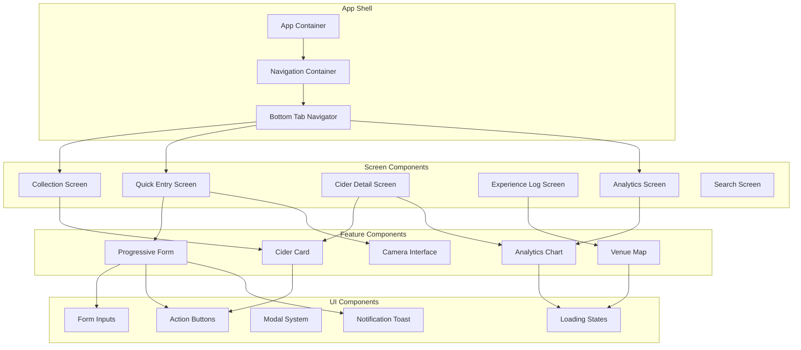

# Cider Dictionary: Component Architecture

## Executive Summary

The Component Architecture defines a comprehensive React Native component hierarchy designed for optimal performance, reusability, and maintainability. Built around the progressive disclosure pattern and 30-second quick entry requirement, this architecture provides a scalable foundation for delivering sub-200ms response times while maintaining 60fps animations throughout the user experience.

## Component Architecture Principles

### 1. Progressive Disclosure Pattern
- **Layered Complexity**: Components support three levels of detail (casual → enthusiast → expert)
- **Contextual Expansion**: Forms and displays adapt based on user expertise and preferences
- **Performance Optimization**: Only render complexity when needed
- **Graceful Degradation**: Simpler versions available for performance-constrained scenarios
- **Specification Compliance**: Implements casual/enthusiast/expert taxonomy from requirements

### 2. Performance-First Design
- **Memoization Strategy**: React.memo, useMemo, and useCallback used strategically
- **Virtual Scrolling**: Large lists rendered efficiently with FlashList
- **Lazy Loading**: Components loaded on-demand to reduce initial bundle size
- **Optimistic Updates**: UI updates immediately, sync happens in background

### 3. Accessibility and Usability
- **Pub Environment Optimization**: Large touch targets, high contrast, readable fonts
- **One-handed Operation**: Key actions accessible with thumb navigation
- **Haptic Feedback**: Tactile confirmation for all user actions
- **Voice Over Support**: Complete screen reader compatibility

## Component Hierarchy Overview



## Screen Components

### 1. Collection Screen Architecture
```typescript
interface CollectionScreenProps {
  navigation: NavigationProp;
  route: RouteProp;
}

interface CollectionScreenState {
  viewMode: 'grid' | 'list' | 'map';
  filterState: FilterState;
  sortState: SortState;
  searchQuery: string;
  selectedCiders: string[];
}

// High-performance collection screen with virtual scrolling
const CollectionScreen: React.FC<CollectionScreenProps> = () => {
  // State management with selective subscriptions
  const { data: ciders, isLoading } = useCiderCollection();
  const { viewMode, filterState, sortState } = useCollectionStore(
    useCallback(
      (state) => ({
        viewMode: state.viewMode,
        filterState: state.filterState,
        sortState: state.sortState,
      }),
      []
    )
  );

  // Memoized data processing
  const processedCiders = useMemo(() => {
    return applySortAndFilter(ciders, sortState, filterState);
  }, [ciders, sortState, filterState]);

  // Virtualized list rendering for performance
  const renderCiderItem = useCallback(
    ({ item, index }: { item: CiderMasterRecord; index: number }) => (
      <CiderCard
        key={item.id}
        cider={item}
        viewMode={viewMode}
        onPress={() => navigateToCiderDetail(item.id)}
        onLongPress={() => showCiderContextMenu(item)}
        index={index}
      />
    ),
    [viewMode]
  );

  // Gesture handling for bulk actions
  const { gestureHandler, selectedCount } = useBulkSelection(processedCiders);

  return (
    <SafeAreaView style={styles.container}>
      <CollectionHeader
        ciderCount={processedCiders.length}
        selectedCount={selectedCount}
        onFilterPress={() => showFilterModal()}
        onSortPress={() => showSortModal()}
        onViewModeChange={setViewMode}
      />

      <SearchBar
        placeholder="Search your collection..."
        onSearchTextChange={setSearchQuery}
        showFilters={true}
      />

      <FlashList
        data={processedCiders}
        renderItem={renderCiderItem}
        estimatedItemSize={viewMode === 'grid' ? 200 : 120}
        numColumns={viewMode === 'grid' ? 2 : 1}
        keyExtractor={(item) => item.id}
        onEndReached={loadMoreCiders}
        onEndReachedThreshold={0.8}
        ListEmptyComponent={<EmptyCollectionState />}
        {...gestureHandler}
      />

      <QuickActionButton
        onPress={() => navigateToQuickEntry()}
        icon="plus"
        position="bottom-right"
      />
    </SafeAreaView>
  );
};

// Sub-components for better organization
const CollectionHeader: React.FC<CollectionHeaderProps> = React.memo(({
  ciderCount,
  selectedCount,
  onFilterPress,
  onSortPress,
  onViewModeChange,
}) => {
  return (
    <View style={styles.header}>
      <View style={styles.headerLeft}>
        <Text style={styles.collectionCount}>
          {selectedCount > 0 ? `${selectedCount} selected` : `${ciderCount} ciders`}
        </Text>
      </View>

      <View style={styles.headerRight}>
        <IconButton
          icon="filter"
          onPress={onFilterPress}
          accessibilityLabel="Filter collection"
        />
        <IconButton
          icon="sort"
          onPress={onSortPress}
          accessibilityLabel="Sort collection"
        />
        <ViewModeToggle onModeChange={onViewModeChange} />
      </View>
    </View>
  );
});
```

### Progressive Disclosure Type Definitions
```typescript
// SPECIFICATION COMPLIANCE: 3-level progressive disclosure system
type EntryStep = 'casual' | 'enthusiast' | 'expert';

interface DisclosureConfig {
  level: EntryStep;
  requiredFields: string[];
  optionalFields: string[];
  maxFields: number;
  targetTime: number; // seconds
}

// Progressive disclosure configurations
const DISCLOSURE_CONFIGS: Record<EntryStep, DisclosureConfig> = {
  casual: {
    level: 'casual',
    requiredFields: ['name', 'brand', 'abv', 'overallRating'],
    optionalFields: ['photo'],
    maxFields: 5,
    targetTime: 30 // 30-second quick entry target
  },
  enthusiast: {
    level: 'enthusiast',
    requiredFields: ['name', 'brand', 'abv', 'overallRating'],
    optionalFields: [
      'photo', 'notes', 'tasteTags', 'containerType',
      'traditionalStyle', 'sweetnessLevel', 'carbonation'
    ],
    maxFields: 11,
    targetTime: 120 // 2-minute target for enthusiast entry
  },
  expert: {
    level: 'expert',
    requiredFields: ['name', 'brand', 'abv', 'overallRating'],
    optionalFields: [
      // All available fields for comprehensive classification
      'photo', 'notes', 'tasteTags', 'containerType', 'traditionalStyle',
      'appleCategories', 'appleVarieties', 'sweetnessLevel', 'carbonation',
      'clarity', 'color', 'fermentationType', 'specialProcesses',
      'fruitAdditions', 'hops', 'spicesBotanicals', 'woodAging',
      'producerSize', 'qualityCertifications', 'appearance', 'aroma', 'taste', 'mouthfeel'
    ],
    maxFields: 50,
    targetTime: 300 // 5-minute target for expert entry
  }
};

interface EntryStepManager {
  currentStep: EntryStep;
  userExpertiseScore: number;
  determineOptimalStep(context: EntryContext): EntryStep;
  getFieldsForStep(step: EntryStep): DisclosureConfig;
  canAdvanceToStep(step: EntryStep): boolean;
}

// Progressive disclosure implementation
class ProgressiveDisclosureManager implements EntryStepManager {
  currentStep: EntryStep = 'casual';
  userExpertiseScore: number = 0;

  constructor(private user: User) {
    this.userExpertiseScore = this.calculateExpertiseScore(user);
    this.currentStep = this.determineOptimalStep({ isFirstUse: user.totalCiders === 0 });
  }

  determineOptimalStep(context: EntryContext): EntryStep {
    // SPECIFICATION COMPLIANCE: 3-level expertise scoring
    if (this.userExpertiseScore < 30 || context.isFirstUse || context.quickEntryRequested) {
      return 'casual';     // Quick entry: 4 required fields only
    } else if (this.userExpertiseScore < 75 || context.timeConstrained) {
      return 'enthusiast'; // Basic classification
    } else {
      return 'expert';     // Full Long Ashton classification
    }
  }

  getFieldsForStep(step: EntryStep): DisclosureConfig {
    return DISCLOSURE_CONFIGS[step];
  }

  canAdvanceToStep(step: EntryStep): boolean {
    const requiredScores: Record<EntryStep, number> = {
      'casual': 0,
      'enthusiast': 30,
      'expert': 75
    };

    return this.userExpertiseScore >= requiredScores[step];
  }

  private calculateExpertiseScore(user: User): number {
    // SPECIFICATION COMPLIANCE: Expertise scoring algorithm
    let score = 0;

    // Collection size factor (0-30 points)
    const ciderCount = user.totalCiders || 0;
    score += Math.min(30, ciderCount * 0.5);

    // Detail completion rate (0-25 points)
    const detailRate = user.averageDetailCompletion || 0;
    score += detailRate * 25;

    // Experience logging frequency (0-20 points)
    const experienceRate = user.experienceLogFrequency || 0;
    score += experienceRate * 20;

    // Advanced feature usage (0-15 points)
    const advancedUsage = user.advancedFeatureUsage || 0;
    score += advancedUsage * 15;

    // Account tenure bonus (0-10 points)
    const tenureMonths = user.accountAgeMonths || 0;
    const tenureBonus = Math.min(10, tenureMonths * 0.5);
    score += tenureBonus;

    return Math.min(100, Math.max(0, score));
  }
}

interface EntryContext {
  isFirstUse?: boolean;
  quickEntryRequested?: boolean;
  timeConstrained?: boolean;
  targetTime?: number;
  currentLocation?: string;
  venueType?: string;
}
```

### 2. Quick Entry Screen Architecture
```typescript
// Progressive disclosure form with 30-second optimization
const QuickEntryScreen: React.FC = () => {
  const { addCider } = useAddCider();
  const [formState, setFormState] = useQuickEntryForm();
  const [currentStep, setCurrentStep] = useState<EntryStep>('casual');

  // Performance timer for 30-second target
  const { startTimer, recordCompletion } = usePerformanceTimer('quick_entry');

  useEffect(() => {
    startTimer();
    return () => recordCompletion(formState.isValid);
  }, []);

  // Animated form progression
  const animatedProgress = useSharedValue(0);
  const progressStyle = useAnimatedStyle(() => ({
    width: `${animatedProgress.value * 100}%`,
  }));

  const handleFieldChange = useCallback(
    (field: keyof QuickEntryForm, value: any) => {
      setFormState(prev => ({
        ...prev,
        [field]: value,
        isDirty: true,
        lastModified: Date.now(),
      }));

      // Update progress animation
      const completedFields = countCompletedFields(formState);
      animatedProgress.value = withTiming(completedFields / 4, {
        duration: 200,
        easing: Easing.out(Easing.quad),
      });

      // Auto-validate for immediate feedback
      requestAnimationFrame(() => {
        validateField(field, value);
      });
    },
    [formState]
  );

  // Quick submission with optimistic updates
  const handleQuickSubmit = useCallback(async () => {
    if (!formState.isValid) return;

    try {
      // Optimistic UI update
      const newCider = createOptimisticCider(formState);

      // Immediate feedback
      triggerHapticFeedback('success');
      showSuccessToast('Cider added to collection!');

      // Background save
      await addCider(formState);

      // Navigate back or to detail
      navigation.navigate('Collection');
    } catch (error) {
      handleSubmissionError(error);
    }
  }, [formState, addCider]);

  return (
    <KeyboardAvoidingView style={styles.container}>
      <ProgressHeader
        title="Add Cider"
        progress={progressStyle}
        onBackPress={() => handleFormExit()}
      />

      <ScrollView contentContainerStyle={styles.formContainer}>
        {/* Core Fields - Always Visible */}
        <FormSection title="Essential Details" expanded={true}>
          <ValidatedInput
            label="Cider Name"
            value={formState.name}
            onChangeText={(text) => handleFieldChange('name', text)}
            placeholder="What's the cider called?"
            autoFocus={true}
            required={true}
            onSubmitEditing={() => focusNextField('brand')}
          />

          <ValidatedInput
            label="Brand"
            value={formState.brand}
            onChangeText={(text) => handleFieldChange('brand', text)}
            placeholder="Who makes it?"
            required={true}
            onSubmitEditing={() => focusNextField('abv')}
          />

          <ABVInput
            label="ABV %"
            value={formState.abv}
            onValueChange={(abv) => handleFieldChange('abv', abv)}
            required={true}
          />

          <RatingInput
            label="Overall Rating"
            value={formState.overallRating}
            onRatingChange={(rating) => handleFieldChange('overallRating', rating)}
            scale={userPreferences.ratingScale}
            required={true}
          />
        </FormSection>

        {/* Progressive Disclosure - Optional Fields */}
        <ProgressiveDisclosureSection
          title="Additional Details"
          expanded={formState.showOptionalFields}
          onToggle={() => toggleOptionalFields()}
        >
          <ImagePickerInput
            label="Photo"
            value={formState.photo}
            onImageSelected={(image) => handleFieldChange('photo', image)}
            compressionOptions={{
              quality: 0.8,
              maxWidth: 1920,
              maxHeight: 1080,
            }}
          />

          <TextAreaInput
            label="Notes"
            value={formState.notes}
            onChangeText={(text) => handleFieldChange('notes', text)}
            placeholder="Any thoughts or tasting notes?"
            maxLength={500}
            showCharacterCount={true}
          />

          <ContainerTypeSelector
            label="Container"
            value={formState.containerType}
            onSelectionChange={(type) => handleFieldChange('containerType', type)}
            options={CONTAINER_TYPES}
          />
        </ProgressiveDisclosureSection>
      </ScrollView>

      {/* Quick Action Footer */}
      <QuickEntryFooter
        canSubmit={formState.isValid}
        onQuickSubmit={handleQuickSubmit}
        onDetailedEntry={() => navigateToDetailedEntry(formState)}
        submissionTime={formState.completionTime}
      />

      {/* Duplicate Warning Modal */}
      <DuplicateWarningModal
        visible={!!formState.duplicateWarning}
        duplicate={formState.duplicateWarning}
        onContinueAnyway={handleContinueWithDuplicate}
        onModifyEntry={handleModifyEntry}
        onCancel={handleCancelEntry}
      />
    </KeyboardAvoidingView>
  );
};
```

## Feature Components

### 1. Cider Card Component
```typescript
interface CiderCardProps {
  cider: CiderMasterRecord;
  viewMode: 'grid' | 'list';
  onPress: () => void;
  onLongPress: () => void;
  index: number;
}

// High-performance cider card with gesture support
const CiderCard: React.FC<CiderCardProps> = React.memo(({
  cider,
  viewMode,
  onPress,
  onLongPress,
  index,
}) => {
  // Memoized derived data to prevent recalculation
  const derivedData = useMemo(() => ({
    lastTasted: getLastTastedDate(cider.id),
    averagePrice: getAveragePrice(cider.id),
    timesTried: getTimesTriedCount(cider.id),
    favoriteVenue: getFavoriteVenue(cider.id),
  }), [cider.id]);

  // Gesture animations
  const scale = useSharedValue(1);
  const translateX = useSharedValue(0);
  const opacity = useSharedValue(1);

  // Pan gesture for swipe actions
  const panGesture = Gesture.Pan()
    .onStart(() => {
      runOnJS(triggerHapticFeedback)('light');
    })
    .onUpdate((event) => {
      translateX.value = event.translationX;
      scale.value = interpolate(
        Math.abs(event.translationX),
        [0, 100, 200],
        [1, 0.95, 0.9],
        Extrapolate.CLAMP
      );
    })
    .onEnd((event) => {
      const shouldTriggerAction = Math.abs(event.translationX) > 120;

      if (shouldTriggerAction) {
        if (event.translationX > 0) {
          // Swipe right - Quick rate
          runOnJS(handleQuickRate)();
        } else {
          // Swipe left - Quick experience
          runOnJS(handleQuickExperience)();
        }
      }

      // Animate back to original position
      translateX.value = withSpring(0);
      scale.value = withSpring(1);
    });

  // Long press gesture for context menu
  const longPressGesture = Gesture.LongPress()
    .minDuration(500)
    .onStart(() => {
      runOnJS(triggerHapticFeedback)('heavy');
      runOnJS(onLongPress)();
    });

  const combinedGesture = Gesture.Simultaneous(panGesture, longPressGesture);

  const animatedStyle = useAnimatedStyle(() => ({
    transform: [
      { translateX: translateX.value },
      { scale: scale.value },
    ],
    opacity: opacity.value,
  }));

  // Staggered entrance animation
  useEffect(() => {
    const delay = index * 50; // Stagger by 50ms per item
    opacity.value = 0;
    scale.value = 0.8;

    setTimeout(() => {
      opacity.value = withTiming(1, { duration: 300 });
      scale.value = withTiming(1, { duration: 300 });
    }, delay);
  }, []);

  const handleQuickRate = useCallback(() => {
    // Show rating picker overlay
    showRatingPicker(cider.id, cider.overallRating);
  }, [cider.id, cider.overallRating]);

  const handleQuickExperience = useCallback(() => {
    // Navigate to quick experience entry
    navigation.navigate('QuickExperience', { ciderId: cider.id });
  }, [cider.id]);

  return (
    <GestureDetector gesture={combinedGesture}>
      <Animated.View style={[styles[viewMode], animatedStyle]}>
        <Pressable
          onPress={onPress}
          style={({ pressed }) => [
            styles.cardContainer,
            pressed && styles.pressed,
          ]}
        >
          {/* Card Image */}
          <CiderImage
            source={{ uri: cider.imageUrl }}
            style={styles.cardImage}
            placeholder={CIDER_PLACEHOLDER}
            cacheKey={`cider_${cider.id}`}
            resizeMode="cover"
          />

          {/* Card Content */}
          <View style={styles.cardContent}>
            <View style={styles.cardHeader}>
              <Text style={styles.ciderName} numberOfLines={2}>
                {cider.name}
              </Text>
              <Text style={styles.brandName} numberOfLines={1}>
                {cider.brand}
              </Text>
            </View>

            <View style={styles.cardDetails}>
              <DetailChip
                icon="percentage"
                text={`${cider.abv}%`}
                style={styles.abvChip}
              />
              <RatingDisplay
                rating={cider.overallRating}
                scale={userPreferences.ratingScale}
                size="small"
              />
            </View>

            {/* Experience Summary */}
            <ExperienceSummary
              lastTasted={derivedData.lastTasted}
              timesTried={derivedData.timesTried}
              averagePrice={derivedData.averagePrice}
              favoriteVenue={derivedData.favoriteVenue}
              compact={viewMode === 'grid'}
            />

            {/* Action Indicators */}
            <ActionIndicators
              translateX={translateX}
              showQuickRate={translateX.value > 60}
              showQuickExperience={translateX.value < -60}
            />
          </View>
        </Pressable>
      </Animated.View>
    </GestureDetector>
  );
});

// Performance optimization - only re-render when cider data changes
const areEqual = (prevProps: CiderCardProps, nextProps: CiderCardProps) => {
  return (
    prevProps.cider.id === nextProps.cider.id &&
    prevProps.cider.updatedAt === nextProps.cider.updatedAt &&
    prevProps.viewMode === nextProps.viewMode &&
    prevProps.index === nextProps.index
  );
};

export default React.memo(CiderCard, areEqual);
```

### 2. Progressive Form Component
```typescript
interface ProgressiveFormProps {
  children: React.ReactNode;
  title: string;
  maxSteps?: number;
  onStepChange?: (step: number) => void;
  autoProgress?: boolean;
}

// Progressive disclosure form container
const ProgressiveForm: React.FC<ProgressiveFormProps> = ({
  children,
  title,
  maxSteps = 3,
  onStepChange,
  autoProgress = true,
}) => {
  const [currentStep, setCurrentStep] = useState(0);
  const [expandedSections, setExpandedSections] = useState<Set<string>>(new Set(['basic']));

  // Animation values for smooth transitions
  const progressWidth = useSharedValue(0);
  const sectionHeights = useSharedValue<Record<string, number>>({});

  // Auto-progress based on completion
  useEffect(() => {
    if (autoProgress) {
      const completedSections = Array.from(expandedSections).length;
      const newStep = Math.min(completedSections, maxSteps - 1);

      if (newStep !== currentStep) {
        setCurrentStep(newStep);
        onStepChange?.(newStep);

        // Animate progress bar
        progressWidth.value = withTiming((newStep / (maxSteps - 1)) * 100, {
          duration: 300,
          easing: Easing.out(Easing.quad),
        });
      }
    }
  }, [expandedSections, currentStep, maxSteps, autoProgress]);

  const expandSection = useCallback((sectionId: string) => {
    setExpandedSections(prev => new Set([...prev, sectionId]));

    // Haptic feedback for expansion
    triggerHapticFeedback('light');
  }, []);

  const collapseSection = useCallback((sectionId: string) => {
    setExpandedSections(prev => {
      const newSet = new Set(prev);
      newSet.delete(sectionId);
      return newSet;
    });
  }, []);

  const progressStyle = useAnimatedStyle(() => ({
    width: `${progressWidth.value}%`,
  }));

  return (
    <View style={styles.progressiveForm}>
      {/* Progress Header */}
      <View style={styles.progressHeader}>
        <Text style={styles.formTitle}>{title}</Text>
        <View style={styles.progressContainer}>
          <View style={styles.progressBackground}>
            <Animated.View style={[styles.progressBar, progressStyle]} />
          </View>
          <Text style={styles.progressText}>
            {currentStep + 1} of {maxSteps}
          </Text>
        </View>
      </View>

      {/* Form Sections */}
      <ScrollView
        style={styles.formContent}
        keyboardShouldPersistTaps="handled"
        showsVerticalScrollIndicator={false}
      >
        {React.Children.map(children, (child, index) => {
          if (React.isValidElement(child) && child.type === FormSection) {
            return React.cloneElement(child, {
              expanded: expandedSections.has(child.props.id),
              onExpand: () => expandSection(child.props.id),
              onCollapse: () => collapseSection(child.props.id),
              index,
            });
          }
          return child;
        })}
      </ScrollView>
    </View>
  );
};

// Collapsible form section with animation
interface FormSectionProps {
  id: string;
  title: string;
  children: React.ReactNode;
  expanded?: boolean;
  required?: boolean;
  onExpand?: () => void;
  onCollapse?: () => void;
  index?: number;
}

const FormSection: React.FC<FormSectionProps> = ({
  id,
  title,
  children,
  expanded = false,
  required = false,
  onExpand,
  onCollapse,
  index = 0,
}) => {
  const height = useSharedValue(expanded ? 'auto' : 0);
  const opacity = useSharedValue(expanded ? 1 : 0);
  const rotate = useSharedValue(expanded ? '180deg' : '0deg');

  useEffect(() => {
    if (expanded) {
      height.value = withTiming('auto', { duration: 300 });
      opacity.value = withTiming(1, { duration: 300 });
      rotate.value = withTiming('180deg', { duration: 300 });
    } else {
      height.value = withTiming(0, { duration: 300 });
      opacity.value = withTiming(0, { duration: 300 });
      rotate.value = withTiming('0deg', { duration: 300 });
    }
  }, [expanded]);

  const contentStyle = useAnimatedStyle(() => ({
    height: height.value,
    opacity: opacity.value,
    overflow: 'hidden',
  }));

  const iconStyle = useAnimatedStyle(() => ({
    transform: [{ rotate: rotate.value }],
  }));

  const handleToggle = useCallback(() => {
    if (expanded) {
      onCollapse?.();
    } else {
      onExpand?.();
    }
  }, [expanded, onExpand, onCollapse]);

  return (
    <View style={[styles.formSection, { marginTop: index > 0 ? 16 : 0 }]}>
      <Pressable
        onPress={handleToggle}
        style={({ pressed }) => [
          styles.sectionHeader,
          pressed && styles.sectionHeaderPressed,
        ]}
      >
        <View style={styles.sectionTitleContainer}>
          <Text style={styles.sectionTitle}>{title}</Text>
          {required && <Text style={styles.requiredIndicator}>*</Text>}
        </View>
        <Animated.View style={iconStyle}>
          <Icon name="chevron-down" size={20} color="#666" />
        </Animated.View>
      </Pressable>

      <Animated.View style={contentStyle}>
        <View style={styles.sectionContent}>
          {children}
        </View>
      </Animated.View>
    </View>
  );
};
```

## UI Component Library

### 1. Validated Input Components
```typescript
interface ValidatedInputProps {
  label: string;
  value: string;
  onChangeText: (text: string) => void;
  placeholder?: string;
  required?: boolean;
  validation?: ValidationRule[];
  errorMessage?: string;
  autoFocus?: boolean;
  onSubmitEditing?: () => void;
}

const ValidatedInput: React.FC<ValidatedInputProps> = ({
  label,
  value,
  onChangeText,
  placeholder,
  required = false,
  validation = [],
  errorMessage,
  autoFocus = false,
  onSubmitEditing,
}) => {
  const [isFocused, setIsFocused] = useState(false);
  const [localError, setLocalError] = useState<string | null>(null);

  // Real-time validation
  const validateInput = useCallback(
    debounce((text: string) => {
      for (const rule of validation) {
        const result = rule.validate(text);
        if (!result.isValid) {
          setLocalError(result.message);
          return;
        }
      }
      setLocalError(null);
    }, 300),
    [validation]
  );

  useEffect(() => {
    if (value) {
      validateInput(value);
    }
  }, [value, validateInput]);

  const hasError = !!(errorMessage || localError);
  const displayError = errorMessage || localError;

  // Animation for error state
  const errorOpacity = useSharedValue(0);
  const borderColor = useSharedValue(COLORS.border);

  useEffect(() => {
    if (hasError) {
      errorOpacity.value = withTiming(1, { duration: 200 });
      borderColor.value = withTiming(COLORS.error, { duration: 200 });
    } else {
      errorOpacity.value = withTiming(0, { duration: 200 });
      borderColor.value = withTiming(
        isFocused ? COLORS.primary : COLORS.border,
        { duration: 200 }
      );
    }
  }, [hasError, isFocused]);

  const inputStyle = useAnimatedStyle(() => ({
    borderColor: borderColor.value,
  }));

  const errorStyle = useAnimatedStyle(() => ({
    opacity: errorOpacity.value,
  }));

  return (
    <View style={styles.inputContainer}>
      <Text style={styles.inputLabel}>
        {label}
        {required && <Text style={styles.required}> *</Text>}
      </Text>

      <Animated.View style={[styles.inputWrapper, inputStyle]}>
        <TextInput
          style={styles.textInput}
          value={value}
          onChangeText={onChangeText}
          placeholder={placeholder}
          autoFocus={autoFocus}
          onFocus={() => setIsFocused(true)}
          onBlur={() => setIsFocused(false)}
          onSubmitEditing={onSubmitEditing}
          returnKeyType="next"
          autoCapitalize="words"
          autoCorrect={false}
        />
      </Animated.View>

      <Animated.View style={[styles.errorContainer, errorStyle]}>
        <Text style={styles.errorText}>{displayError}</Text>
      </Animated.View>
    </View>
  );
};
```

### 2. Rating Input Component
```typescript
interface RatingInputProps {
  label: string;
  value: number | null;
  onRatingChange: (rating: number) => void;
  scale: '1-5' | '1-10';
  required?: boolean;
  showLabels?: boolean;
}

const RatingInput: React.FC<RatingInputProps> = ({
  label,
  value,
  onRatingChange,
  scale,
  required = false,
  showLabels = true,
}) => {
  const maxRating = scale === '1-5' ? 5 : 10;
  const [hoveredRating, setHoveredRating] = useState<number | null>(null);

  // Animation values for each star/number
  const animations = useMemo(
    () => Array.from({ length: maxRating }, () => useSharedValue(1)),
    [maxRating]
  );

  const handleRatingPress = useCallback((rating: number) => {
    onRatingChange(rating);

    // Haptic feedback
    triggerHapticFeedback('selection');

    // Animate selected rating
    animations.forEach((anim, index) => {
      if (index < rating) {
        anim.value = withSequence(
          withTiming(1.3, { duration: 100 }),
          withTiming(1, { duration: 100 })
        );
      }
    });
  }, [onRatingChange, animations]);

  const handleRatingHover = useCallback((rating: number | null) => {
    setHoveredRating(rating);

    // Light haptic feedback on hover
    if (rating !== null) {
      triggerHapticFeedback('light');
    }
  }, []);

  const renderRatingElement = useCallback((index: number) => {
    const rating = index + 1;
    const isSelected = value !== null && rating <= value;
    const isHovered = hoveredRating !== null && rating <= hoveredRating;
    const isActive = isSelected || isHovered;

    const animatedStyle = useAnimatedStyle(() => ({
      transform: [{ scale: animations[index].value }],
    }));

    return (
      <Pressable
        key={rating}
        onPress={() => handleRatingPress(rating)}
        onPressIn={() => handleRatingHover(rating)}
        onPressOut={() => handleRatingHover(null)}
        style={styles.ratingElement}
      >
        <Animated.View style={animatedStyle}>
          {scale === '1-5' ? (
            <Icon
              name={isActive ? 'star' : 'star-outline'}
              size={32}
              color={isActive ? COLORS.warning : COLORS.gray}
            />
          ) : (
            <View style={[
              styles.numberRating,
              isActive && styles.numberRatingActive
            ]}>
              <Text style={[
                styles.numberRatingText,
                isActive && styles.numberRatingTextActive
              ]}>
                {rating}
              </Text>
            </View>
          )}
        </Animated.View>
      </Pressable>
    );
  }, [value, hoveredRating, scale, animations, handleRatingPress, handleRatingHover]);

  return (
    <View style={styles.ratingContainer}>
      <Text style={styles.ratingLabel}>
        {label}
        {required && <Text style={styles.required}> *</Text>}
      </Text>

      <View style={styles.ratingGrid}>
        {Array.from({ length: maxRating }, (_, index) => renderRatingElement(index))}
      </View>

      {showLabels && (
        <View style={styles.ratingLabels}>
          <Text style={styles.ratingLabelText}>Poor</Text>
          <Text style={styles.ratingLabelText}>Excellent</Text>
        </View>
      )}

      {value !== null && (
        <Text style={styles.ratingValue}>
          Rating: {value}/{maxRating}
        </Text>
      )}
    </View>
  );
};
```

## Performance Optimizations

### 1. Memoization Strategies
```typescript
// Memoized selectors for Zustand stores
export const useOptimizedCiderCollection = () => {
  return useCollectionStore(
    useCallback(
      (state) => ({
        ciders: state.ciders,
        totalCount: state.ciders?.length || 0,
        lastUpdated: state.lastUpdated,
      }),
      []
    ),
    shallow // Prevent unnecessary re-renders
  );
};

// Memoized components for heavy calculations
export const MemoizedAnalyticsChart = React.memo(
  AnalyticsChart,
  (prevProps, nextProps) => {
    return (
      prevProps.data === nextProps.data &&
      prevProps.chartType === nextProps.chartType &&
      prevProps.timeRange === nextProps.timeRange
    );
  }
);

// Memoized derived data hooks
export const useCiderAnalytics = (ciderId: string) => {
  return useMemo(() => {
    const cider = getCiderById(ciderId);
    const experiences = getExperiencesByCiderId(ciderId);

    return {
      averageRating: calculateAverageRating(experiences),
      priceRange: calculatePriceRange(experiences),
      lastTasted: getLastTastedDate(experiences),
      favoriteVenue: getMostFrequentVenue(experiences),
      timesTried: experiences.length,
    };
  }, [ciderId]); // Only recalculate when ciderId changes
};
```

### 2. Virtual Scrolling Implementation
```typescript
// FlashList optimization for large collections
export const OptimizedCiderList: React.FC<CiderListProps> = ({
  ciders,
  viewMode,
}) => {
  // Estimate item size based on view mode
  const estimatedItemSize = useMemo(() => {
    switch (viewMode) {
      case 'grid':
        return 220; // Height of grid item
      case 'list':
        return 120; // Height of list item
      case 'compact':
        return 80;  // Height of compact item
      default:
        return 120;
    }
  }, [viewMode]);

  // Memoized render function
  const renderItem = useCallback(
    ({ item, index }: { item: CiderMasterRecord; index: number }) => (
      <CiderCard
        cider={item}
        viewMode={viewMode}
        index={index}
        onPress={() => navigateToCiderDetail(item.id)}
      />
    ),
    [viewMode]
  );

  // Key extractor
  const keyExtractor = useCallback(
    (item: CiderMasterRecord) => item.id,
    []
  );

  return (
    <FlashList
      data={ciders}
      renderItem={renderItem}
      keyExtractor={keyExtractor}
      estimatedItemSize={estimatedItemSize}
      numColumns={viewMode === 'grid' ? 2 : 1}
      removeClippedSubviews={true}
      maxToRenderPerBatch={10}
      windowSize={10}
      initialNumToRender={8}
      getItemType={(item) => viewMode} // Optimize for view mode changes
    />
  );
};
```

This component architecture provides a solid foundation for building a high-performance, user-friendly React Native application that meets the 30-second quick entry requirement while maintaining smooth 60fps animations and sub-200ms response times throughout the user experience.