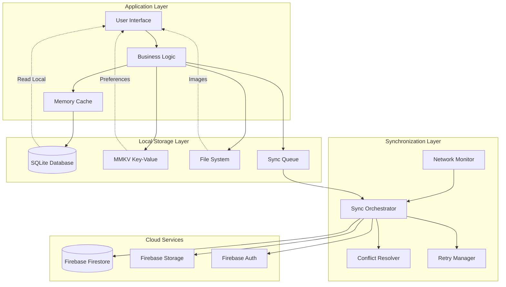

# Cider Dictionary: Offline-First Architecture Patterns

## Executive Summary

The Offline-First Architecture ensures the Cider Dictionary application provides full functionality without internet connectivity, implementing intelligent synchronization patterns, conflict resolution strategies, and data consistency guarantees. This architecture enables the 30-second quick entry target even in poor network conditions, common in pub environments, while maintaining data integrity across all user interactions.

## Offline-First Design Principles

### 1. Local-First Data Operations
- **Immediate Response**: All user actions complete instantly using local data
- **Background Synchronization**: Cloud sync happens transparently in the background
- **Optimistic Updates**: UI updates immediately, conflicts resolved later if necessary
- **Progressive Enhancement**: Online features enhance but don't block offline functionality

### 2. Data Consistency Strategy
- **Single Source of Truth**: Local SQLite database serves as primary data store
- **Versioned Data**: All records include version stamps for conflict detection
- **Idempotent Operations**: All sync operations can be safely retried
- **Event Sourcing**: Change logs enable reconstruction and conflict resolution

### 3. Network-Agnostic Design
- **Connection Independence**: App works identically online and offline
- **Graceful Degradation**: Advanced features degrade smoothly when offline
- **Smart Reconnection**: Automatic background sync when connectivity returns
- **Bandwidth Optimization**: Minimal data transfer with delta synchronization

## Offline Storage Architecture



## Local Database Design

### SQLite Schema with Offline Support
```sql
-- Core tables with offline-first design
CREATE TABLE ciders (
    id TEXT PRIMARY KEY,
    user_id TEXT NOT NULL,
    name TEXT NOT NULL,
    brand TEXT NOT NULL,
    abv REAL NOT NULL,
    overall_rating INTEGER NOT NULL,

    -- Offline sync metadata
    created_at INTEGER NOT NULL,
    updated_at INTEGER NOT NULL,
    version INTEGER DEFAULT 1,
    sync_status TEXT DEFAULT 'pending', -- 'pending', 'synced', 'conflict'
    last_synced_at INTEGER,
    checksum TEXT,

    -- Conflict resolution
    conflict_data TEXT, -- JSON blob for conflict information
    conflict_resolved_at INTEGER,

    -- Soft delete support
    deleted BOOLEAN DEFAULT FALSE,
    deleted_at INTEGER,

    INDEX idx_ciders_user_sync (user_id, sync_status),
    INDEX idx_ciders_updated (updated_at),
    INDEX idx_ciders_version (version)
);

-- Sync operation queue
CREATE TABLE sync_queue (
    id TEXT PRIMARY KEY,
    operation_type TEXT NOT NULL, -- 'CREATE', 'UPDATE', 'DELETE'
    entity_type TEXT NOT NULL,    -- 'cider', 'experience', 'venue'
    entity_id TEXT NOT NULL,

    -- Operation data
    operation_data TEXT NOT NULL, -- JSON blob
    priority INTEGER DEFAULT 5,   -- 1-10, 10 highest

    -- Retry management
    retry_count INTEGER DEFAULT 0,
    max_retries INTEGER DEFAULT 3,
    next_retry_at INTEGER,

    -- Timestamps
    created_at INTEGER NOT NULL,
    last_attempt_at INTEGER,

    INDEX idx_sync_priority (priority DESC, created_at),
    INDEX idx_sync_retry (next_retry_at)
);

-- Change log for audit and conflict resolution
CREATE TABLE change_log (
    id TEXT PRIMARY KEY,
    entity_type TEXT NOT NULL,
    entity_id TEXT NOT NULL,
    change_type TEXT NOT NULL, -- 'CREATE', 'UPDATE', 'DELETE'

    -- Change data
    old_data TEXT,    -- JSON of previous state
    new_data TEXT,    -- JSON of new state
    field_changes TEXT, -- JSON array of changed fields

    -- Metadata
    timestamp INTEGER NOT NULL,
    user_id TEXT NOT NULL,
    source TEXT DEFAULT 'local', -- 'local', 'sync'

    INDEX idx_changes_entity (entity_type, entity_id, timestamp),
    INDEX idx_changes_timestamp (timestamp)
);

-- Conflict resolution table
CREATE TABLE conflicts (
    id TEXT PRIMARY KEY,
    entity_type TEXT NOT NULL,
    entity_id TEXT NOT NULL,

    -- Conflict data
    local_data TEXT NOT NULL,     -- JSON of local version
    remote_data TEXT NOT NULL,    -- JSON of remote version
    conflict_fields TEXT NOT NULL, -- JSON array of conflicting fields

    -- Resolution
    resolution_strategy TEXT,     -- 'local_wins', 'remote_wins', 'merge', 'manual'
    resolved_data TEXT,          -- JSON of final resolved data
    resolved_at INTEGER,
    resolved_by TEXT,            -- 'auto' or user_id

    -- Timestamps
    detected_at INTEGER NOT NULL,
    expires_at INTEGER,          -- Auto-resolve timeout

    INDEX idx_conflicts_entity (entity_type, entity_id),
    INDEX idx_conflicts_unresolved (resolved_at) WHERE resolved_at IS NULL
);
```

### Local Data Access Layer
```typescript
interface OfflineRepository<T> {
  // Basic CRUD operations
  create(data: Omit<T, 'id' | 'createdAt' | 'updatedAt'>): Promise<T>;
  findById(id: string): Promise<T | null>;
  findAll(filters?: FilterOptions): Promise<T[]>;
  update(id: string, data: Partial<T>): Promise<T>;
  delete(id: string): Promise<void>;

  // Offline-specific operations
  findUnsyncedChanges(): Promise<SyncOperation[]>;
  markAsSynced(id: string, version: number): Promise<void>;
  createConflict(localData: T, remoteData: T): Promise<Conflict>;
  resolveConflict(conflictId: string, resolution: ConflictResolution): Promise<T>;
}

class OfflineCiderRepository implements OfflineRepository<CiderMasterRecord> {
  private db: SQLiteDatabase;
  private syncQueue: SyncQueue;

  async create(data: CreateCiderRequest): Promise<CiderMasterRecord> {
    const id = generateUUID();
    const now = Date.now();
    const checksum = calculateChecksum(data);

    const cider: CiderMasterRecord = {
      ...data,
      id,
      createdAt: new Date(now),
      updatedAt: new Date(now),
      version: 1,
      syncStatus: 'pending',
      checksum,
    };

    // Immediate local save
    await this.db.run(
      `INSERT INTO ciders (id, user_id, name, brand, abv, overall_rating,
       created_at, updated_at, version, sync_status, checksum)
       VALUES (?, ?, ?, ?, ?, ?, ?, ?, ?, ?, ?)`,
      [
        cider.id,
        cider.userId,
        cider.name,
        cider.brand,
        cider.abv,
        cider.overallRating,
        now,
        now,
        cider.version,
        cider.syncStatus,
        cider.checksum,
      ]
    );

    // Log change for audit
    await this.logChange('CREATE', cider.id, null, cider);

    // Queue for sync
    await this.syncQueue.enqueue({
      type: 'CREATE',
      entityType: 'cider',
      entityId: cider.id,
      data: cider,
      priority: 7, // High priority for user-created content
    });

    return cider;
  }

  async update(id: string, updates: Partial<CiderMasterRecord>): Promise<CiderMasterRecord> {
    // Get current data for change log
    const current = await this.findById(id);
    if (!current) {
      throw new Error(`Cider not found: ${id}`);
    }

    const now = Date.now();
    const newVersion = current.version + 1;
    const updatedData = { ...current, ...updates, updatedAt: new Date(now), version: newVersion };
    const checksum = calculateChecksum(updatedData);

    // Update in local database
    await this.db.run(
      `UPDATE ciders SET
       name = ?, brand = ?, abv = ?, overall_rating = ?,
       updated_at = ?, version = ?, sync_status = 'pending', checksum = ?
       WHERE id = ?`,
      [
        updatedData.name,
        updatedData.brand,
        updatedData.abv,
        updatedData.overallRating,
        now,
        newVersion,
        checksum,
        id,
      ]
    );

    // Log change
    await this.logChange('UPDATE', id, current, updatedData);

    // Queue for sync
    await this.syncQueue.enqueue({
      type: 'UPDATE',
      entityType: 'cider',
      entityId: id,
      data: updatedData,
      priority: 6,
    });

    return updatedData;
  }

  async findUnsyncedChanges(): Promise<SyncOperation[]> {
    const results = await this.db.all(
      `SELECT * FROM sync_queue
       WHERE entity_type = 'cider'
       AND (next_retry_at IS NULL OR next_retry_at <= ?)
       ORDER BY priority DESC, created_at ASC`,
      [Date.now()]
    );

    return results.map(row => ({
      id: row.id,
      type: row.operation_type,
      entityType: row.entity_type,
      entityId: row.entity_id,
      data: JSON.parse(row.operation_data),
      priority: row.priority,
      retryCount: row.retry_count,
      createdAt: new Date(row.created_at),
    }));
  }

  private async logChange(
    type: 'CREATE' | 'UPDATE' | 'DELETE',
    entityId: string,
    oldData: any,
    newData: any
  ): Promise<void> {
    const changeId = generateUUID();
    const fieldChanges = type === 'UPDATE' ? calculateFieldChanges(oldData, newData) : [];

    await this.db.run(
      `INSERT INTO change_log (id, entity_type, entity_id, change_type,
       old_data, new_data, field_changes, timestamp, user_id, source)
       VALUES (?, ?, ?, ?, ?, ?, ?, ?, ?, ?)`,
      [
        changeId,
        'cider',
        entityId,
        type,
        oldData ? JSON.stringify(oldData) : null,
        JSON.stringify(newData),
        JSON.stringify(fieldChanges),
        Date.now(),
        getCurrentUserId(),
        'local',
      ]
    );
  }
}
```

## Synchronization Orchestration

### Sync Queue Management
```typescript
interface SyncOperation {
  id: string;
  type: 'CREATE' | 'UPDATE' | 'DELETE';
  entityType: string;
  entityId: string;
  data: any;
  priority: number; // 1-10, 10 highest
  retryCount: number;
  maxRetries: number;
  createdAt: Date;
  nextRetryAt?: Date;
}

class SyncOrchestrator {
  private syncQueue: SyncQueue;
  private networkMonitor: NetworkMonitor;
  private conflictResolver: ConflictResolver;
  private isProcessing = false;

  constructor() {
    this.syncQueue = new SyncQueue();
    this.networkMonitor = new NetworkMonitor();
    this.conflictResolver = new ConflictResolver();

    // Listen for network changes
    this.networkMonitor.onStateChange(this.handleNetworkChange.bind(this));
  }

  async startSyncProcess(): Promise<void> {
    if (this.isProcessing) return;

    this.isProcessing = true;

    try {
      // Process high priority operations first
      await this.processHighPriorityOperations();

      // Process regular operations if network is stable
      if (this.networkMonitor.isStable()) {
        await this.processRegularOperations();
      }

      // Pull latest changes from server
      await this.pullServerChanges();

      // Process any new conflicts
      await this.processConflicts();
    } catch (error) {
      logger.error('Sync process failed', error);
    } finally {
      this.isProcessing = false;
    }
  }

  private async processHighPriorityOperations(): Promise<void> {
    const highPriorityOps = await this.syncQueue.getByPriority(8, 10);

    for (const operation of highPriorityOps) {
      if (!this.networkMonitor.isOnline()) break;

      try {
        await this.executeOperation(operation);
        await this.syncQueue.markCompleted(operation.id);
      } catch (error) {
        await this.handleOperationError(operation, error);
      }
    }
  }

  private async executeOperation(operation: SyncOperation): Promise<void> {
    switch (operation.type) {
      case 'CREATE':
        await this.executeCreate(operation);
        break;
      case 'UPDATE':
        await this.executeUpdate(operation);
        break;
      case 'DELETE':
        await this.executeDelete(operation);
        break;
    }
  }

  private async executeCreate(operation: SyncOperation): Promise<void> {
    try {
      // Check if entity already exists on server (duplicate detection)
      const existingEntity = await this.checkServerForEntity(
        operation.entityType,
        operation.entityId
      );

      if (existingEntity) {
        // Handle potential conflict
        await this.handleCreateConflict(operation, existingEntity);
        return;
      }

      // Create on server
      const result = await this.firebaseService.create(
        operation.entityType,
        operation.data
      );

      // Update local record with server data
      await this.updateLocalRecord(operation.entityId, result);
    } catch (error) {
      if (error.code === 'permission-denied') {
        // Handle authorization errors
        await this.handleAuthorizationError(operation);
      } else {
        throw error;
      }
    }
  }

  private async executeUpdate(operation: SyncOperation): Promise<void> {
    try {
      // Get current server version
      const serverEntity = await this.firebaseService.get(
        operation.entityType,
        operation.entityId
      );

      if (!serverEntity) {
        // Entity doesn't exist on server, convert to CREATE
        await this.convertToCreate(operation);
        return;
      }

      // Check for conflicts
      const localVersion = operation.data.version;
      const serverVersion = serverEntity.version;

      if (serverVersion > localVersion) {
        // Conflict detected
        await this.handleUpdateConflict(operation, serverEntity);
        return;
      }

      // Update on server
      const result = await this.firebaseService.update(
        operation.entityType,
        operation.entityId,
        operation.data
      );

      // Update local record
      await this.updateLocalRecord(operation.entityId, result);
    } catch (error) {
      throw error;
    }
  }

  private async handleOperationError(
    operation: SyncOperation,
    error: any
  ): Promise<void> {
    operation.retryCount++;

    if (operation.retryCount >= operation.maxRetries) {
      // Mark as failed and log for manual review
      await this.syncQueue.markFailed(operation.id, error);
      logger.error('Operation failed permanently', { operation, error });
    } else {
      // Schedule retry with exponential backoff
      const delay = Math.min(1000 * Math.pow(2, operation.retryCount), 60000);
      operation.nextRetryAt = new Date(Date.now() + delay);
      await this.syncQueue.scheduleRetry(operation);
    }
  }
}
```

## Conflict Resolution System

### Intelligent Conflict Detection
```typescript
interface ConflictDetection {
  conflictType: 'VERSION' | 'FIELD' | 'DEPENDENCY';
  localData: any;
  remoteData: any;
  conflictingFields: string[];
  timestamp: Date;
}

interface ConflictResolution {
  strategy: 'LOCAL_WINS' | 'REMOTE_WINS' | 'MERGE' | 'MANUAL';
  resolvedData: any;
  appliedAt: Date;
}

class ConflictResolver {
  private resolutionStrategies: Map<string, ConflictResolutionStrategy>;

  constructor() {
    this.resolutionStrategies = new Map([
      ['cider', new CiderConflictStrategy()],
      ['experience', new ExperienceConflictStrategy()],
      ['venue', new VenueConflictStrategy()],
    ]);
  }

  async detectConflicts(
    entityType: string,
    localData: any,
    remoteData: any
  ): Promise<ConflictDetection | null> {
    // Version-based conflict detection
    if (localData.version !== remoteData.version) {
      const conflictingFields = this.identifyConflictingFields(localData, remoteData);

      if (conflictingFields.length > 0) {
        return {
          conflictType: 'VERSION',
          localData,
          remoteData,
          conflictingFields,
          timestamp: new Date(),
        };
      }
    }

    // Field-level conflict detection
    const fieldConflicts = this.detectFieldConflicts(localData, remoteData);
    if (fieldConflicts.length > 0) {
      return {
        conflictType: 'FIELD',
        localData,
        remoteData,
        conflictingFields: fieldConflicts,
        timestamp: new Date(),
      };
    }

    return null;
  }

  async resolveConflict(
    entityType: string,
    conflict: ConflictDetection
  ): Promise<ConflictResolution> {
    const strategy = this.resolutionStrategies.get(entityType);
    if (!strategy) {
      throw new Error(`No conflict resolution strategy for ${entityType}`);
    }

    return await strategy.resolve(conflict);
  }

  private identifyConflictingFields(local: any, remote: any): string[] {
    const conflicts: string[] = [];
    const localKeys = Object.keys(local);
    const remoteKeys = Object.keys(remote);
    const allKeys = new Set([...localKeys, ...remoteKeys]);

    for (const key of allKeys) {
      if (this.isMetadataField(key)) continue;

      const localValue = local[key];
      const remoteValue = remote[key];

      if (!this.areEqual(localValue, remoteValue)) {
        conflicts.push(key);
      }
    }

    return conflicts;
  }

  private areEqual(a: any, b: any): boolean {
    if (typeof a !== typeof b) return false;
    if (a === null || b === null) return a === b;
    if (typeof a === 'object') {
      return JSON.stringify(a) === JSON.stringify(b);
    }
    return a === b;
  }

  private isMetadataField(field: string): boolean {
    return ['updatedAt', 'version', 'syncStatus', 'checksum'].includes(field);
  }
}

// Cider-specific conflict resolution strategy
class CiderConflictStrategy implements ConflictResolutionStrategy {
  async resolve(conflict: ConflictDetection): Promise<ConflictResolution> {
    const { localData, remoteData, conflictingFields } = conflict;

    // User data always wins for core cider information
    const userDataFields = ['name', 'brand', 'overallRating', 'notes'];
    const systemDataFields = ['timesTried', 'averagePrice', 'lastTasted'];

    const resolved = { ...remoteData };

    for (const field of conflictingFields) {
      if (userDataFields.includes(field)) {
        // User-entered data from local client wins
        resolved[field] = localData[field];
      } else if (systemDataFields.includes(field)) {
        // System-calculated data from server wins (more complete)
        resolved[field] = remoteData[field];
      } else {
        // For other fields, use timestamp-based resolution
        const localTimestamp = new Date(localData.updatedAt).getTime();
        const remoteTimestamp = new Date(remoteData.updatedAt).getTime();

        if (localTimestamp > remoteTimestamp) {
          resolved[field] = localData[field];
        } else {
          resolved[field] = remoteData[field];
        }
      }
    }

    // Update metadata
    resolved.version = Math.max(localData.version, remoteData.version) + 1;
    resolved.updatedAt = new Date();
    resolved.conflictResolvedAt = new Date();

    return {
      strategy: 'MERGE',
      resolvedData: resolved,
      appliedAt: new Date(),
    };
  }
}
```

## Network State Management

### Adaptive Sync Behavior
```typescript
interface NetworkState {
  isOnline: boolean;
  connectionType: 'none' | 'wifi' | 'cellular' | 'other';
  bandwidth: number; // bytes per second
  latency: number; // milliseconds
  isStable: boolean;
}

class NetworkMonitor {
  private currentState: NetworkState;
  private listeners: ((state: NetworkState) => void)[] = [];
  private stabilityTimer?: NodeJS.Timeout;

  constructor() {
    this.currentState = {
      isOnline: false,
      connectionType: 'none',
      bandwidth: 0,
      latency: 0,
      isStable: false,
    };

    this.initializeMonitoring();
  }

  private initializeMonitoring(): void {
    // React Native NetInfo integration
    NetInfo.addEventListener(this.handleNetworkChange.bind(this));

    // Periodic connection quality testing
    setInterval(this.testConnectionQuality.bind(this), 30000); // Every 30 seconds
  }

  private handleNetworkChange(state: NetInfoState): void {
    const newState: NetworkState = {
      isOnline: state.isConnected && state.isInternetReachable,
      connectionType: state.type as any,
      bandwidth: this.estimateBandwidth(state),
      latency: 0, // Will be measured separately
      isStable: false,
    };

    // Reset stability timer
    if (this.stabilityTimer) {
      clearTimeout(this.stabilityTimer);
    }

    // Consider connection stable after 5 seconds
    this.stabilityTimer = setTimeout(() => {
      newState.isStable = true;
      this.updateState(newState);
    }, 5000);

    this.updateState(newState);
  }

  private async testConnectionQuality(): Promise<void> {
    if (!this.currentState.isOnline) return;

    try {
      const startTime = Date.now();
      const response = await fetch('https://firestore.googleapis.com/ping', {
        method: 'HEAD',
        timeout: 5000,
      });
      const endTime = Date.now();

      if (response.ok) {
        this.currentState.latency = endTime - startTime;
        this.currentState.bandwidth = this.estimateBandwidthFromResponse(response);
      }
    } catch (error) {
      // Connection quality test failed
      this.currentState.latency = 5000; // Assume high latency
      this.currentState.bandwidth = 0;
    }
  }

  onStateChange(listener: (state: NetworkState) => void): () => void {
    this.listeners.push(listener);
    return () => {
      const index = this.listeners.indexOf(listener);
      if (index > -1) {
        this.listeners.splice(index, 1);
      }
    };
  }

  private updateState(newState: NetworkState): void {
    this.currentState = newState;
    this.listeners.forEach(listener => listener(newState));
  }

  getState(): NetworkState {
    return { ...this.currentState };
  }

  isOnline(): boolean {
    return this.currentState.isOnline;
  }

  isStable(): boolean {
    return this.currentState.isOnline && this.currentState.isStable;
  }

  isHighBandwidth(): boolean {
    return this.currentState.bandwidth > 1000000; // 1 MB/s
  }
}
```

## Offline User Experience Patterns

### Offline Indicator and Feedback
```typescript
// Offline status indicator component
const OfflineIndicator: React.FC = () => {
  const networkState = useNetworkState();
  const { pendingOperations } = useSyncQueue();

  const [isVisible, setIsVisible] = useState(false);
  const translateY = useSharedValue(-100);
  const opacity = useSharedValue(0);

  useEffect(() => {
    const shouldShow = !networkState.isOnline || pendingOperations.length > 0;

    if (shouldShow !== isVisible) {
      setIsVisible(shouldShow);

      if (shouldShow) {
        translateY.value = withTiming(0, { duration: 300 });
        opacity.value = withTiming(1, { duration: 300 });
      } else {
        translateY.value = withTiming(-100, { duration: 300 });
        opacity.value = withTiming(0, { duration: 300 });
      }
    }
  }, [networkState.isOnline, pendingOperations.length, isVisible]);

  const animatedStyle = useAnimatedStyle(() => ({
    transform: [{ translateY: translateY.value }],
    opacity: opacity.value,
  }));

  if (!isVisible) return null;

  return (
    <Animated.View style={[styles.offlineIndicator, animatedStyle]}>
      <Icon name="cloud-offline" size={16} color="#fff" />
      <Text style={styles.offlineText}>
        {!networkState.isOnline
          ? 'Working offline'
          : `${pendingOperations.length} changes pending sync`}
      </Text>
      {pendingOperations.length > 0 && (
        <ActivityIndicator size="small" color="#fff" />
      )}
    </Animated.View>
  );
};

// Optimistic update feedback
export const useOptimisticUpdate = <T,>(
  mutationFn: () => Promise<T>,
  optimisticData: T
) => {
  const [isOptimistic, setIsOptimistic] = useState(false);
  const [data, setData] = useState<T | null>(null);

  const execute = useCallback(async () => {
    // Apply optimistic update immediately
    setData(optimisticData);
    setIsOptimistic(true);

    try {
      // Execute actual mutation
      const result = await mutationFn();
      setData(result);
      setIsOptimistic(false);
      return result;
    } catch (error) {
      // Revert optimistic update on error
      setData(null);
      setIsOptimistic(false);
      throw error;
    }
  }, [mutationFn, optimisticData]);

  return { execute, data, isOptimistic };
};
```

### Data Synchronization Status
```typescript
// Sync status provider for real-time feedback
export const SyncStatusProvider: React.FC<{ children: React.ReactNode }> = ({
  children,
}) => {
  const [syncStatus, setSyncStatus] = useState<SyncStatus>({
    isActive: false,
    progress: 0,
    totalOperations: 0,
    completedOperations: 0,
    errors: [],
  });

  useEffect(() => {
    const unsubscribe = syncOrchestrator.onStatusChange((status) => {
      setSyncStatus(status);
    });

    return unsubscribe;
  }, []);

  return (
    <SyncStatusContext.Provider value={syncStatus}>
      {children}
    </SyncStatusContext.Provider>
  );
};

// Hook for components to access sync status
export const useSyncStatus = () => {
  const context = useContext(SyncStatusContext);
  if (!context) {
    throw new Error('useSyncStatus must be used within SyncStatusProvider');
  }
  return context;
};
```

This offline-first architecture ensures that the Cider Dictionary application provides a seamless user experience regardless of network conditions, while maintaining data integrity and providing transparent synchronization feedback to users. The patterns defined here enable the 30-second quick entry target even in poor connectivity environments, which is essential for the pub use case.