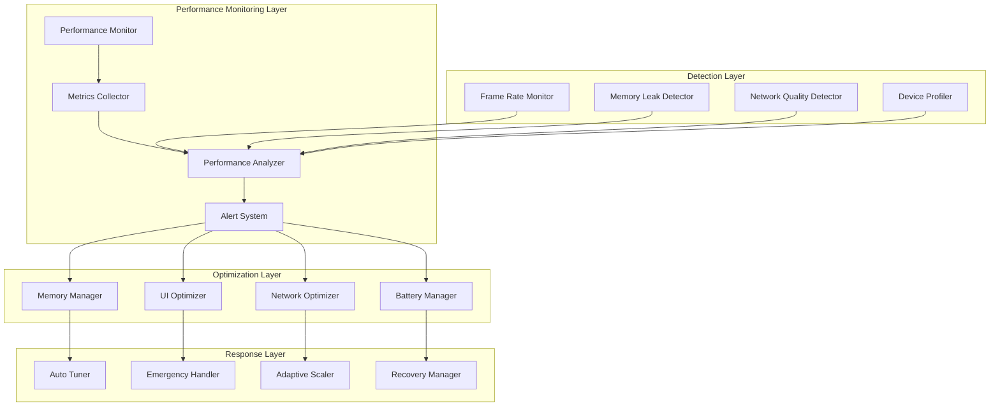

# Cider Dictionary: Performance Optimization Patterns

## Executive Summary

The Performance Optimization Patterns document defines comprehensive strategies for achieving sub-200ms response times and maintaining 60fps performance across all user interactions in the Cider Dictionary React Native application. Built upon the foundation architecture documents, this system implements advanced React Native optimizations, intelligent memory management, and adaptive performance scaling to ensure optimal user experience across diverse device capabilities and network conditions.

## Performance Architecture Principles

### 1. Performance-First Design
- **Sub-200ms Target**: All user interactions complete within performance threshold
- **60fps Guarantee**: Smooth animations and transitions maintained consistently
- **Adaptive Scaling**: Performance adjusts automatically to device capabilities
- **Proactive Optimization**: System anticipates and prevents performance bottlenecks

### 2. Multi-Tier Performance Strategy
- **Real-time Optimization**: Immediate response to performance degradation
- **Predictive Enhancement**: Anticipatory loading and resource management
- **Background Optimization**: Continuous system tuning during idle periods
- **Emergency Recovery**: Rapid response to critical performance failures

### 3. Device-Aware Performance
- **Capability Detection**: Automatic device profiling and optimization
- **Resource Allocation**: Dynamic resource management based on device constraints
- **Battery Optimization**: Adaptive power management for extended usage
- **Network Adaptation**: Performance tuning based on connection quality

## Performance Monitoring Architecture



## Advanced Memory Management Patterns

### 1. Intelligent Memory Pool System
```typescript
interface AdvancedMemoryManager {
  // Memory pool configuration
  pools: {
    images: MemoryPool;      // 20MB pool for image resources
    data: MemoryPool;        // 15MB pool for application data
    ui: MemoryPool;          // 10MB pool for UI components
    cache: MemoryPool;       // 30MB pool for cached content
  };

  // Memory monitoring
  monitoring: {
    currentUsage: MemoryUsage;
    thresholds: MemoryThresholds;
    alerts: MemoryAlert[];
    history: MemorySnapshot[];
  };

  // Optimization strategies
  strategies: {
    proactiveCleanup: CleanupStrategy;
    emergencyRecovery: RecoveryStrategy;
    leakDetection: LeakDetectionStrategy;
    poolOptimization: PoolOptimizationStrategy;
  };
}

class MemoryPerformanceManager {
  private memoryPools: Map<PoolType, MemoryPool>;
  private gcOptimizer: GarbageCollectionOptimizer;
  private leakDetector: MemoryLeakDetector;
  private performanceThresholds: PerformanceThresholds;

  constructor() {
    this.initializeMemoryPools();
    this.setupMemoryMonitoring();
    this.configureOptimizationStrategies();
  }

  // Proactive memory management
  async manageMemoryPerformance(): Promise<void> {
    const currentUsage = await this.getCurrentMemoryUsage();
    const memoryPressure = this.calculateMemoryPressure(currentUsage);

    // Adaptive response based on memory pressure
    if (memoryPressure > 0.95) {
      await this.executeEmergencyMemoryRecovery();
    } else if (memoryPressure > 0.8) {
      await this.executeProactiveMemoryCleanup();
    } else if (memoryPressure > 0.6) {
      await this.executePreventiveMemoryOptimization();
    }

    // Continuous optimization
    await this.optimizeMemoryPools();
    await this.detectAndFixMemoryLeaks();
    await this.optimizeGarbageCollection();
  }

  // Emergency memory recovery
  private async executeEmergencyMemoryRecovery(): Promise<void> {
    // 1. Immediate cache clearing
    await this.clearNonEssentialCaches();

    // 2. Force garbage collection
    await this.forceGarbageCollection();

    // 3. Release unused image resources
    await this.releaseUnusedImages();

    // 4. Compress large objects
    await this.compressLargeObjects();

    // 5. Pause non-critical operations
    await this.pauseNonCriticalOperations();

    // 6. Notify user and log emergency action
    this.notifyEmergencyRecovery();

    logger.warn('Emergency memory recovery executed', {
      memoryFreed: await this.calculateMemoryFreed(),
      currentUsage: await this.getCurrentMemoryUsage(),
      timestamp: Date.now(),
    });
  }

  // Predictive memory optimization
  private async optimizeMemoryPools(): Promise<void> {
    for (const [poolType, pool] of this.memoryPools) {
      const usage = await pool.getUsageAnalytics();
      const optimization = this.calculatePoolOptimization(usage);

      if (optimization.shouldResize) {
        await pool.resize(optimization.newSize);
      }

      if (optimization.shouldDefragment) {
        await pool.defragment();
      }

      if (optimization.shouldRebalance) {
        await this.rebalancePool(pool, optimization.targetDistribution);
      }
    }
  }

  // Advanced leak detection
  private async detectAndFixMemoryLeaks(): Promise<void> {
    const snapshot = await this.takeMemorySnapshot();
    const leaks = await this.leakDetector.detectLeaks(snapshot);

    for (const leak of leaks) {
      switch (leak.type) {
        case 'component_leak':
          await this.fixComponentLeak(leak);
          break;
        case 'event_listener_leak':
          await this.fixEventListenerLeak(leak);
          break;
        case 'timer_leak':
          await this.fixTimerLeak(leak);
          break;
        case 'subscription_leak':
          await this.fixSubscriptionLeak(leak);
          break;
      }
    }
  }
}
```

### 2. React Native Specific Optimizations
```typescript
class ReactNativePerformanceOptimizer {
  private componentProfiler: ComponentProfiler;
  private bridgeOptimizer: BridgeOptimizer;
  private renderOptimizer: RenderOptimizer;

  // Component-level optimizations
  optimizeComponentPerformance(component: ComponentInfo): OptimizationPlan {
    const analysis = this.componentProfiler.analyzeComponent(component);
    const optimizations: Optimization[] = [];

    // 1. Memoization optimization
    if (analysis.hasExpensiveCalculations) {
      optimizations.push(this.createMemoizationOptimization(component));
    }

    // 2. Render optimization
    if (analysis.hasFrequentRerenders) {
      optimizations.push(this.createRenderOptimization(component));
    }

    // 3. Props optimization
    if (analysis.hasUnnecessaryPropUpdates) {
      optimizations.push(this.createPropsOptimization(component));
    }

    // 4. State optimization
    if (analysis.hasIneffientStateUpdates) {
      optimizations.push(this.createStateOptimization(component));
    }

    return {
      component,
      optimizations,
      estimatedImprovement: this.calculateEstimatedImprovement(optimizations),
      priority: this.calculateOptimizationPriority(analysis),
    };
  }

  // Bridge communication optimization
  optimizeBridgePerformance(): void {
    // 1. Batch bridge operations
    this.bridgeOptimizer.enableBatching({
      maxBatchSize: 10,
      batchTimeout: 16, // One frame
      priorityThreshold: 8,
    });

    // 2. Optimize data serialization
    this.bridgeOptimizer.optimizeDataSerialization({
      useTypedArrays: true,
      enableCompression: true,
      optimizeJsonSerialization: true,
    });

    // 3. Reduce bridge calls
    this.bridgeOptimizer.implementCallCoalescing({
      coalescingWindow: 32, // Two frames
      maxCoalescedCalls: 5,
      preserveCallOrder: true,
    });
  }

  // Native module optimization
  optimizeNativeModules(): void {
    // Move performance-critical operations to native
    const criticalOperations = [
      'imageProcessing',
      'dataEncryption',
      'largeMathCalculations',
      'stringProcessing',
    ];

    criticalOperations.forEach(operation => {
      this.bridgeOptimizer.moveToNativeModule(operation);
    });
  }
}
```

## UI Performance Optimization Patterns

### 1. 60fps Rendering Guarantee
```typescript
interface UIPerformanceGuarantee {
  frameRate: {
    target: 60;
    minimum: 55;
    recovery: 45;
  };
  renderTime: {
    target: 16.67; // milliseconds per frame
    warning: 20;
    critical: 25;
  };
  animations: {
    nativeDriver: boolean;
    complexity: 'low' | 'medium' | 'high';
    frameDropTolerance: number;
  };
}

class FrameRateGuarantor {
  private frameMonitor: FrameRateMonitor;
  private renderOptimizer: RenderOptimizer;
  private animationManager: AnimationManager;

  // Real-time frame rate monitoring
  async monitorFrameRate(): Promise<void> {
    this.frameMonitor.onFrameRateChange((frameRate, frameTime) => {
      if (frameRate < this.thresholds.minimum) {
        this.handleFrameRateDrop(frameRate, frameTime);
      }
    });

    this.frameMonitor.onFrameDrop((droppedFrames, consecutiveDrops) => {
      if (consecutiveDrops > 3) {
        this.handleConsecutiveFrameDrops(droppedFrames);
      }
    });
  }

  // Immediate response to frame rate issues
  private async handleFrameRateDrop(frameRate: number, frameTime: number): Promise<void> {
    // 1. Immediate optimizations
    await this.reduceRenderComplexity();
    await this.pauseNonEssentialAnimations();
    await this.optimizeCurrentRenderCycle();

    // 2. Identify root cause
    const cause = await this.identifyFrameDropCause();

    // 3. Apply targeted optimization
    switch (cause.type) {
      case 'expensive_calculation':
        await this.moveCalculationToBackground(cause.operation);
        break;
      case 'large_component_tree':
        await this.virtualizeComponent(cause.component);
        break;
      case 'memory_pressure':
        await this.releaseMemoryResources();
        break;
      case 'bridge_congestion':
        await this.optimizeBridgeOperations();
        break;
    }

    // 4. Verify improvement
    await this.verifyFrameRateRecovery();
  }

  // Advanced render optimization
  private async optimizeRenderCycle(): Promise<void> {
    // 1. Component-level optimizations
    const heavyComponents = await this.identifyHeavyComponents();

    for (const component of heavyComponents) {
      await this.optimizeComponent(component);
    }

    // 2. Layout optimization
    await this.optimizeLayoutCalculations();

    // 3. Paint optimization
    await this.optimizePaintOperations();

    // 4. Composite optimization
    await this.optimizeCompositeOperations();
  }

  // Dynamic animation management
  private async manageAnimationPerformance(): Promise<void> {
    const runningAnimations = this.animationManager.getRunningAnimations();

    for (const animation of runningAnimations) {
      const performance = await this.analyzeAnimationPerformance(animation);

      if (performance.impactsFrameRate) {
        await this.optimizeAnimation(animation, performance);
      }
    }
  }
}
```

### 2. Intelligent List Virtualization
```typescript
class IntelligentVirtualization {
  private virtualizer: VirtualizationEngine;
  private itemSizePredictor: ItemSizePredictor;
  private scrollPredictor: ScrollPredictor;

  // Adaptive virtualization strategy
  async optimizeListPerformance(listData: ListData[]): Promise<VirtualizationConfig> {
    const analysis = await this.analyzeListCharacteristics(listData);

    return {
      // Dynamic item height calculation
      itemHeight: analysis.hasVariableHeight
        ? this.createDynamicHeightCalculator(listData)
        : analysis.averageHeight,

      // Intelligent buffering
      bufferSize: this.calculateOptimalBufferSize(analysis),

      // Predictive rendering
      predictiveRenderCount: this.calculatePredictiveRenderCount(analysis),

      // Scroll optimization
      scrollOptimization: {
        momentum: analysis.hasLongScrolls,
        deceleration: analysis.scrollVelocity,
        snapToInterval: analysis.hasUniformItems,
      },

      // Memory management
      memoryOptimization: {
        recycleInvisibleItems: true,
        compressOffscreenData: analysis.hasLargeItems,
        lazyLoadImages: analysis.hasImages,
      },
    };
  }

  // Predictive item rendering
  private async implementPredictiveRendering(config: VirtualizationConfig): Promise<void> {
    const scrollBehavior = await this.scrollPredictor.analyzeScrollPattern();

    // Pre-render items in scroll direction
    if (scrollBehavior.direction === 'down') {
      await this.preRenderItems(
        config.currentIndex + config.visibleCount,
        config.predictiveRenderCount
      );
    } else if (scrollBehavior.direction === 'up') {
      await this.preRenderItems(
        config.currentIndex - config.predictiveRenderCount,
        config.predictiveRenderCount
      );
    }

    // Release items moving out of predictive range
    await this.releaseOutOfRangeItems(config);
  }

  // Dynamic height calculation
  private createDynamicHeightCalculator(listData: ListData[]): HeightCalculator {
    return {
      calculateHeight: async (item: ListData, index: number) => {
        // Use machine learning to predict item height
        const prediction = await this.itemSizePredictor.predictHeight(item);

        // Fallback to measurement if prediction is uncertain
        if (prediction.confidence < 0.8) {
          return await this.measureItemHeight(item);
        }

        return prediction.height;
      },

      updatePredictionModel: (item: ListData, actualHeight: number) => {
        this.itemSizePredictor.updateModel(item, actualHeight);
      },
    };
  }
}
```

## Network Performance Optimization

### 1. Adaptive Network Management
```typescript
interface NetworkPerformanceStrategy {
  connectionAdaptation: {
    wifi: NetworkConfig;
    cellular4G: NetworkConfig;
    cellular3G: NetworkConfig;
    slowConnection: NetworkConfig;
  };

  loadingStrategies: {
    progressive: ProgressiveLoadingConfig;
    predictive: PredictiveLoadingConfig;
    adaptive: AdaptiveLoadingConfig;
  };

  offlineCapabilities: {
    queueManagement: OfflineQueueConfig;
    dataSync: SyncConfig;
    cacheStrategy: CacheConfig;
  };
}

class AdaptiveNetworkManager {
  private networkMonitor: NetworkQualityMonitor;
  private loadingStrategy: LoadingStrategyManager;
  private cacheManager: IntelligentCacheManager;

  // Dynamic network adaptation
  async adaptToNetworkConditions(): Promise<void> {
    const networkState = await this.networkMonitor.getCurrentState();
    const networkQuality = await this.networkMonitor.assessQuality();

    // Adapt loading strategy
    const strategy = this.selectLoadingStrategy(networkState, networkQuality);
    await this.loadingStrategy.switchToStrategy(strategy);

    // Adjust cache behavior
    const cacheConfig = this.calculateOptimalCacheConfig(networkState);
    await this.cacheManager.reconfigure(cacheConfig);

    // Optimize data transfer
    await this.optimizeDataTransfer(networkState);
  }

  // Progressive loading implementation
  private async implementProgressiveLoading(request: DataRequest): Promise<DataResponse> {
    const loadingPlan = this.createProgressiveLoadingPlan(request);

    // Load essential data first
    const essentialData = await this.loadEssentialData(loadingPlan.essential);

    // Load additional data in background
    this.scheduleProgressiveLoading([
      { data: loadingPlan.important, delay: 100, priority: 2 },
      { data: loadingPlan.supplementary, delay: 500, priority: 3 },
      { data: loadingPlan.optional, delay: 1000, priority: 4 },
    ]);

    return essentialData;
  }

  // Predictive data preloading
  private async implementPredictiveLoading(): Promise<void> {
    const userBehavior = await this.analyzeUserBehavior();
    const predictions = this.generateDataPredictions(userBehavior);

    for (const prediction of predictions) {
      if (prediction.confidence > 0.7 && prediction.timeToAccess < 300000) {
        await this.preloadData(prediction.data, prediction.priority);
      }
    }
  }

  // Intelligent request batching
  private async optimizeRequestBatching(): Promise<void> {
    const pendingRequests = this.getPendingRequests();
    const batches = this.createOptimalBatches(pendingRequests);

    for (const batch of batches) {
      await this.executeBatch(batch);

      // Respect rate limits and server capacity
      await this.waitOptimalInterval(batch.size);
    }
  }
}
```

### 2. Offline-First Performance Patterns
```typescript
class OfflinePerformanceManager {
  private syncQueue: IntelligentSyncQueue;
  private conflictResolver: ConflictResolver;
  private dataCompressor: DataCompressor;

  // Optimized offline operations
  async optimizeOfflinePerformance(): Promise<void> {
    // 1. Intelligent sync queue management
    await this.optimizeSyncQueue();

    // 2. Conflict-free data operations
    await this.implementConflictFreeOperations();

    // 3. Data compression for storage efficiency
    await this.optimizeLocalDataStorage();

    // 4. Background sync optimization
    await this.optimizeBackgroundSync();
  }

  // Smart sync queue prioritization
  private async optimizeSyncQueue(): Promise<void> {
    const queueItems = await this.syncQueue.getAllItems();

    // Prioritize based on user impact and data importance
    const prioritizedItems = queueItems.sort((a, b) => {
      const aPriority = this.calculateSyncPriority(a);
      const bPriority = this.calculateSyncPriority(b);
      return bPriority - aPriority;
    });

    // Process high-priority items first when network returns
    await this.syncQueue.reorderItems(prioritizedItems);
  }

  // Conflict-free CRDT operations
  private async implementConflictFreeOperations(): Promise<void> {
    // Use Conflict-free Replicated Data Types for concurrent operations
    const crdtOperations = {
      counterIncrement: this.createGCounterOperation(),
      setAddition: this.createGSetOperation(),
      textEditing: this.createLWWRegisterOperation(),
      listOperations: this.createORSetOperation(),
    };

    // Apply CRDT operations for concurrent-safe updates
    for (const [operationType, operation] of Object.entries(crdtOperations)) {
      await this.registerCRDTOperation(operationType, operation);
    }
  }

  // Data compression for offline storage
  private async optimizeLocalDataStorage(): Promise<void> {
    const storageAnalysis = await this.analyzeStorageUsage();

    // Compress large data objects
    for (const largeItem of storageAnalysis.largeItems) {
      const compressed = await this.dataCompressor.compress(largeItem);
      await this.replaceStoredItem(largeItem.id, compressed);
    }

    // Archive old data with higher compression
    for (const oldItem of storageAnalysis.oldItems) {
      const archived = await this.dataCompressor.archive(oldItem);
      await this.moveToArchiveStorage(oldItem.id, archived);
    }
  }
}
```

## Battery Life Optimization Patterns

### 1. Adaptive Power Management
```typescript
interface PowerOptimizationStrategy {
  batteryLevels: {
    high: PowerConfig;      // >60% battery
    medium: PowerConfig;    // 30-60% battery
    low: PowerConfig;       // 10-30% battery
    critical: PowerConfig;  // <10% battery
  };

  adaptiveFeatures: {
    backgroundProcessing: AdaptiveConfig;
    locationServices: LocationConfig;
    syncFrequency: SyncConfig;
    animationQuality: AnimationConfig;
  };
}

class AdaptivePowerManager {
  private batteryMonitor: BatteryMonitor;
  private powerProfiler: PowerProfiler;
  private featureManager: AdaptiveFeatureManager;

  // Dynamic power optimization
  async optimizePowerConsumption(): Promise<void> {
    const batteryState = await this.batteryMonitor.getBatteryState();
    const powerProfile = await this.powerProfiler.getCurrentProfile();

    // Adapt system behavior based on battery level
    const optimizationLevel = this.calculateOptimizationLevel(batteryState);
    await this.applyPowerOptimizations(optimizationLevel);

    // Monitor power-hungry operations
    await this.monitorPowerConsumption();
  }

  // Battery-aware feature management
  private async applyPowerOptimizations(level: OptimizationLevel): Promise<void> {
    switch (level) {
      case 'aggressive':
        await this.enableAggressivePowerSaving();
        break;
      case 'moderate':
        await this.enableModeratePowerSaving();
        break;
      case 'minimal':
        await this.enableMinimalPowerSaving();
        break;
      case 'none':
        await this.enableFullPerformance();
        break;
    }
  }

  // Aggressive power saving mode
  private async enableAggressivePowerSaving(): Promise<void> {
    // Reduce CPU frequency
    await this.setCPUGovernor('powersave');

    // Minimize background operations
    await this.pauseNonEssentialBackgroundTasks();

    // Reduce sync frequency
    await this.setSyncInterval(600000); // 10 minutes

    // Disable animations
    await this.disableNonEssentialAnimations();

    // Reduce location accuracy
    await this.setLocationAccuracy('low');

    // Dim screen and reduce refresh rate
    await this.optimizeDisplaySettings();

    // Notify user of power saving mode
    this.notifyPowerSavingMode();
  }

  // Intelligent background task management
  private async manageBackgroundTasks(batteryLevel: number): Promise<void> {
    const tasks = await this.getBackgroundTasks();

    for (const task of tasks) {
      const taskPriority = this.calculateTaskPriority(task);
      const powerImpact = await this.estimatePowerImpact(task);

      // Defer or cancel low-priority, high-power tasks
      if (batteryLevel < 30 && powerImpact > 0.1 && taskPriority < 5) {
        await this.deferTask(task, batteryLevel * 1000);
      } else if (batteryLevel < 10 && taskPriority < 8) {
        await this.cancelTask(task);
      }
    }
  }
}
```

## Device Capability Adaptation

### 1. Dynamic Device Profiling
```typescript
interface DeviceCapabilityProfile {
  hardware: {
    memoryCapacity: number;
    storageCapacity: number;
    processorCores: number;
    processorSpeed: number;
    gpuCapability: GPUCapability;
    batteryCapacity: number;
  };

  performance: {
    renderingCapability: RenderCapability;
    computationSpeed: ComputationSpeed;
    networkCapability: NetworkCapability;
    energyEfficiency: EnergyProfile;
  };

  limitations: {
    memoryConstraints: MemoryConstraints;
    storageConstraints: StorageConstraints;
    powerConstraints: PowerConstraints;
    thermalConstraints: ThermalConstraints;
  };
}

class DeviceCapabilityManager {
  private deviceProfiler: DeviceProfiler;
  private performanceTuner: PerformanceTuner;
  private adaptationEngine: AdaptationEngine;

  // Comprehensive device profiling
  async profileDevice(): Promise<DeviceCapabilityProfile> {
    const profile: DeviceCapabilityProfile = {
      hardware: await this.profileHardware(),
      performance: await this.benchmarkPerformance(),
      limitations: await this.identifyLimitations(),
    };

    // Create device-specific optimization strategy
    const optimizationStrategy = await this.createOptimizationStrategy(profile);
    await this.applyDeviceOptimizations(optimizationStrategy);

    return profile;
  }

  // Device-specific optimization application
  private async applyDeviceOptimizations(profile: DeviceCapabilityProfile): Promise<void> {
    // Memory optimizations
    if (profile.hardware.memoryCapacity < 2 * 1024 * 1024 * 1024) { // 2GB
      await this.enableLowMemoryOptimizations();
    }

    // CPU optimizations
    if (profile.hardware.processorCores < 4) {
      await this.enableLowCoreOptimizations();
    }

    // Storage optimizations
    if (profile.hardware.storageCapacity < 8 * 1024 * 1024 * 1024) { // 8GB
      await this.enableStorageOptimizations();
    }

    // GPU optimizations
    if (profile.hardware.gpuCapability === 'low') {
      await this.enableLowGPUOptimizations();
    }
  }

  // Low memory device optimizations
  private async enableLowMemoryOptimizations(): Promise<void> {
    // Reduce image cache size
    await this.imageCacheManager.setMaxSize(20 * 1024 * 1024); // 20MB

    // Enable aggressive garbage collection
    await this.memoryManager.enableAggressiveGC();

    // Reduce component complexity
    await this.componentManager.enableSimplifiedComponents();

    // Disable memory-intensive features
    await this.featureManager.disableMemoryIntensiveFeatures();
  }

  // Performance adaptation based on device capabilities
  private async adaptPerformanceSettings(profile: DeviceCapabilityProfile): Promise<void> {
    const performanceConfig = {
      animationQuality: this.calculateAnimationQuality(profile),
      renderingComplexity: this.calculateRenderingComplexity(profile),
      concurrencyLevel: this.calculateConcurrencyLevel(profile),
      cacheSize: this.calculateOptimalCacheSize(profile),
    };

    await this.performanceTuner.applyConfiguration(performanceConfig);
  }
}
```

## Performance Analytics and Monitoring

### 1. Real-Time Performance Analytics
```typescript
class PerformanceAnalyticsEngine {
  private metricsCollector: MetricsCollector;
  private performanceProfiler: PerformanceProfiler;
  private anomalyDetector: AnomalyDetector;
  private optimizationRecommender: OptimizationRecommender;

  // Comprehensive performance monitoring
  async monitorPerformance(): Promise<void> {
    const metrics = await this.collectPerformanceMetrics();
    const analysis = await this.analyzePerformance(metrics);

    // Detect performance anomalies
    const anomalies = await this.anomalyDetector.detectAnomalies(metrics);

    if (anomalies.length > 0) {
      await this.handlePerformanceAnomalies(anomalies);
    }

    // Generate optimization recommendations
    const recommendations = await this.generateOptimizationRecommendations(analysis);
    await this.applyAutomaticOptimizations(recommendations);

    // Report performance insights
    await this.reportPerformanceInsights(metrics, analysis, recommendations);
  }

  // Comprehensive metrics collection
  private async collectPerformanceMetrics(): Promise<PerformanceMetrics> {
    return {
      // UI performance metrics
      frameRate: await this.getFrameRateMetrics(),
      renderTime: await this.getRenderTimeMetrics(),
      uiThreadUsage: await this.getUIThreadUsage(),

      // Memory metrics
      memoryUsage: await this.getMemoryUsageMetrics(),
      heapSize: await this.getHeapSizeMetrics(),
      garbageCollections: await this.getGCMetrics(),

      // Network metrics
      networkLatency: await this.getNetworkLatencyMetrics(),
      dataTransferred: await this.getDataTransferMetrics(),
      requestSuccessRate: await this.getRequestSuccessRateMetrics(),

      // Battery metrics
      batteryUsage: await this.getBatteryUsageMetrics(),
      powerConsumption: await this.getPowerConsumptionMetrics(),

      // Cache metrics
      cacheHitRate: await this.getCacheHitRateMetrics(),
      cacheMemoryUsage: await this.getCacheMemoryUsageMetrics(),

      // Device metrics
      cpuUsage: await this.getCPUUsageMetrics(),
      thermalState: await this.getThermalStateMetrics(),
    };
  }

  // Intelligent optimization recommendations
  private async generateOptimizationRecommendations(
    analysis: PerformanceAnalysis
  ): Promise<OptimizationRecommendation[]> {
    const recommendations: OptimizationRecommendation[] = [];

    // Memory optimization recommendations
    if (analysis.memoryPressure > 0.8) {
      recommendations.push({
        type: 'memory_optimization',
        priority: 'high',
        description: 'Implement aggressive memory cleanup',
        estimatedImpact: 'high',
        implementationComplexity: 'low',
        action: async () => await this.executeMemoryOptimization(),
      });
    }

    // UI performance recommendations
    if (analysis.averageFrameRate < 55) {
      recommendations.push({
        type: 'ui_optimization',
        priority: 'high',
        description: 'Optimize rendering performance',
        estimatedImpact: 'high',
        implementationComplexity: 'medium',
        action: async () => await this.executeUIOptimization(),
      });
    }

    // Network optimization recommendations
    if (analysis.networkEfficiency < 0.7) {
      recommendations.push({
        type: 'network_optimization',
        priority: 'medium',
        description: 'Implement adaptive loading strategies',
        estimatedImpact: 'medium',
        implementationComplexity: 'medium',
        action: async () => await this.executeNetworkOptimization(),
      });
    }

    return recommendations;
  }
}
```

## Emergency Performance Recovery

### 1. Critical Performance Recovery System
```typescript
class EmergencyPerformanceRecovery {
  private performanceMonitor: CriticalPerformanceMonitor;
  private emergencyProtocols: EmergencyProtocol[];
  private recoveryStrategies: RecoveryStrategy[];

  // Critical performance failure detection
  async monitorCriticalPerformance(): Promise<void> {
    this.performanceMonitor.onCriticalFailure(async (failure) => {
      await this.executeEmergencyRecovery(failure);
    });

    this.performanceMonitor.onPerformanceDegradation(async (degradation) => {
      await this.executeGradualRecovery(degradation);
    });
  }

  // Emergency recovery execution
  private async executeEmergencyRecovery(failure: CriticalFailure): Promise<void> {
    // Immediate response (within 100ms)
    await this.executeImmediateResponse(failure);

    // Short-term recovery (within 1 second)
    await this.executeShortTermRecovery(failure);

    // Long-term recovery (within 5 seconds)
    await this.executeLongTermRecovery(failure);

    // Verify recovery success
    await this.verifyRecoverySuccess();
  }

  // Immediate response protocols
  private async executeImmediateResponse(failure: CriticalFailure): Promise<void> {
    switch (failure.type) {
      case 'memory_exhaustion':
        await this.forceGarbageCollection();
        await this.clearAllCaches();
        break;

      case 'ui_freeze':
        await this.interruptCurrentOperations();
        await this.forceUIRefresh();
        break;

      case 'infinite_loop':
        await this.terminateRunawayOperations();
        break;

      case 'memory_leak':
        await this.isolateLeakingComponents();
        await this.forceComponentCleanup();
        break;
    }
  }

  // Gradual performance recovery
  private async executeGradualRecovery(degradation: PerformanceDegradation): Promise<void> {
    const recoveryPlan = await this.createRecoveryPlan(degradation);

    for (const step of recoveryPlan.steps) {
      await this.executeRecoveryStep(step);

      // Verify improvement after each step
      const improvement = await this.measureImprovement();
      if (improvement.isAcceptable) {
        break; // Recovery successful
      }
    }
  }
}
```

This comprehensive performance optimization architecture ensures that the Cider Dictionary application maintains sub-200ms response times and 60fps performance across all user interactions, adapting intelligently to device capabilities, network conditions, and battery constraints while providing emergency recovery mechanisms for critical performance failures.