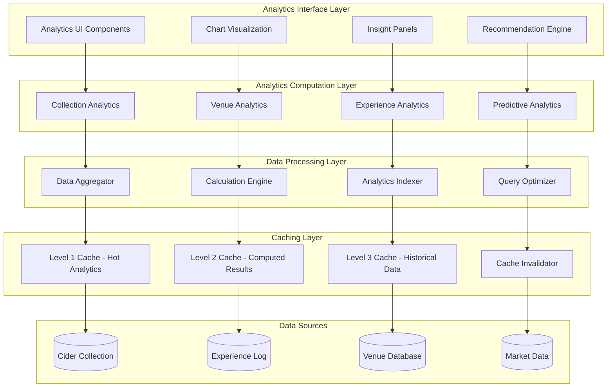

# Cider Dictionary: Analytics Architecture

## Executive Summary

The Analytics Architecture defines a comprehensive real-time analytics computation system for the Cider Dictionary application, implementing advanced calculation patterns for collection insights, venue analytics, and user intelligence. Built upon the offline-first foundation, this architecture provides sub-200ms analytics generation while supporting complex computations like collection completeness scoring, gap analysis, venue price intelligence, and predictive recommendations.

## Analytics Architecture Principles

### 1. Real-Time Computation Strategy
- **Instant Insights**: Analytics calculations complete within 200ms response target
- **Progressive Disclosure**: Basic analytics load immediately, detailed insights follow progressively
- **Intelligent Caching**: Multi-tier caching with automatic invalidation and refresh
- **Background Processing**: Heavy computations execute in background with immediate provisional results

### 2. Multi-Dimensional Analytics
- **Collection Analytics**: Completeness scoring, diversity analysis, gap identification
- **Venue Analytics**: Price intelligence, deal detection, market analysis
- **Experience Analytics**: Personal patterns, taste profile evolution, spending insights
- **Predictive Analytics**: Recommendation generation, trend prediction, goal tracking

### 3. Scalable Computation Patterns
- **Incremental Updates**: Differential calculations minimize computation overhead
- **Parallel Processing**: Multi-threaded computation with Web Workers for heavy analysis
- **Adaptive Precision**: Calculation complexity adapts to data size and device capability
- **Temporal Optimization**: Time-based caching and calculation scheduling

## Analytics System Architecture



## Collection Analytics Engine

### 1. Real-Time Collection Completeness
```typescript
interface CollectionMetrics {
  totalCiders: number;
  uniqueProducers: number;
  uniqueStyles: number;
  uniqueRegions: number;
  averageRating: number;
  completenessScore: number;
  diversityIndex: number;
  collectionValue: number;
  lastAnalyzed: Date;
}

interface GapAnalysis {
  missingProducers: Producer[];
  missingStyles: CiderStyle[];
  missingRegions: Region[];
  suggestedTargets: CollectionTarget[];
  priorityScore: number;
  recommendations: string[];
}

class CollectionAnalyticsEngine {
  private calculationCache: AnalyticsCache;
  private incrementalCalculator: IncrementalCalculator;
  private diversityAnalyzer: DiversityAnalyzer;
  private gapAnalyzer: GapAnalyzer;

  // Real-time collection metrics calculation
  async calculateCollectionMetrics(userId: string): Promise<CollectionMetrics> {
    const cacheKey = `collection_metrics:${userId}`;

    // Check cache first for sub-200ms response
    const cached = await this.calculationCache.get(cacheKey);
    if (cached && this.isCacheValid(cached)) {
      return cached.data;
    }

    // Get user's cider collection
    const userCiders = await this.getCiderCollection(userId);

    // Parallel calculation of metrics components
    const [
      basicMetrics,
      completenessScore,
      diversityIndex,
      collectionValue
    ] = await Promise.all([
      this.calculateBasicMetrics(userCiders),
      this.calculateCompletenessScore(userCiders),
      this.calculateDiversityIndex(userCiders),
      this.calculateCollectionValue(userCiders),
    ]);

    const metrics: CollectionMetrics = {
      ...basicMetrics,
      completenessScore,
      diversityIndex,
      collectionValue,
      lastAnalyzed: new Date(),
    };

    // Cache with intelligent TTL
    await this.calculationCache.set(cacheKey, metrics, this.calculateTTL(metrics));

    return metrics;
  }

  // Advanced completeness scoring algorithm
  private async calculateCompletenessScore(ciders: CiderRecord[]): Promise<number> {
    // Multi-dimensional completeness calculation
    const weights = {
      producer: 0.3,
      style: 0.25,
      region: 0.2,
      specific: 0.15,
      quality: 0.1,
    };

    // Parallel dimension calculations
    const [
      producerScore,
      styleScore,
      regionScore,
      specificScore,
      qualityScore
    ] = await Promise.all([
      this.calculateProducerCoverage(ciders),
      this.calculateStyleCoverage(ciders),
      this.calculateRegionCoverage(ciders),
      this.calculateSpecificCoverage(ciders),
      this.calculateQualityCoverage(ciders),
    ]);

    // Weighted combination with diminishing returns
    const totalScore =
      (producerScore * weights.producer) +
      (styleScore * weights.style) +
      (regionScore * weights.region) +
      (specificScore * weights.specific) +
      (qualityScore * weights.quality);

    return Math.min(totalScore, 100.0);
  }

  // Intelligent diversity analysis
  private async calculateDiversityIndex(ciders: CiderRecord[]): Promise<number> {
    // Shannon diversity index across multiple dimensions
    const styleEntropy = this.calculateEntropy(
      this.countDistribution(ciders, 'styleId')
    );

    const producerEntropy = this.calculateEntropy(
      this.countDistribution(ciders, 'producerId')
    );

    const regionEntropy = this.calculateEntropy(
      this.countDistribution(ciders, 'regionId')
    );

    // Weighted combination of entropies
    const weights = { style: 0.4, producer: 0.35, region: 0.25 };

    const combinedEntropy =
      (styleEntropy * weights.style) +
      (producerEntropy * weights.producer) +
      (regionEntropy * weights.region);

    // Normalize to 0-100 scale
    const maxPossibleEntropy = this.calculateMaxEntropy(ciders.length);
    return (combinedEntropy / maxPossibleEntropy) * 100;
  }

  // Predictive gap analysis
  async performGapAnalysis(userId: string, targetLevel: 'beginner' | 'intermediate' | 'expert'): Promise<GapAnalysis> {
    const userCiders = await this.getCiderCollection(userId);
    const userPreferences = await this.analyzeUserPreferences(userCiders);

    // Parallel gap identification
    const [
      missingProducers,
      missingStyles,
      missingRegions,
      suggestedTargets
    ] = await Promise.all([
      this.identifyMissingProducers(userCiders, userPreferences, targetLevel),
      this.identifyMissingStyles(userCiders, userPreferences, targetLevel),
      this.identifyMissingRegions(userCiders, userPreferences, targetLevel),
      this.generateCollectionTargets(userCiders, userPreferences, targetLevel),
    ]);

    const priorityScore = this.calculateGapPriority(
      { missingProducers, missingStyles, missingRegions },
      userCiders.length
    );

    return {
      missingProducers,
      missingStyles,
      missingRegions,
      suggestedTargets,
      priorityScore,
      recommendations: await this.generateGapRecommendations(suggestedTargets),
    };
  }

  // Incremental calculation optimization
  private async optimizeIncrementalCalculation(
    userId: string,
    changes: DataChange[]
  ): Promise<void> {
    const currentMetrics = await this.getLastCalculatedMetrics(userId);

    if (!currentMetrics) {
      // Full calculation required
      await this.calculateCollectionMetrics(userId);
      return;
    }

    // Determine if incremental update is possible
    const incrementalPossible = this.canCalculateIncrementally(changes);

    if (incrementalPossible) {
      const updatedMetrics = await this.calculateIncrementalUpdate(
        currentMetrics,
        changes
      );

      await this.updateCachedMetrics(userId, updatedMetrics);
    } else {
      // Full recalculation needed
      await this.calculateCollectionMetrics(userId);
    }
  }
}
```

### 2. Advanced User Preference Analysis
```typescript
interface UserPreferences {
  preferredStyles: StylePreference[];
  preferredProducers: ProducerPreference[];
  preferredRegions: RegionPreference[];
  preferredABVRange: ABVRange;
  flavorProfile: FlavorProfile;
  priceSensitivity: PriceSensitivity;
  qualityThreshold: number;
  adventurousness: number; // 0-100 scale
}

interface TasteProfile {
  sweetness: number;      // 0-100 scale
  tartness: number;       // 0-100 scale
  bitterness: number;     // 0-100 scale
  funkiness: number;      // 0-100 scale
  complexity: number;     // 0-100 scale
  confidence: number;     // Confidence in profile accuracy
}

class UserPreferenceAnalyzer {
  private tasteModelEngine: TasteModelEngine;
  private preferenceTracker: PreferenceTracker;
  private evolutionAnalyzer: EvolutionAnalyzer;

  // Dynamic preference analysis
  async analyzeUserPreferences(ciders: CiderRecord[]): Promise<UserPreferences> {
    const ratedCiders = ciders.filter(c => c.overallRating !== null);

    if (ratedCiders.length < 5) {
      return this.inferPreferencesFromCollection(ciders);
    }

    // High-rated ciders (4+ stars) reveal preferences
    const highRatedCiders = ratedCiders.filter(c => c.overallRating >= 4.0);

    // Parallel preference analysis
    const [
      stylePreferences,
      producerPreferences,
      regionPreferences,
      abvPreferences,
      flavorProfile,
      priceSensitivity
    ] = await Promise.all([
      this.analyzeStylePreferences(highRatedCiders),
      this.analyzeProducerPreferences(highRatedCiders),
      this.analyzeRegionPreferences(highRatedCiders),
      this.analyzeABVPreferences(highRatedCiders),
      this.analyzeFlavorPreferences(highRatedCiders),
      this.analyzePriceSensitivity(ratedCiders),
    ]);

    return {
      preferredStyles: stylePreferences,
      preferredProducers: producerPreferences,
      preferredRegions: regionPreferences,
      preferredABVRange: abvPreferences,
      flavorProfile,
      priceSensitivity,
      qualityThreshold: this.calculateQualityThreshold(ratedCiders),
      adventurousness: this.calculateAdventurousness(ciders),
    };
  }

  // Machine learning taste profile
  private async analyzeFlavorPreferences(ciders: CiderRecord[]): Promise<FlavorProfile> {
    const tasteVectors = await this.extractTasteVectors(ciders);
    const preferenceModel = await this.tasteModelEngine.trainModel(tasteVectors);

    return {
      sweetness: preferenceModel.predict('sweetness'),
      tartness: preferenceModel.predict('tartness'),
      bitterness: preferenceModel.predict('bitterness'),
      funkiness: preferenceModel.predict('funkiness'),
      complexity: preferenceModel.predict('complexity'),
      confidence: preferenceModel.getConfidence(),
    };
  }

  // Preference evolution tracking
  async trackPreferenceEvolution(userId: string): Promise<PreferenceEvolution> {
    const historicalPreferences = await this.getHistoricalPreferences(userId);

    if (historicalPreferences.length < 2) {
      return { evolution: 'insufficient_data', trends: [] };
    }

    const trends = this.evolutionAnalyzer.analyzeTrends(historicalPreferences);

    return {
      evolution: this.classifyEvolutionPattern(trends),
      trends,
      predictions: await this.predictFuturePreferences(trends),
      recommendations: this.generateEvolutionRecommendations(trends),
    };
  }
}
```

## Venue Analytics Engine

### 1. Real-Time Price Intelligence
```typescript
interface VenueAnalytics {
  venueId: string;
  priceCompetitiveness: number;
  averagePrice: number;
  priceRange: PriceRange;
  diversityScore: number;
  valueRating: number;
  inventoryFreshness: number;
  dealCount: number;
  lastAnalyzed: Date;
}

interface PriceHeatMap {
  regionId: string;
  styleId: string;
  priceData: PricePoint[];
  averagePrice: number;
  medianPrice: number;
  priceDeviation: number;
  confidence: number;
  lastUpdated: Date;
}

class VenueAnalyticsEngine {
  private priceAnalyzer: PriceAnalyzer;
  private marketAnalyzer: MarketAnalyzer;
  private dealDetector: DealDetector;
  private heatMapGenerator: HeatMapGenerator;

  // Real-time venue analysis
  async analyzeVenue(venueId: string): Promise<VenueAnalytics> {
    const cacheKey = `venue_analytics:${venueId}`;

    // Fast cache lookup
    const cached = await this.calculationCache.get(cacheKey);
    if (cached && this.isCacheValid(cached)) {
      return cached.data;
    }

    const venueCiders = await this.getVenueCiders(venueId);

    if (venueCiders.length === 0) {
      return this.createEmptyAnalytics(venueId);
    }

    // Parallel analytics calculation
    const [
      priceMetrics,
      diversityScore,
      competitiveness,
      freshness,
      valueRating,
      dealCount
    ] = await Promise.all([
      this.calculatePriceMetrics(venueCiders),
      this.calculateDiversityScore(venueCiders),
      this.calculatePriceCompetitiveness(venueCiders, venueId),
      this.calculateInventoryFreshness(venueCiders),
      this.calculateValueRating(venueCiders),
      this.countDeals(venueId),
    ]);

    const analytics: VenueAnalytics = {
      venueId,
      priceCompetitiveness: competitiveness,
      averagePrice: priceMetrics.average,
      priceRange: priceMetrics.range,
      diversityScore,
      valueRating,
      inventoryFreshness: freshness,
      dealCount,
      lastAnalyzed: new Date(),
    };

    // Cache with venue-specific TTL
    await this.calculationCache.set(cacheKey, analytics, this.calculateVenueTTL(analytics));

    return analytics;
  }

  // Dynamic price competitiveness calculation
  private async calculatePriceCompetitiveness(
    venueCiders: VenueCider[],
    venueId: string
  ): Promise<number> {
    const venue = await this.getVenue(venueId);
    let competitivePrices = 0;
    let totalComparisons = 0;

    // Parallel market price lookups
    const marketPricePromises = venueCiders
      .filter(c => c.price !== null)
      .map(async cider => {
        const marketPrice = await this.marketAnalyzer.getMarketAveragePrice(
          cider.ciderId,
          venue.regionId
        );

        return { cider, marketPrice };
      });

    const marketPrices = await Promise.all(marketPricePromises);

    for (const { cider, marketPrice } of marketPrices) {
      if (marketPrice !== null) {
        totalComparisons++;

        if (cider.price <= marketPrice) {
          competitivePrices++;
        } else {
          // Partial credit for prices within 10% of market
          const priceDiff = (cider.price - marketPrice) / marketPrice;
          if (priceDiff <= 0.1) {
            competitivePrices += 0.5;
          }
        }
      }
    }

    return totalComparisons === 0 ? 50.0 : (competitivePrices / totalComparisons) * 100;
  }

  // Heat map generation for price analysis
  async generatePriceHeatMap(regionId: string, styleId: string): Promise<PriceHeatMap> {
    const cacheKey = `heatmap:${regionId}:${styleId}`;

    const cached = await this.calculationCache.get(cacheKey);
    if (cached && this.isHeatMapCacheValid(cached)) {
      return cached.data;
    }

    // Gather regional price data
    const venues = await this.getVenuesByRegion(regionId);
    const priceDataPromises = venues.map(async venue => {
      const venueCiders = await this.getVenueCidersByStyle(venue.id, styleId);
      return this.extractPricePoints(venue, venueCiders);
    });

    const allPriceData = (await Promise.all(priceDataPromises)).flat();
    const validPriceData = allPriceData.filter(point => this.validatePricePoint(point));

    if (validPriceData.length < 3) {
      return this.createEmptyHeatMap(regionId, styleId);
    }

    const prices = validPriceData.map(point => point.pricePerML);

    const heatMap: PriceHeatMap = {
      regionId,
      styleId,
      priceData: validPriceData,
      averagePrice: this.calculateAverage(prices),
      medianPrice: this.calculateMedian(prices),
      priceDeviation: this.calculateStandardDeviation(prices),
      confidence: this.calculateConfidenceLevel(validPriceData.length),
      lastUpdated: new Date(),
    };

    // Cache heat map with longer TTL
    await this.calculationCache.set(cacheKey, heatMap, 6 * 60 * 60 * 1000); // 6 hours

    return heatMap;
  }

  // Advanced deal detection algorithm
  async identifyBestDeals(regionId: string, userId: string): Promise<CiderDeal[]> {
    const userPreferences = await this.getUserPreferences(userId);
    const venues = await this.getVenuesByRegion(regionId);

    const dealPromises = venues.map(async venue => {
      return await this.analyzeVenueDeals(venue, userPreferences);
    });

    const allDeals = (await Promise.all(dealPromises)).flat();

    // Score and rank deals
    const scoredDeals = await Promise.all(
      allDeals.map(async deal => ({
        ...deal,
        score: await this.calculateDealScore(deal, userPreferences),
      }))
    );

    // Return top deals sorted by score
    return scoredDeals
      .filter(deal => deal.dealQuality !== 'poor')
      .sort((a, b) => b.score - a.score)
      .slice(0, 20);
  }

  // Intelligent deal scoring
  private async calculateDealScore(deal: CiderDeal, preferences: UserPreferences): Promise<number> {
    let score = deal.savingsPercentage; // Base score from savings

    // Bonus for preferred styles
    if (preferences.preferredStyles.some(style => style.id === deal.cider.styleId)) {
      score += 20;
    }

    // Bonus for preferred producers
    if (preferences.preferredProducers.some(producer => producer.id === deal.cider.producerId)) {
      score += 15;
    }

    // Penalty for outside ABV preference
    const abvInRange = deal.cider.abv >= preferences.preferredABVRange.min &&
                      deal.cider.abv <= preferences.preferredABVRange.max;
    if (!abvInRange) {
      score -= 10;
    }

    // Bonus for high-quality ciders
    if (deal.cider.averageRating >= 4.0) {
      score += 10;
    }

    return Math.max(0, score);
  }
}
```

### 2. Market Intelligence System
```typescript
interface MarketAnalysis {
  regionId: string;
  styleId: string;
  averagePrice: number;
  priceRange: PriceRange;
  topVenues: VenueRanking[];
  priceLeaders: VenueRanking[];
  qualityLeaders: VenueRanking[];
  marketTrends: PriceTrend[];
  recommendations: MarketRecommendation[];
}

class MarketIntelligenceEngine {
  private trendAnalyzer: TrendAnalyzer;
  private competitiveAnalyzer: CompetitiveAnalyzer;
  private forecastEngine: ForecastEngine;

  // Comprehensive market analysis
  async analyzeMarket(regionId: string, styleId: string): Promise<MarketAnalysis> {
    const venues = await this.getVenuesByRegion(regionId);

    // Parallel market data collection
    const [
      priceAnalysis,
      venueRankings,
      trendAnalysis,
      competitiveAnalysis
    ] = await Promise.all([
      this.analyzePriceMetrics(venues, styleId),
      this.rankVenues(venues, styleId),
      this.trendAnalyzer.analyzeTrends(regionId, styleId, 365), // 1 year
      this.competitiveAnalyzer.analyzeCompetition(venues, styleId),
    ]);

    const recommendations = await this.generateMarketRecommendations(
      priceAnalysis,
      venueRankings,
      trendAnalysis
    );

    return {
      regionId,
      styleId,
      averagePrice: priceAnalysis.average,
      priceRange: priceAnalysis.range,
      topVenues: venueRankings.overall,
      priceLeaders: venueRankings.price,
      qualityLeaders: venueRankings.quality,
      marketTrends: trendAnalysis.trends,
      recommendations,
    };
  }

  // Predictive price forecasting
  async forecastPriceTrends(
    regionId: string,
    styleId: string,
    forecastDays: number = 90
  ): Promise<PriceForecast[]> {
    const historicalData = await this.getHistoricalPriceData(regionId, styleId, 365);

    if (historicalData.length < 30) {
      return []; // Insufficient data for reliable forecasting
    }

    // Multiple forecasting models for accuracy
    const [
      linearForecast,
      exponentialForecast,
      seasonalForecast,
      mlForecast
    ] = await Promise.all([
      this.forecastEngine.linearRegression(historicalData, forecastDays),
      this.forecastEngine.exponentialSmoothing(historicalData, forecastDays),
      this.forecastEngine.seasonalDecomposition(historicalData, forecastDays),
      this.forecastEngine.machineLearning(historicalData, forecastDays),
    ]);

    // Ensemble forecasting for improved accuracy
    return this.combineForecasts([
      linearForecast,
      exponentialForecast,
      seasonalForecast,
      mlForecast,
    ]);
  }
}
```

## Experience Analytics Engine

### 1. Personal Analytics Generation
```typescript
interface PersonalAnalytics {
  totalExperiences: number;
  averageRating: number;
  totalSpent: number;
  averagePricePerML: number;
  favoriteStyles: StyleAnalytics[];
  favoriteVenues: VenueAnalytics[];
  spendingTrends: SpendingTrend[];
  tastingPatterns: TastingPattern[];
  achievementProgress: AchievementProgress[];
}

interface TastingPattern {
  pattern: string;
  frequency: number;
  confidence: number;
  description: string;
  recommendations: string[];
}

class ExperienceAnalyticsEngine {
  private patternDetector: PatternDetector;
  private spendingAnalyzer: SpendingAnalyzer;
  private achievementTracker: AchievementTracker;
  private trendAnalyzer: PersonalTrendAnalyzer;

  // Comprehensive personal analytics
  async generatePersonalAnalytics(userId: string): Promise<PersonalAnalytics> {
    const experiences = await this.getUserExperiences(userId);

    if (experiences.length === 0) {
      return this.createEmptyAnalytics(userId);
    }

    // Parallel analytics computation
    const [
      basicMetrics,
      favoriteStyles,
      favoriteVenues,
      spendingTrends,
      tastingPatterns,
      achievementProgress
    ] = await Promise.all([
      this.calculateBasicMetrics(experiences),
      this.analyzeFavoriteStyles(experiences),
      this.analyzeFavoriteVenues(experiences),
      this.spendingAnalyzer.analyzeTrends(experiences),
      this.patternDetector.detectPatterns(experiences),
      this.achievementTracker.calculateProgress(userId, experiences),
    ]);

    return {
      ...basicMetrics,
      favoriteStyles,
      favoriteVenues,
      spendingTrends,
      tastingPatterns,
      achievementProgress,
    };
  }

  // Advanced pattern detection
  private async detectTastingPatterns(experiences: Experience[]): Promise<TastingPattern[]> {
    const patterns: TastingPattern[] = [];

    // Temporal patterns
    const temporalPatterns = await this.detectTemporalPatterns(experiences);
    patterns.push(...temporalPatterns);

    // Venue patterns
    const venuePatterns = await this.detectVenuePatterns(experiences);
    patterns.push(...venuePatterns);

    // Style evolution patterns
    const stylePatterns = await this.detectStyleEvolutionPatterns(experiences);
    patterns.push(...stylePatterns);

    // Social patterns
    const socialPatterns = await this.detectSocialPatterns(experiences);
    patterns.push(...socialPatterns);

    // Price patterns
    const pricePatterns = await this.detectPricePatterns(experiences);
    patterns.push(...pricePatterns);

    return patterns.sort((a, b) => b.confidence - a.confidence);
  }

  // Spending behavior analysis
  private async analyzeSpendingTrends(experiences: Experience[]): Promise<SpendingTrend[]> {
    const paidExperiences = experiences.filter(e => e.price !== null);

    if (paidExperiences.length < 5) {
      return [];
    }

    // Monthly spending analysis
    const monthlySpending = this.groupByMonth(paidExperiences);
    const monthlyTrends = this.calculateTrendDirection(monthlySpending);

    // Venue spending analysis
    const venueSpending = this.groupByVenue(paidExperiences);
    const venuePreferences = this.analyzeVenueSpendingPreferences(venueSpending);

    // Price sensitivity analysis
    const priceSensitivity = this.analyzePriceSensitivity(paidExperiences);

    return [
      {
        type: 'monthly_spending',
        trend: monthlyTrends.direction,
        data: monthlySpending,
        insights: this.generateSpendingInsights(monthlyTrends),
      },
      {
        type: 'venue_preferences',
        trend: 'stable',
        data: venuePreferences,
        insights: this.generateVenueSpendingInsights(venuePreferences),
      },
      {
        type: 'price_sensitivity',
        trend: priceSensitivity.trend,
        data: priceSensitivity.data,
        insights: this.generatePriceSensitivityInsights(priceSensitivity),
      },
    ];
  }
}
```

## Predictive Analytics Engine

### 1. Recommendation System
```typescript
interface RecommendationEngine {
  personalizedRecommendations: PersonalizedRecommendation[];
  collectionTargets: CollectionTarget[];
  venueRecommendations: VenueRecommendation[];
  experienceRecommendations: ExperienceRecommendation[];
}

class PredictiveAnalyticsEngine {
  private mlEngine: MachineLearningEngine;
  private collaborativeFilter: CollaborativeFilter;
  private contentBasedFilter: ContentBasedFilter;
  private hybridRecommender: HybridRecommender;

  // Multi-algorithm recommendation generation
  async generateRecommendations(userId: string): Promise<RecommendationEngine> {
    const userProfile = await this.buildUserProfile(userId);

    // Parallel recommendation generation
    const [
      personalizedRecs,
      collectionTargets,
      venueRecs,
      experienceRecs
    ] = await Promise.all([
      this.generatePersonalizedRecommendations(userProfile),
      this.generateCollectionTargets(userProfile),
      this.generateVenueRecommendations(userProfile),
      this.generateExperienceRecommendations(userProfile),
    ]);

    return {
      personalizedRecommendations: personalizedRecs,
      collectionTargets,
      venueRecommendations: venueRecs,
      experienceRecommendations: experienceRecs,
    };
  }

  // Advanced personalized recommendations
  private async generatePersonalizedRecommendations(
    userProfile: UserProfile
  ): Promise<PersonalizedRecommendation[]> {
    // Multiple recommendation algorithms
    const [
      collaborativeRecs,
      contentBasedRecs,
      hybridRecs,
      trendingRecs
    ] = await Promise.all([
      this.collaborativeFilter.recommend(userProfile),
      this.contentBasedFilter.recommend(userProfile),
      this.hybridRecommender.recommend(userProfile),
      this.generateTrendingRecommendations(userProfile),
    ]);

    // Combine and score recommendations
    const allRecommendations = [
      ...collaborativeRecs,
      ...contentBasedRecs,
      ...hybridRecs,
      ...trendingRecs,
    ];

    return this.rankAndDeduplicateRecommendations(allRecommendations, userProfile);
  }

  // Machine learning-based taste prediction
  private async predictTasteCompatibility(
    user: UserProfile,
    cider: CiderRecord
  ): Promise<number> {
    const features = this.extractFeatures(user, cider);
    const compatibility = await this.mlEngine.predict('taste_compatibility', features);

    return compatibility;
  }

  // Collaborative filtering implementation
  private async findSimilarUsers(userProfile: UserProfile): Promise<UserProfile[]> {
    const allUsers = await this.getAllUserProfiles();

    // Calculate user similarity based on ratings and preferences
    const similarities = await Promise.all(
      allUsers.map(async otherUser => ({
        user: otherUser,
        similarity: await this.calculateUserSimilarity(userProfile, otherUser),
      }))
    );

    return similarities
      .filter(s => s.similarity > 0.6) // Minimum similarity threshold
      .sort((a, b) => b.similarity - a.similarity)
      .slice(0, 20) // Top 20 similar users
      .map(s => s.user);
  }
}
```

### 2. Goal Tracking and Achievement System
```typescript
interface AchievementSystem {
  categories: AchievementCategory[];
  userProgress: UserAchievementProgress;
  recommendations: AchievementRecommendation[];
  milestones: Milestone[];
}

class AchievementAnalyticsEngine {
  private achievementCalculator: AchievementCalculator;
  private progressTracker: ProgressTracker;
  private milestoneGenerator: MilestoneGenerator;

  // Comprehensive achievement analysis
  async analyzeAchievements(userId: string): Promise<AchievementSystem> {
    const userCollection = await this.getUserCollection(userId);
    const userExperiences = await this.getUserExperiences(userId);

    // Parallel achievement calculation
    const [
      achievements,
      progress,
      recommendations,
      milestones
    ] = await Promise.all([
      this.calculateAllAchievements(userId, userCollection, userExperiences),
      this.trackProgress(userId),
      this.generateAchievementRecommendations(userId),
      this.generateMilestones(userId, userCollection),
    ]);

    return {
      categories: this.categorizeAchievements(achievements),
      userProgress: progress,
      recommendations,
      milestones,
    };
  }

  // Dynamic achievement calculation
  private async calculateAllAchievements(
    userId: string,
    collection: CiderRecord[],
    experiences: Experience[]
  ): Promise<Achievement[]> {
    const achievements: Achievement[] = [];

    // Collection size achievements
    achievements.push(...this.calculateCollectionSizeAchievements(collection));

    // Diversity achievements
    achievements.push(...this.calculateDiversityAchievements(collection));

    // Quality achievements
    achievements.push(...this.calculateQualityAchievements(collection));

    // Exploration achievements
    achievements.push(...this.calculateExplorationAchievements(experiences));

    // Social achievements
    achievements.push(...this.calculateSocialAchievements(experiences));

    // Special achievements
    achievements.push(...this.calculateSpecialAchievements(collection, experiences));

    return achievements.filter(a => a.progress > 0);
  }

  // Predictive milestone generation
  private async generateMilestones(
    userId: string,
    collection: CiderRecord[]
  ): Promise<Milestone[]> {
    const userBehavior = await this.analyzeUserBehavior(userId);
    const growthRate = this.calculateGrowthRate(collection);

    const milestones: Milestone[] = [];

    // Next collection milestone
    const nextCollectionMilestone = this.calculateNextCollectionMilestone(collection.length);
    if (nextCollectionMilestone) {
      const estimatedTime = this.estimateTimeToMilestone(
        collection.length,
        nextCollectionMilestone.target,
        growthRate
      );

      milestones.push({
        ...nextCollectionMilestone,
        estimatedCompletion: estimatedTime,
      });
    }

    // Style exploration milestones
    const styleProgress = this.calculateStyleExplorationProgress(collection);
    const nextStyleMilestone = this.calculateNextStyleMilestone(styleProgress);
    if (nextStyleMilestone) {
      milestones.push(nextStyleMilestone);
    }

    // Quality milestones
    const qualityProgress = this.calculateQualityProgress(collection);
    const nextQualityMilestone = this.calculateNextQualityMilestone(qualityProgress);
    if (nextQualityMilestone) {
      milestones.push(nextQualityMilestone);
    }

    return milestones;
  }
}
```

## Performance Optimization for Analytics

### 1. Intelligent Caching Strategy
```typescript
class AnalyticsCacheManager {
  private l1Cache: LRUCache; // 1MB - Hot analytics (recently accessed)
  private l2Cache: LFUCache; // 5MB - Warm analytics (frequently accessed)
  private l3Cache: DiskCache; // 50MB - Cold analytics (historical data)

  // Adaptive caching based on analytics type
  async cacheAnalytics(
    key: string,
    data: any,
    analyticsType: AnalyticsType
  ): Promise<void> {
    const ttl = this.calculateTTL(analyticsType, data);
    const cacheLevel = this.determineCacheLevel(analyticsType, data);

    switch (cacheLevel) {
      case 1:
        await this.l1Cache.set(key, data, ttl);
        break;
      case 2:
        await this.l2Cache.set(key, data, ttl);
        break;
      case 3:
        await this.l3Cache.set(key, data, ttl);
        break;
    }
  }

  // Intelligent cache warming
  async warmCache(userId: string): Promise<void> {
    const userBehavior = await this.analyzeUserBehavior(userId);

    // Predict likely analytics requests
    const predictions = this.predictAnalyticsRequests(userBehavior);

    for (const prediction of predictions) {
      if (prediction.confidence > 0.7) {
        await this.precomputeAnalytics(prediction.analyticsType, prediction.parameters);
      }
    }
  }

  // Cache invalidation strategy
  async invalidateRelevantCache(change: DataChange): Promise<void> {
    const affectedKeys = this.calculateAffectedCacheKeys(change);

    for (const key of affectedKeys) {
      await this.invalidateCacheKey(key);
    }

    // Trigger background recomputation for critical analytics
    await this.scheduleBackgroundRecomputation(affectedKeys);
  }
}
```

### 2. Progressive Analytics Loading
```typescript
class ProgressiveAnalyticsLoader {
  // Load analytics in progressive complexity
  async loadAnalyticsProgressively(
    userId: string,
    analyticsType: AnalyticsType
  ): Promise<ProgressiveAnalyticsResponse> {
    // Phase 1: Immediate basic metrics (< 50ms)
    const basicMetrics = await this.loadBasicMetrics(userId, analyticsType);

    // Phase 2: Computed analytics (< 200ms)
    const computedAnalytics = await this.loadComputedAnalytics(userId, analyticsType);

    // Phase 3: Advanced insights (background)
    this.loadAdvancedInsights(userId, analyticsType);

    return {
      basic: basicMetrics,
      computed: computedAnalytics,
      advanced: null, // Will be provided via callback
    };
  }

  // Background computation with progress updates
  private async loadAdvancedInsights(
    userId: string,
    analyticsType: AnalyticsType
  ): Promise<void> {
    const insights = await this.computeAdvancedInsights(userId, analyticsType);

    // Notify UI of advanced insights availability
    this.notifyInsightsReady(userId, analyticsType, insights);
  }
}
```

This comprehensive analytics architecture provides real-time computation capabilities while maintaining the sub-200ms response target through intelligent caching, progressive loading, and optimized calculation algorithms that scale efficiently with collection size and complexity.