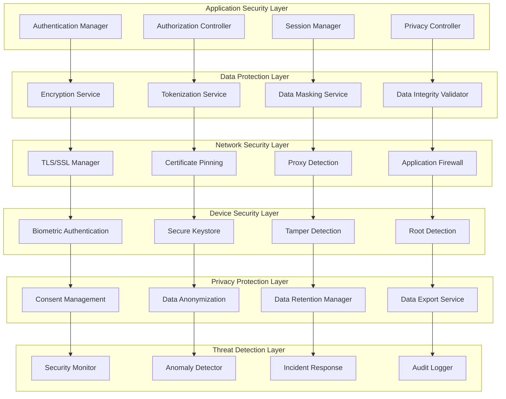

# Cider Dictionary: Security Architecture Patterns

## Executive Summary

The Security Architecture Patterns document defines comprehensive security and privacy protection strategies for the Cider Dictionary React Native application. Built upon the offline-first and Firebase integration foundations, this architecture implements advanced mobile security patterns, data protection mechanisms, privacy compliance frameworks, and threat detection systems to ensure user data security and regulatory compliance while maintaining the performance targets and user experience goals.

## Security Architecture Principles

### 1. Privacy-First Design
- **Data Minimization**: Collect only essential data required for application functionality
- **Purpose Limitation**: Use collected data solely for stated purposes and user benefit
- **Transparency**: Clear disclosure of data collection, processing, and sharing practices
- **User Control**: Comprehensive user control over personal data and privacy settings

### 2. Defense in Depth Strategy
- **Multiple Security Layers**: Redundant security controls throughout the application stack
- **Fail-Safe Defaults**: Secure-by-default configurations and fallback mechanisms
- **Least Privilege Access**: Minimal permissions required for each component and operation
- **Continuous Monitoring**: Real-time threat detection and security event monitoring

### 3. Compliance-Driven Architecture
- **GDPR Compliance**: Full European data protection regulation compliance
- **CCPA Compliance**: California Consumer Privacy Act adherence
- **Mobile Security Standards**: OWASP Mobile Top 10 mitigation strategies
- **Industry Best Practices**: Implementation of security frameworks and standards

## Security Architecture Overview



## Authentication and Authorization Architecture

### 1. Multi-Factor Authentication System
```typescript
interface AuthenticationStrategy {
  factors: AuthenticationFactor[];
  policies: AuthenticationPolicy[];
  recovery: AccountRecoveryOptions;
  session: SessionManagement;
}

interface AuthenticationFactor {
  type: 'password' | 'biometric' | 'device' | 'email' | 'sms';
  required: boolean;
  fallback?: AuthenticationFactor;
  configuration: FactorConfiguration;
}

class SecureAuthenticationManager {
  private biometricAuth: BiometricAuthenticator;
  private deviceAuth: DeviceAuthenticator;
  private passwordManager: SecurePasswordManager;
  private sessionManager: SecureSessionManager;

  // Multi-factor authentication orchestration
  async authenticateUser(credentials: AuthenticationCredentials): Promise<AuthenticationResult> {
    const authFlow = await this.determineAuthenticationFlow(credentials);

    // Primary authentication factor
    const primaryResult = await this.authenticatePrimaryFactor(credentials, authFlow.primary);

    if (!primaryResult.success) {
      await this.handleAuthenticationFailure(primaryResult);
      throw new AuthenticationError('Primary authentication failed', primaryResult.reason);
    }

    // Secondary authentication factors (if required)
    if (authFlow.requiresSecondaryFactors) {
      const secondaryResult = await this.authenticateSecondaryFactors(
        credentials,
        authFlow.secondary
      );

      if (!secondaryResult.success) {
        await this.handleAuthenticationFailure(secondaryResult);
        throw new AuthenticationError('Secondary authentication failed', secondaryResult.reason);
      }
    }

    // Device trust evaluation
    const deviceTrust = await this.evaluateDeviceTrust(credentials.deviceInfo);

    if (deviceTrust.riskLevel > 0.7) {
      await this.requestAdditionalVerification(deviceTrust);
    }

    // Create secure session
    const session = await this.sessionManager.createSecureSession({
      userId: primaryResult.userId,
      deviceInfo: credentials.deviceInfo,
      authenticationFactors: authFlow.completedFactors,
      riskScore: deviceTrust.riskLevel,
    });

    return {
      success: true,
      session,
      requiresAdditionalSetup: await this.checkSecuritySetupRequirements(primaryResult.userId),
    };
  }

  // Biometric authentication implementation
  private async authenticateBiometric(
    biometricData: BiometricData
  ): Promise<BiometricAuthResult> {
    // Validate biometric capability
    const capability = await this.biometricAuth.checkCapability();

    if (!capability.available) {
      return {
        success: false,
        reason: 'biometric_unavailable',
        fallbackRequired: true,
      };
    }

    // Local biometric verification
    const verification = await this.biometricAuth.verifyBiometric(biometricData);

    if (!verification.success) {
      await this.handleBiometricFailure(verification);
      return {
        success: false,
        reason: 'biometric_mismatch',
        attemptsRemaining: verification.attemptsRemaining,
      };
    }

    // Additional security checks
    const securityChecks = await this.performBiometricSecurityChecks(biometricData);

    return {
      success: securityChecks.passed,
      confidence: verification.confidence,
      securityScore: securityChecks.score,
    };
  }

  // Device-based authentication
  private async authenticateDevice(deviceInfo: DeviceInfo): Promise<DeviceAuthResult> {
    // Device fingerprinting
    const fingerprint = await this.deviceAuth.generateDeviceFingerprint(deviceInfo);

    // Check device trust status
    const trustStatus = await this.deviceAuth.checkDeviceTrust(fingerprint);

    if (trustStatus.isBlacklisted) {
      return {
        success: false,
        reason: 'device_blacklisted',
        requiresManualReview: true,
      };
    }

    // Analyze device security posture
    const securityPosture = await this.analyzeDeviceSecurityPosture(deviceInfo);

    if (securityPosture.riskLevel > 0.8) {
      return {
        success: false,
        reason: 'device_compromised',
        securityIssues: securityPosture.issues,
      };
    }

    return {
      success: true,
      trustLevel: trustStatus.trustLevel,
      fingerprint,
      securityPosture,
    };
  }
}
```

### 2. Advanced Session Management
```typescript
interface SecureSession {
  sessionId: string;
  userId: string;
  deviceFingerprint: string;
  createdAt: Date;
  expiresAt: Date;
  lastActivityAt: Date;
  securityContext: SecurityContext;
  permissions: Permission[];
}

interface SecurityContext {
  riskScore: number;
  authenticationFactors: string[];
  deviceTrust: DeviceTrust;
  networkTrust: NetworkTrust;
  behaviorProfile: BehaviorProfile;
}

class SecureSessionManager {
  private sessionStore: EncryptedSessionStore;
  private riskAnalyzer: RiskAnalyzer;
  private behaviorAnalyzer: BehaviorAnalyzer;

  // Secure session creation with risk assessment
  async createSecureSession(sessionRequest: SessionRequest): Promise<SecureSession> {
    // Generate cryptographically secure session ID
    const sessionId = await this.generateSecureSessionId();

    // Analyze initial risk score
    const riskScore = await this.riskAnalyzer.calculateInitialRisk(sessionRequest);

    // Create security context
    const securityContext: SecurityContext = {
      riskScore,
      authenticationFactors: sessionRequest.authenticationFactors,
      deviceTrust: sessionRequest.deviceTrust,
      networkTrust: await this.analyzeNetworkTrust(),
      behaviorProfile: await this.behaviorAnalyzer.getBaseBehaviorProfile(sessionRequest.userId),
    };

    // Calculate session duration based on risk
    const sessionDuration = this.calculateSessionDuration(riskScore);

    const session: SecureSession = {
      sessionId,
      userId: sessionRequest.userId,
      deviceFingerprint: sessionRequest.deviceFingerprint,
      createdAt: new Date(),
      expiresAt: new Date(Date.now() + sessionDuration),
      lastActivityAt: new Date(),
      securityContext,
      permissions: await this.calculateSessionPermissions(sessionRequest.userId, riskScore),
    };

    // Store session securely
    await this.sessionStore.storeSession(session);

    // Initialize continuous monitoring
    await this.initializeContinuousMonitoring(session);

    return session;
  }

  // Continuous session security monitoring
  private async monitorSessionSecurity(session: SecureSession): Promise<void> {
    // Monitor for anomalous behavior
    const currentBehavior = await this.behaviorAnalyzer.analyzeCurrentBehavior(session.userId);
    const behaviorAnomaly = await this.detectBehaviorAnomaly(
      session.securityContext.behaviorProfile,
      currentBehavior
    );

    if (behaviorAnomaly.detected) {
      await this.handleBehaviorAnomaly(session, behaviorAnomaly);
    }

    // Monitor device security changes
    const currentDeviceState = await this.analyzeCurrentDeviceState();
    const deviceRiskChange = await this.detectDeviceRiskChange(
      session.securityContext.deviceTrust,
      currentDeviceState
    );

    if (deviceRiskChange.increased) {
      await this.handleDeviceRiskIncrease(session, deviceRiskChange);
    }

    // Monitor network security changes
    const currentNetworkState = await this.analyzeCurrentNetworkState();
    const networkRiskChange = await this.detectNetworkRiskChange(
      session.securityContext.networkTrust,
      currentNetworkState
    );

    if (networkRiskChange.increased) {
      await this.handleNetworkRiskIncrease(session, networkRiskChange);
    }

    // Update session risk score
    const updatedRiskScore = await this.riskAnalyzer.calculateCurrentRisk(session);
    await this.updateSessionRisk(session, updatedRiskScore);
  }

  // Dynamic session timeout based on risk
  private calculateSessionDuration(riskScore: number): number {
    const baseDuration = 24 * 60 * 60 * 1000; // 24 hours

    if (riskScore < 0.3) {
      return baseDuration; // Low risk: full duration
    } else if (riskScore < 0.6) {
      return baseDuration * 0.5; // Medium risk: 12 hours
    } else if (riskScore < 0.8) {
      return baseDuration * 0.25; // High risk: 6 hours
    } else {
      return baseDuration * 0.125; // Very high risk: 3 hours
    }
  }
}
```

## Data Protection and Encryption

### 1. Multi-Layer Encryption Strategy
```typescript
interface EncryptionConfiguration {
  algorithms: EncryptionAlgorithm[];
  keyManagement: KeyManagementStrategy;
  dataClassification: DataClassification[];
  encryptionPolicies: EncryptionPolicy[];
}

interface DataClassification {
  classification: 'public' | 'internal' | 'confidential' | 'restricted';
  dataTypes: string[];
  encryptionRequirement: EncryptionRequirement;
  retentionPolicy: RetentionPolicy;
}

class DataProtectionService {
  private encryptionEngine: EncryptionEngine;
  private keyManager: SecureKeyManager;
  private dataClassifier: DataClassifier;
  private integrityValidator: DataIntegrityValidator;

  // Comprehensive data protection implementation
  async protectData(data: any, context: DataContext): Promise<ProtectedData> {
    // Classify data sensitivity
    const classification = await this.dataClassifier.classifyData(data, context);

    // Determine encryption requirements
    const encryptionReq = this.getEncryptionRequirements(classification);

    // Apply data protection measures
    const protectedData = await this.applyDataProtection(data, encryptionReq);

    // Generate integrity validation
    const integrityHash = await this.integrityValidator.generateHash(protectedData);

    return {
      data: protectedData,
      classification,
      encryptionMetadata: encryptionReq.metadata,
      integrityHash,
      protectionTimestamp: new Date(),
    };
  }

  // Field-level encryption for sensitive data
  private async applyFieldLevelEncryption(
    data: Record<string, any>,
    encryptionMap: FieldEncryptionMap
  ): Promise<Record<string, any>> {
    const encryptedData = { ...data };

    for (const [field, encryptionConfig] of Object.entries(encryptionMap)) {
      if (data[field] !== undefined) {
        encryptedData[field] = await this.encryptField(data[field], encryptionConfig);
      }
    }

    return encryptedData;
  }

  // Advanced key management
  private async manageEncryptionKeys(dataType: string): Promise<EncryptionKey> {
    // Generate data-specific encryption key
    const dataKey = await this.keyManager.generateDataKey(dataType);

    // Encrypt data key with master key
    const encryptedDataKey = await this.keyManager.encryptDataKey(dataKey);

    // Store encrypted data key securely
    await this.keyManager.storeEncryptedKey(encryptedDataKey);

    // Set up key rotation schedule
    await this.keyManager.scheduleKeyRotation(dataKey, this.getKeyRotationInterval(dataType));

    return dataKey;
  }

  // Data anonymization for analytics
  async anonymizeDataForAnalytics(data: PersonalData): Promise<AnonymizedData> {
    const anonymizationConfig = await this.getAnonymizationConfig(data.type);

    // Apply k-anonymity
    const kAnonymized = await this.applyKAnonymity(data, anonymizationConfig.k);

    // Apply l-diversity
    const lDiversified = await this.applyLDiversity(kAnonymized, anonymizationConfig.l);

    // Apply t-closeness
    const tCloseness = await this.applyTCloseness(lDiversified, anonymizationConfig.t);

    // Remove direct identifiers
    const deidentified = await this.removeDirectIdentifiers(tCloseness);

    // Apply differential privacy
    const differentiallyPrivate = await this.applyDifferentialPrivacy(deidentified);

    return {
      data: differentiallyPrivate,
      anonymizationLevel: 'high',
      privacyGuarantees: {
        kAnonymity: anonymizationConfig.k,
        lDiversity: anonymizationConfig.l,
        tCloseness: anonymizationConfig.t,
        differentialPrivacy: true,
      },
      anonymizationTimestamp: new Date(),
    };
  }
}
```

### 2. Secure Local Storage Architecture
```typescript
interface SecureStorageConfiguration {
  encryptionAlgorithm: 'AES-256-GCM';
  keyDerivation: 'PBKDF2' | 'Argon2';
  keyIterations: number;
  integrityCheck: boolean;
  compressionEnabled: boolean;
}

class SecureLocalStorageManager {
  private encryptionService: LocalEncryptionService;
  private integrityService: IntegrityService;
  private keyManager: LocalKeyManager;

  // Secure data storage implementation
  async storeSecureData(
    key: string,
    data: any,
    storageClass: StorageClass
  ): Promise<void> {
    // Serialize data
    const serializedData = JSON.stringify(data);

    // Compress if enabled
    const processedData = storageClass.compressionEnabled
      ? await this.compressData(serializedData)
      : serializedData;

    // Generate encryption key for this data
    const encryptionKey = await this.keyManager.deriveKey(key, storageClass);

    // Encrypt data
    const encryptedData = await this.encryptionService.encrypt(processedData, encryptionKey);

    // Generate integrity hash
    const integrityHash = await this.integrityService.generateHash(encryptedData);

    // Store encrypted data with metadata
    const storageEntry: SecureStorageEntry = {
      encryptedData,
      integrityHash,
      storageClass,
      timestamp: Date.now(),
      version: 1,
    };

    await this.storeToDevice(key, storageEntry);
  }

  // Secure data retrieval with integrity verification
  async retrieveSecureData<T>(key: string, storageClass: StorageClass): Promise<T | null> {
    // Retrieve from device storage
    const storageEntry = await this.retrieveFromDevice(key);

    if (!storageEntry) {
      return null;
    }

    // Verify integrity
    const integrityValid = await this.integrityService.verifyHash(
      storageEntry.encryptedData,
      storageEntry.integrityHash
    );

    if (!integrityValid) {
      await this.handleIntegrityFailure(key, storageEntry);
      throw new IntegrityError('Data integrity verification failed');
    }

    // Derive decryption key
    const decryptionKey = await this.keyManager.deriveKey(key, storageClass);

    // Decrypt data
    const decryptedData = await this.encryptionService.decrypt(
      storageEntry.encryptedData,
      decryptionKey
    );

    // Decompress if needed
    const processedData = storageClass.compressionEnabled
      ? await this.decompressData(decryptedData)
      : decryptedData;

    // Parse and return
    return JSON.parse(processedData) as T;
  }

  // Secure data deletion with overwriting
  async secureDelete(key: string): Promise<void> {
    // Get current storage entry
    const storageEntry = await this.retrieveFromDevice(key);

    if (storageEntry) {
      // Overwrite with random data multiple times
      await this.secureOverwrite(key, 3);

      // Remove from device storage
      await this.removeFromDevice(key);

      // Clear related keys
      await this.keyManager.clearKey(key);

      // Log secure deletion
      await this.auditLogger.logSecureDeletion(key);
    }
  }
}
```

## Privacy Protection Framework

### 1. GDPR Compliance Implementation
```typescript
interface GDPRCompliance {
  consentManagement: ConsentManager;
  dataSubjectRights: DataSubjectRightsManager;
  dataProcessingRecords: ProcessingRecordsManager;
  privacyByDesign: PrivacyByDesignController;
}

interface ConsentRecord {
  userId: string;
  purposes: ConsentPurpose[];
  timestamp: Date;
  consentMethod: ConsentMethod;
  withdrawalHistory: ConsentWithdrawal[];
  lawfulBasis: LawfulBasis;
}

class GDPRComplianceManager {
  private consentManager: ConsentManager;
  private dataRightsManager: DataSubjectRightsManager;
  private processingRecords: ProcessingRecordsManager;
  private privacyController: PrivacyByDesignController;

  // Comprehensive consent management
  async manageUserConsent(userId: string, consentRequest: ConsentRequest): Promise<ConsentResult> {
    // Validate consent request
    await this.validateConsentRequest(consentRequest);

    // Check existing consent
    const existingConsent = await this.consentManager.getConsent(userId);

    // Process consent changes
    const consentChanges = await this.calculateConsentChanges(existingConsent, consentRequest);

    // Apply consent changes
    for (const change of consentChanges) {
      await this.applyConsentChange(userId, change);
    }

    // Record consent transaction
    const consentRecord: ConsentRecord = {
      userId,
      purposes: consentRequest.purposes,
      timestamp: new Date(),
      consentMethod: consentRequest.method,
      withdrawalHistory: existingConsent?.withdrawalHistory || [],
      lawfulBasis: this.determineLawfulBasis(consentRequest),
    };

    await this.consentManager.recordConsent(consentRecord);

    // Update data processing activities
    await this.updateDataProcessingActivities(userId, consentRecord);

    return {
      success: true,
      consentId: consentRecord.userId,
      effectiveDate: consentRecord.timestamp,
      applicablePurposes: consentRecord.purposes,
    };
  }

  // Data subject rights implementation
  async handleDataSubjectRequest(request: DataSubjectRequest): Promise<DataSubjectResponse> {
    // Verify identity
    await this.verifyDataSubjectIdentity(request);

    switch (request.type) {
      case 'access':
        return await this.handleAccessRequest(request);
      case 'rectification':
        return await this.handleRectificationRequest(request);
      case 'erasure':
        return await this.handleErasureRequest(request);
      case 'portability':
        return await this.handlePortabilityRequest(request);
      case 'restriction':
        return await this.handleProcessingRestrictionRequest(request);
      case 'objection':
        return await this.handleObjectionRequest(request);
      default:
        throw new UnsupportedRequestError('Unsupported data subject request type');
    }
  }

  // Right to be forgotten implementation
  private async handleErasureRequest(request: DataSubjectRequest): Promise<DataSubjectResponse> {
    const userId = request.userId;

    // Check erasure conditions
    const erasureAssessment = await this.assessErasureRequest(request);

    if (!erasureAssessment.canErase) {
      return {
        success: false,
        reason: erasureAssessment.reason,
        legalBasis: erasureAssessment.legalBasis,
      };
    }

    // Perform data erasure
    const erasureResult = await this.performDataErasure(userId, request.scope);

    // Update processing records
    await this.processingRecords.recordErasure(userId, erasureResult);

    // Notify third parties if required
    if (erasureResult.thirdPartyNotificationRequired) {
      await this.notifyThirdPartiesOfErasure(userId, erasureResult.thirdParties);
    }

    return {
      success: true,
      erasedDataTypes: erasureResult.erasedDataTypes,
      retainedDataTypes: erasureResult.retainedDataTypes,
      retentionReason: erasureResult.retentionReason,
      completionDate: new Date(),
    };
  }

  // Data portability implementation
  private async handlePortabilityRequest(request: DataSubjectRequest): Promise<DataSubjectResponse> {
    const userId = request.userId;

    // Collect portable data
    const portableData = await this.collectPortableData(userId);

    // Anonymize data for export
    const anonymizedData = await this.anonymizeForExport(portableData);

    // Generate export package
    const exportPackage = await this.generateExportPackage(anonymizedData, request.format);

    // Secure delivery
    const deliveryResult = await this.secureDelivery(exportPackage, request.deliveryMethod);

    return {
      success: true,
      exportId: exportPackage.id,
      deliveryMethod: request.deliveryMethod,
      deliveryReference: deliveryResult.reference,
      exportDate: new Date(),
    };
  }
}
```

### 2. Privacy by Design Architecture
```typescript
interface PrivacyByDesignPrinciples {
  proactiveNotReactive: PrivacyProtection[];
  privacyAsDefault: DefaultPrivacySettings;
  privacyEmbeddedInDesign: EmbeddedPrivacyControls;
  fullFunctionality: FunctionalityWithPrivacy;
  endToEndSecurity: SecurityMeasures;
  visibilityAndTransparency: TransparencyMeasures;
  respectForPrivacy: UserCentricControls;
}

class PrivacyByDesignController {
  private privacyEngine: PrivacyEngine;
  private transparencyManager: TransparencyManager;
  private userControlManager: UserControlManager;

  // Proactive privacy protection
  async implementProactivePrivacy(): Promise<void> {
    // Data minimization at collection
    await this.implementDataMinimization();

    // Purpose limitation enforcement
    await this.enforcePurposeLimitation();

    // Automated privacy risk assessment
    await this.performPrivacyRiskAssessment();

    // Privacy-preserving analytics
    await this.implementPrivacyPreservingAnalytics();

    // Automated data retention management
    await this.automateDataRetentionManagement();
  }

  // Data minimization implementation
  private async implementDataMinimization(): Promise<void> {
    // Analyze data collection patterns
    const collectionPatterns = await this.analyzeDataCollectionPatterns();

    // Identify unnecessary data collection
    const unnecessaryData = await this.identifyUnnecessaryDataCollection(collectionPatterns);

    // Implement data collection filters
    for (const dataType of unnecessaryData) {
      await this.implementCollectionFilter(dataType);
    }

    // Monitor and adjust data collection
    await this.monitorDataCollectionEfficiency();
  }

  // Purpose limitation enforcement
  private async enforcePurposeLimitation(): Promise<void> {
    // Define purpose taxonomies
    const purposes = await this.definePurposeTaxonomies();

    // Implement purpose-based access controls
    for (const purpose of purposes) {
      await this.implementPurposeBasedAccess(purpose);
    }

    // Monitor purpose compliance
    await this.monitorPurposeCompliance();

    // Automated purpose violation detection
    await this.setupPurposeViolationDetection();
  }

  // Privacy-preserving analytics
  private async implementPrivacyPreservingAnalytics(): Promise<void> {
    // Differential privacy implementation
    await this.implementDifferentialPrivacy();

    // Federated analytics setup
    await this.setupFederatedAnalytics();

    // Homomorphic encryption for analytics
    await this.implementHomomorphicEncryption();

    // Secure multi-party computation
    await this.setupSecureMultiPartyComputation();
  }
}
```

## Mobile-Specific Security Patterns

### 1. Device Security Assessment
```typescript
interface DeviceSecurityProfile {
  deviceFingerprint: string;
  securityFeatures: SecurityFeature[];
  riskFactors: RiskFactor[];
  trustLevel: number;
  recommendations: SecurityRecommendation[];
}

interface SecurityFeature {
  feature: string;
  available: boolean;
  enabled: boolean;
  strength: 'weak' | 'medium' | 'strong';
  details: FeatureDetails;
}

class DeviceSecurityAssessor {
  private deviceProfiler: DeviceProfiler;
  private securityAnalyzer: SecurityAnalyzer;
  private threatDetector: ThreatDetector;

  // Comprehensive device security assessment
  async assessDeviceSecurity(): Promise<DeviceSecurityProfile> {
    // Generate device fingerprint
    const fingerprint = await this.deviceProfiler.generateSecureFingerprint();

    // Assess security features
    const securityFeatures = await this.assessSecurityFeatures();

    // Identify risk factors
    const riskFactors = await this.identifyRiskFactors();

    // Calculate trust level
    const trustLevel = await this.calculateDeviceTrustLevel(securityFeatures, riskFactors);

    // Generate security recommendations
    const recommendations = await this.generateSecurityRecommendations(
      securityFeatures,
      riskFactors
    );

    return {
      deviceFingerprint: fingerprint,
      securityFeatures,
      riskFactors,
      trustLevel,
      recommendations,
    };
  }

  // Security feature assessment
  private async assessSecurityFeatures(): Promise<SecurityFeature[]> {
    const features: SecurityFeature[] = [];

    // Biometric authentication assessment
    const biometricFeature = await this.assessBiometricSecurity();
    features.push(biometricFeature);

    // Device encryption assessment
    const encryptionFeature = await this.assessDeviceEncryption();
    features.push(encryptionFeature);

    // Screen lock assessment
    const screenLockFeature = await this.assessScreenLock();
    features.push(screenLockFeature);

    // App permissions assessment
    const permissionsFeature = await this.assessAppPermissions();
    features.push(permissionsFeature);

    // Network security assessment
    const networkFeature = await this.assessNetworkSecurity();
    features.push(networkFeature);

    return features;
  }

  // Threat detection implementation
  private async identifyRiskFactors(): Promise<RiskFactor[]> {
    const riskFactors: RiskFactor[] = [];

    // Root/jailbreak detection
    const rootDetection = await this.threatDetector.detectRoot();
    if (rootDetection.detected) {
      riskFactors.push({
        type: 'device_compromise',
        severity: 'high',
        description: 'Device appears to be rooted/jailbroken',
        mitigation: 'Consider using a non-compromised device',
      });
    }

    // Malware detection
    const malwareDetection = await this.threatDetector.detectMalware();
    if (malwareDetection.detected) {
      riskFactors.push({
        type: 'malware_presence',
        severity: 'critical',
        description: 'Potential malware detected on device',
        mitigation: 'Perform thorough device security scan',
      });
    }

    // Insecure network detection
    const networkRisk = await this.threatDetector.assessNetworkRisk();
    if (networkRisk.riskLevel > 0.7) {
      riskFactors.push({
        type: 'network_risk',
        severity: 'medium',
        description: 'Connected to potentially insecure network',
        mitigation: 'Use secure network or VPN',
      });
    }

    // Outdated OS detection
    const osRisk = await this.threatDetector.assessOSRisk();
    if (osRisk.outdated) {
      riskFactors.push({
        type: 'outdated_os',
        severity: 'medium',
        description: 'Operating system is not up to date',
        mitigation: 'Update to latest OS version',
      });
    }

    return riskFactors;
  }
}
```

### 2. Application Tamper Detection
```typescript
interface TamperDetectionSystem {
  integrityChecks: IntegrityCheck[];
  runtimeProtection: RuntimeProtection[];
  antiDebugging: AntiDebuggingMeasure[];
  obfuscation: ObfuscationTechnique[];
}

class TamperProtectionService {
  private integrityValidator: IntegrityValidator;
  private runtimeMonitor: RuntimeMonitor;
  private antiDebugger: AntiDebugger;

  // Comprehensive tamper detection
  async detectTampering(): Promise<TamperDetectionResult> {
    const detectionResults: TamperDetectionResult[] = [];

    // Application integrity verification
    const integrityResult = await this.verifyApplicationIntegrity();
    detectionResults.push(integrityResult);

    // Runtime tampering detection
    const runtimeResult = await this.detectRuntimeTampering();
    detectionResults.push(runtimeResult);

    // Debugging detection
    const debuggingResult = await this.detectDebugging();
    detectionResults.push(debuggingResult);

    // Hook detection
    const hookResult = await this.detectHooks();
    detectionResults.push(hookResult);

    // Emulator detection
    const emulatorResult = await this.detectEmulator();
    detectionResults.push(emulatorResult);

    // Aggregate results
    const overallResult = this.aggregateTamperResults(detectionResults);

    if (overallResult.tamperDetected) {
      await this.handleTamperDetection(overallResult);
    }

    return overallResult;
  }

  // Application integrity verification
  private async verifyApplicationIntegrity(): Promise<TamperDetectionResult> {
    // Verify application signature
    const signatureValid = await this.integrityValidator.verifySignature();

    if (!signatureValid) {
      return {
        tamperDetected: true,
        tamperType: 'signature_invalid',
        severity: 'critical',
        description: 'Application signature verification failed',
      };
    }

    // Verify critical files
    const fileIntegrityResults = await this.verifyFileIntegrity();

    if (fileIntegrityResults.some(result => !result.valid)) {
      return {
        tamperDetected: true,
        tamperType: 'file_modification',
        severity: 'high',
        description: 'Critical application files have been modified',
      };
    }

    // Verify code integrity
    const codeIntegrityValid = await this.verifyCodeIntegrity();

    if (!codeIntegrityValid) {
      return {
        tamperDetected: true,
        tamperType: 'code_modification',
        severity: 'high',
        description: 'Application code has been modified',
      };
    }

    return {
      tamperDetected: false,
      tamperType: null,
      severity: 'none',
      description: 'Application integrity verified',
    };
  }

  // Runtime protection implementation
  private async detectRuntimeTampering(): Promise<TamperDetectionResult> {
    // Check for runtime modifications
    const runtimeChecks = await Promise.all([
      this.runtimeMonitor.checkMemoryModification(),
      this.runtimeMonitor.checkAPIHooking(),
      this.runtimeMonitor.checkCodeInjection(),
      this.runtimeMonitor.checkDynamicLoading(),
    ]);

    const tamperDetected = runtimeChecks.some(check => check.detected);

    if (tamperDetected) {
      const detectedChecks = runtimeChecks.filter(check => check.detected);
      return {
        tamperDetected: true,
        tamperType: 'runtime_modification',
        severity: 'high',
        description: `Runtime tampering detected: ${detectedChecks.map(c => c.type).join(', ')}`,
        details: detectedChecks,
      };
    }

    return {
      tamperDetected: false,
      tamperType: null,
      severity: 'none',
      description: 'No runtime tampering detected',
    };
  }

  // Response to tamper detection
  private async handleTamperDetection(result: TamperDetectionResult): Promise<void> {
    // Log security incident
    await this.securityLogger.logTamperDetection(result);

    // Notify security monitoring
    await this.securityMonitor.reportTamperAttempt(result);

    // Apply protective measures based on severity
    switch (result.severity) {
      case 'critical':
        await this.applyCriticalProtection();
        break;
      case 'high':
        await this.applyHighProtection();
        break;
      case 'medium':
        await this.applyMediumProtection();
        break;
    }
  }

  // Critical protection measures
  private async applyCriticalProtection(): Promise<void> {
    // Immediately terminate application
    await this.terminateApplication();

    // Clear sensitive data
    await this.clearSensitiveData();

    // Invalidate sessions
    await this.invalidateAllSessions();

    // Notify user of security incident
    await this.notifySecurityIncident();
  }
}
```

## Threat Detection and Response

### 1. Behavioral Anomaly Detection
```typescript
interface BehaviorProfile {
  userId: string;
  baselinePatterns: BehaviorPattern[];
  recentActivity: ActivityPattern[];
  riskScore: number;
  anomalies: BehaviorAnomaly[];
}

interface BehaviorPattern {
  pattern: string;
  frequency: number;
  timeDistribution: TimeDistribution;
  devicePatterns: DevicePattern[];
  locationPatterns: LocationPattern[];
}

class BehaviorAnomalyDetector {
  private behaviorAnalyzer: BehaviorAnalyzer;
  private mlEngine: MachineLearningEngine;
  private riskCalculator: RiskCalculator;

  // Continuous behavior monitoring
  async monitorUserBehavior(userId: string): Promise<BehaviorMonitoringResult> {
    // Get current behavior profile
    const currentProfile = await this.getBehaviorProfile(userId);

    // Analyze current activity
    const currentActivity = await this.analyzeCurrentActivity(userId);

    // Detect anomalies
    const anomalies = await this.detectBehaviorAnomalies(currentProfile, currentActivity);

    // Calculate risk score
    const riskScore = await this.riskCalculator.calculateBehaviorRisk(anomalies);

    // Update behavior profile
    await this.updateBehaviorProfile(userId, currentActivity, anomalies);

    return {
      userId,
      anomalies,
      riskScore,
      actionRequired: riskScore > 0.8,
      recommendations: await this.generateSecurityRecommendations(anomalies),
    };
  }

  // Machine learning-based anomaly detection
  private async detectBehaviorAnomalies(
    baseline: BehaviorProfile,
    current: ActivityPattern[]
  ): Promise<BehaviorAnomaly[]> {
    const anomalies: BehaviorAnomaly[] = [];

    // Time-based anomaly detection
    const timeAnomalies = await this.detectTimeAnomalies(baseline, current);
    anomalies.push(...timeAnomalies);

    // Location-based anomaly detection
    const locationAnomalies = await this.detectLocationAnomalies(baseline, current);
    anomalies.push(...locationAnomalies);

    // Device-based anomaly detection
    const deviceAnomalies = await this.detectDeviceAnomalies(baseline, current);
    anomalies.push(...deviceAnomalies);

    // Usage pattern anomaly detection
    const usageAnomalies = await this.detectUsageAnomalies(baseline, current);
    anomalies.push(...usageAnomalies);

    // Network behavior anomaly detection
    const networkAnomalies = await this.detectNetworkAnomalies(baseline, current);
    anomalies.push(...networkAnomalies);

    return anomalies;
  }

  // Real-time threat response
  private async respondToThreats(anomalies: BehaviorAnomaly[]): Promise<void> {
    for (const anomaly of anomalies) {
      switch (anomaly.severity) {
        case 'critical':
          await this.handleCriticalAnomaly(anomaly);
          break;
        case 'high':
          await this.handleHighAnomaly(anomaly);
          break;
        case 'medium':
          await this.handleMediumAnomaly(anomaly);
          break;
        case 'low':
          await this.logLowAnomaly(anomaly);
          break;
      }
    }
  }
}
```

### 2. Incident Response System
```typescript
interface SecurityIncident {
  incidentId: string;
  type: IncidentType;
  severity: IncidentSeverity;
  description: string;
  affectedUsers: string[];
  detectionTime: Date;
  responseActions: ResponseAction[];
  status: IncidentStatus;
}

class IncidentResponseManager {
  private incidentClassifier: IncidentClassifier;
  private responseOrchestrator: ResponseOrchestrator;
  private communicationManager: CommunicationManager;

  // Automated incident response
  async handleSecurityIncident(incident: SecurityIncidentInput): Promise<IncidentResponse> {
    // Classify incident
    const classifiedIncident = await this.incidentClassifier.classify(incident);

    // Determine response plan
    const responsePlan = await this.createResponsePlan(classifiedIncident);

    // Execute immediate response
    const immediateResponse = await this.executeImmediateResponse(classifiedIncident);

    // Orchestrate full response
    const fullResponse = await this.responseOrchestrator.orchestrateResponse(
      classifiedIncident,
      responsePlan
    );

    // Communicate incident
    await this.communicateIncident(classifiedIncident, fullResponse);

    return {
      incidentId: classifiedIncident.incidentId,
      responseExecuted: fullResponse,
      estimatedResolutionTime: responsePlan.estimatedDuration,
      affectedUsers: classifiedIncident.affectedUsers,
    };
  }

  // Immediate response actions
  private async executeImmediateResponse(incident: SecurityIncident): Promise<ImmediateResponse> {
    const actions: ResponseAction[] = [];

    switch (incident.severity) {
      case 'critical':
        // Isolate affected systems
        actions.push(await this.isolateAffectedSystems(incident.affectedUsers));

        // Revoke access tokens
        actions.push(await this.revokeAccessTokens(incident.affectedUsers));

        // Enable enhanced monitoring
        actions.push(await this.enableEnhancedMonitoring());

        break;

      case 'high':
        // Increase authentication requirements
        actions.push(await this.increaseAuthRequirements(incident.affectedUsers));

        // Enable additional logging
        actions.push(await this.enableAdditionalLogging());

        break;

      case 'medium':
        // Notify affected users
        actions.push(await this.notifyAffectedUsers(incident.affectedUsers));

        // Enhance monitoring for affected users
        actions.push(await this.enhanceUserMonitoring(incident.affectedUsers));

        break;
    }

    return {
      actionsExecuted: actions,
      executionTime: new Date(),
      effectiveness: await this.assessResponseEffectiveness(actions),
    };
  }
}
```

This comprehensive security architecture ensures robust protection of user data and privacy while maintaining compliance with international privacy regulations and mobile security best practices, all while preserving the application's performance targets and user experience goals.