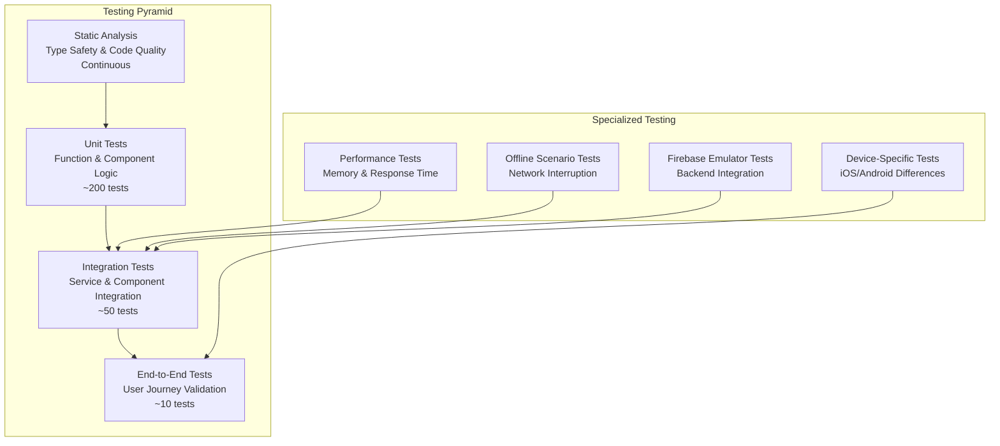

# Cider Dictionary: Testing Architecture and Quality Assurance

## Executive Summary

This document defines a comprehensive testing strategy for the Cider Dictionary React Native application, emphasizing offline-first functionality, Firebase integration testing, and mobile-specific quality assurance patterns. The architecture supports automated testing throughout the development lifecycle while ensuring reliability of critical user workflows like rapid cider entry and offline synchronization.

## Testing Philosophy

### Core Principles
- **Offline-First Testing**: All tests must validate offline functionality before online behavior
- **Performance-Driven QA**: Sub-200ms response time validation integrated into all test suites
- **Firebase Emulator Integration**: Complete Firebase functionality testing without production dependencies
- **Mobile-Specific Validation**: Device-specific behavior, memory constraints, and battery optimization
- **Progressive Quality Gates**: Each commit level improves overall system reliability

### Testing Pyramid Strategy



## Unit Testing Architecture

### Component Testing Patterns

```typescript
// Example: Cider Entry Form Component Testing
import { render, fireEvent, waitFor } from '@testing-library/react-native';
import { CiderEntryForm } from '../CiderEntryForm';
import { createMockNavigation } from '../../__mocks__/navigation';
import { createMockStore } from '../../__mocks__/store';

describe('CiderEntryForm', () => {
  const mockStore = createMockStore();
  const mockNavigation = createMockNavigation();

  beforeEach(() => {
    jest.clearAllMocks();
    mockStore.reset();
  });

  describe('Progressive Disclosure Behavior', () => {
    it('should show basic fields initially', () => {
      const { getByTestId, queryByTestId } = render(
        <CiderEntryForm
          store={mockStore}
          navigation={mockNavigation}
        />
      );

      expect(getByTestId('cider-name-input')).toBeTruthy();
      expect(getByTestId('brand-input')).toBeTruthy();
      expect(queryByTestId('advanced-fields')).toBeFalsy();
    });

    it('should expand advanced fields on toggle', async () => {
      const { getByTestId } = render(
        <CiderEntryForm
          store={mockStore}
          navigation={mockNavigation}
        />
      );

      fireEvent.press(getByTestId('advanced-toggle'));

      await waitFor(() => {
        expect(getByTestId('advanced-fields')).toBeTruthy();
        expect(getByTestId('alcohol-content-input')).toBeTruthy();
        expect(getByTestId('tasting-notes-input')).toBeTruthy();
      });
    });
  });

  describe('Offline Behavior', () => {
    it('should save to local storage when offline', async () => {
      mockStore.setNetworkStatus(false);

      const { getByTestId } = render(
        <CiderEntryForm
          store={mockStore}
          navigation={mockNavigation}
        />
      );

      fireEvent.changeText(getByTestId('cider-name-input'), 'Test Cider');
      fireEvent.changeText(getByTestId('brand-input'), 'Test Brand');
      fireEvent.press(getByTestId('save-button'));

      await waitFor(() => {
        expect(mockStore.getLocalCiders()).toHaveLength(1);
        expect(mockStore.getSyncQueue()).toHaveLength(1);
      });
    });
  });

  describe('Performance Requirements', () => {
    it('should render within 100ms', async () => {
      const startTime = Date.now();

      render(
        <CiderEntryForm
          store={mockStore}
          navigation={mockNavigation}
        />
      );

      const renderTime = Date.now() - startTime;
      expect(renderTime).toBeLessThan(100);
    });

    it('should save within 200ms', async () => {
      const { getByTestId } = render(
        <CiderEntryForm
          store={mockStore}
          navigation={mockNavigation}
        />
      );

      fireEvent.changeText(getByTestId('cider-name-input'), 'Test Cider');

      const startTime = Date.now();
      fireEvent.press(getByTestId('save-button'));

      await waitFor(() => {
        const saveTime = Date.now() - startTime;
        expect(saveTime).toBeLessThan(200);
        expect(mockStore.getLocalCiders()).toHaveLength(1);
      });
    });
  });
});
```

### Service Layer Testing

```typescript
// Example: Analytics Service Testing
import { AnalyticsService } from '../services/AnalyticsService';
import { createMockFirestore } from '../__mocks__/firebase';
import { createMockSQLite } from '../__mocks__/sqlite';

describe('AnalyticsService', () => {
  let analyticsService: AnalyticsService;
  let mockFirestore: any;
  let mockSQLite: any;

  beforeEach(() => {
    mockFirestore = createMockFirestore();
    mockSQLite = createMockSQLite();
    analyticsService = new AnalyticsService(mockFirestore, mockSQLite);
  });

  describe('Collection Analytics', () => {
    it('should calculate diversity metrics correctly', async () => {
      const mockExperiences = [
        { cider: { brand: 'Brand A', style: 'Dry' }, rating: 4 },
        { cider: { brand: 'Brand A', style: 'Sweet' }, rating: 3 },
        { cider: { brand: 'Brand B', style: 'Dry' }, rating: 5 },
      ];

      mockSQLite.getExperiences.mockResolvedValue(mockExperiences);

      const analytics = await analyticsService.calculateCollectionAnalytics();

      expect(analytics.brandDiversity).toBe(2);
      expect(analytics.styleDiversity).toBe(2);
      expect(analytics.averageRating).toBe(4);
    });

    it('should handle empty collection gracefully', async () => {
      mockSQLite.getExperiences.mockResolvedValue([]);

      const analytics = await analyticsService.calculateCollectionAnalytics();

      expect(analytics.brandDiversity).toBe(0);
      expect(analytics.totalExperiences).toBe(0);
      expect(analytics.averageRating).toBe(0);
    });
  });

  describe('Performance Optimization', () => {
    it('should use cached results when available', async () => {
      const cacheKey = 'collection_analytics_user123';
      mockSQLite.getCache.mockResolvedValue({
        data: { totalExperiences: 10 },
        timestamp: Date.now() - 1000 // 1 second ago
      });

      const analytics = await analyticsService.calculateCollectionAnalytics();

      expect(mockSQLite.getExperiences).not.toHaveBeenCalled();
      expect(analytics.totalExperiences).toBe(10);
    });

    it('should recalculate when cache is stale', async () => {
      const cacheKey = 'collection_analytics_user123';
      mockSQLite.getCache.mockResolvedValue({
        data: { totalExperiences: 10 },
        timestamp: Date.now() - 600000 // 10 minutes ago (stale)
      });

      mockSQLite.getExperiences.mockResolvedValue([{}, {}, {}]); // 3 experiences

      const analytics = await analyticsService.calculateCollectionAnalytics();

      expect(mockSQLite.getExperiences).toHaveBeenCalled();
      expect(analytics.totalExperiences).toBe(3);
    });
  });
});
```

## Integration Testing Architecture

### Firebase Emulator Integration

```typescript
// Firebase Emulator Test Setup
import { initializeTestEnvironment } from '@firebase/rules-unit-testing';
import { FirebaseService } from '../services/FirebaseService';

describe('Firebase Integration Tests', () => {
  let testEnv: any;
  let firebaseService: FirebaseService;

  beforeAll(async () => {
    testEnv = await initializeTestEnvironment({
      projectId: 'cider-dictionary-test',
      firestore: {
        port: 8080,
        host: 'localhost',
      },
      storage: {
        port: 9199,
        host: 'localhost',
      },
    });

    firebaseService = new FirebaseService(testEnv.authenticatedContext('user123'));
  });

  afterAll(async () => {
    await testEnv.cleanup();
  });

  beforeEach(async () => {
    await testEnv.clearFirestore();
    await testEnv.clearStorage();
  });

  describe('Cider CRUD Operations', () => {
    it('should create and retrieve cider documents', async () => {
      const ciderData = {
        name: 'Test Cider',
        brand: 'Test Brand',
        style: 'Dry',
        alcoholContent: 5.5,
      };

      const ciderId = await firebaseService.createCider(ciderData);
      const retrievedCider = await firebaseService.getCider(ciderId);

      expect(retrievedCider).toMatchObject(ciderData);
      expect(retrievedCider.id).toBe(ciderId);
    });

    it('should handle concurrent writes correctly', async () => {
      const ciderData = { name: 'Concurrent Test', brand: 'Test Brand' };

      const promises = Array.from({ length: 5 }, () =>
        firebaseService.createCider(ciderData)
      );

      const ciderIds = await Promise.all(promises);

      expect(new Set(ciderIds)).toHaveProperty('size', 5); // All unique IDs

      for (const ciderId of ciderIds) {
        const cider = await firebaseService.getCider(ciderId);
        expect(cider).toMatchObject(ciderData);
      }
    });
  });

  describe('Offline Sync Integration', () => {
    it('should sync local changes when connection is restored', async () => {
      // Simulate offline creation
      const localCider = {
        id: 'local-temp-id',
        name: 'Offline Cider',
        brand: 'Local Brand',
        _isLocal: true,
      };

      // Queue for sync
      const syncQueue = [{ operation: 'create', data: localCider }];

      // Process sync queue
      const syncResults = await firebaseService.processSyncQueue(syncQueue);

      expect(syncResults).toHaveLength(1);
      expect(syncResults[0].success).toBe(true);
      expect(syncResults[0].remoteId).toBeDefined();

      // Verify in Firestore
      const remoteCider = await firebaseService.getCider(syncResults[0].remoteId);
      expect(remoteCider.name).toBe('Offline Cider');
      expect(remoteCider._isLocal).toBeUndefined();
    });
  });
});
```

### Component Integration Testing

```typescript
// Example: Search and Discovery Integration
import { render, fireEvent, waitFor } from '@testing-library/react-native';
import { SearchScreen } from '../screens/SearchScreen';
import { createIntegrationTestWrapper } from '../__tests__/utils/integrationWrapper';

describe('Search and Discovery Integration', () => {
  let wrapper: any;

  beforeEach(() => {
    wrapper = createIntegrationTestWrapper({
      initialCiders: [
        { id: '1', name: 'Dry Cider', brand: 'Brand A', style: 'Dry' },
        { id: '2', name: 'Sweet Cider', brand: 'Brand B', style: 'Sweet' },
        { id: '3', name: 'Farmhouse Dry', brand: 'Brand A', style: 'Dry' },
      ],
    });
  });

  it('should filter results in real-time', async () => {
    const { getByTestId, getAllByTestId } = render(
      <SearchScreen />,
      { wrapper }
    );

    // Initial state - all ciders shown
    expect(getAllByTestId('cider-card')).toHaveLength(3);

    // Type in search
    fireEvent.changeText(getByTestId('search-input'), 'Dry');

    // Should debounce and filter
    await waitFor(() => {
      expect(getAllByTestId('cider-card')).toHaveLength(2);
    }, { timeout: 1000 }); // Account for debounce

    // Apply brand filter
    fireEvent.press(getByTestId('filter-button'));
    fireEvent.press(getByTestId('brand-filter-Brand A'));

    await waitFor(() => {
      expect(getAllByTestId('cider-card')).toHaveLength(1);
    });
  });

  it('should maintain search state during navigation', async () => {
    const { getByTestId, getAllByTestId } = render(
      <SearchScreen />,
      { wrapper }
    );

    fireEvent.changeText(getByTestId('search-input'), 'Sweet');

    await waitFor(() => {
      expect(getAllByTestId('cider-card')).toHaveLength(1);
    });

    // Navigate to cider details
    fireEvent.press(getAllByTestId('cider-card')[0]);

    // Navigate back
    fireEvent.press(getByTestId('back-button'));

    // Search state should be preserved
    expect(getByTestId('search-input').props.value).toBe('Sweet');
    expect(getAllByTestId('cider-card')).toHaveLength(1);
  });
});
```

## End-to-End Testing Architecture

### Detox Configuration

```javascript
// detox.config.js
module.exports = {
  testRunner: 'jest',
  runnerConfig: './e2e/jest.config.js',

  configurations: {
    'ios.sim.debug': {
      device: 'simulator',
      app: 'ios.debug',
    },
    'ios.sim.release': {
      device: 'simulator',
      app: 'ios.release',
    },
    'android.emu.debug': {
      device: 'emulator',
      app: 'android.debug',
    },
    'android.emu.release': {
      device: 'emulator',
      app: 'android.release',
    },
  },

  devices: {
    simulator: {
      type: 'ios.simulator',
      device: {
        type: 'iPhone 14',
      },
    },
    emulator: {
      type: 'android.emulator',
      device: {
        avdName: 'Pixel_4_API_30',
      },
    },
  },

  apps: {
    'ios.debug': {
      type: 'ios.app',
      binaryPath: 'ios/build/Build/Products/Debug-iphonesimulator/CiderDictionary.app',
      build: 'xcodebuild -workspace ios/CiderDictionary.xcworkspace -scheme CiderDictionary -configuration Debug -sdk iphonesimulator -derivedDataPath ios/build',
    },
    'android.debug': {
      type: 'android.apk',
      binaryPath: 'android/app/build/outputs/apk/debug/app-debug.apk',
      build: 'cd android && ./gradlew assembleDebug assembleAndroidTest -DtestBuildType=debug',
    },
  },
};
```

### Critical User Journey Testing

```typescript
// e2e/criticalJourneys.e2e.ts
import { by, device, element, expect, waitFor } from 'detox';

describe('Critical User Journeys', () => {
  beforeAll(async () => {
    await device.launchApp({
      newInstance: true,
      permissions: { location: 'always', camera: 'YES' },
    });
  });

  beforeEach(async () => {
    await device.reloadReactNative();
  });

  describe('Rapid Cider Entry Journey', () => {
    it('should complete cider entry in under 30 seconds', async () => {
      const startTime = Date.now();

      // Navigate to entry screen
      await element(by.id('quick-entry-tab')).tap();

      // Fill required fields
      await element(by.id('cider-name-input')).typeText('Test Cider');
      await element(by.id('brand-input')).typeText('Test Brand');

      // Save entry
      await element(by.id('save-button')).tap();

      // Verify success
      await waitFor(element(by.text('Cider saved successfully')))
        .toBeVisible()
        .withTimeout(5000);

      const totalTime = Date.now() - startTime;
      expect(totalTime).toBeLessThan(30000); // 30 seconds
    });

    it('should work offline and sync when online', async () => {
      // Simulate offline mode
      await device.setLocation({
        lat: 37.7749,
        lon: -122.4194,
      });

      await device.setURLBlacklist(['*']);

      // Create cider offline
      await element(by.id('quick-entry-tab')).tap();
      await element(by.id('cider-name-input')).typeText('Offline Cider');
      await element(by.id('brand-input')).typeText('Offline Brand');
      await element(by.id('save-button')).tap();

      // Verify offline indicator
      await expect(element(by.id('offline-indicator'))).toBeVisible();

      // Verify local save
      await element(by.id('collection-tab')).tap();
      await expect(element(by.text('Offline Cider'))).toBeVisible();
      await expect(element(by.id('sync-pending-indicator'))).toBeVisible();

      // Restore network
      await device.setURLBlacklist([]);

      // Wait for sync
      await waitFor(element(by.id('sync-pending-indicator')))
        .not.toBeVisible()
        .withTimeout(10000);

      // Verify sync success
      await expect(element(by.text('Offline Cider'))).toBeVisible();
      await expect(element(by.id('sync-success-indicator'))).toBeVisible();
    });
  });

  describe('Collection Analytics Journey', () => {
    it('should display analytics with real-time updates', async () => {
      // Navigate to analytics
      await element(by.id('analytics-tab')).tap();

      // Wait for analytics to load
      await waitFor(element(by.id('analytics-content')))
        .toBeVisible()
        .withTimeout(5000);

      // Verify key metrics are displayed
      await expect(element(by.id('total-ciders-metric'))).toBeVisible();
      await expect(element(by.id('brand-diversity-metric'))).toBeVisible();
      await expect(element(by.id('average-rating-metric'))).toBeVisible();

      // Add new experience and verify update
      await element(by.id('quick-entry-tab')).tap();
      await element(by.id('cider-name-input')).typeText('Analytics Test');
      await element(by.id('brand-input')).typeText('New Brand');
      await element(by.id('save-button')).tap();

      // Return to analytics
      await element(by.id('analytics-tab')).tap();

      // Verify metrics updated
      await waitFor(element(by.id('analytics-updated-indicator')))
        .toBeVisible()
        .withTimeout(3000);
    });
  });

  describe('Search and Discovery Journey', () => {
    it('should find ciders quickly with fuzzy search', async () => {
      await element(by.id('search-tab')).tap();

      // Test fuzzy search
      await element(by.id('search-input')).typeText('cidre'); // Fuzzy for 'cider'

      await waitFor(element(by.id('search-results')))
        .toBeVisible()
        .withTimeout(2000);

      // Verify results appear quickly
      await expect(element(by.id('cider-result')).atIndex(0)).toBeVisible();

      // Test filter application
      await element(by.id('filter-button')).tap();
      await element(by.id('style-filter-dry')).tap();
      await element(by.id('apply-filters-button')).tap();

      // Verify filtered results
      await waitFor(element(by.id('filtered-results')))
        .toBeVisible()
        .withTimeout(1000);
    });
  });
});
```

## Performance Testing Architecture

### Automated Performance Validation

```typescript
// performance/performanceTests.ts
import { device, by, element } from 'detox';
import { PerformanceObserver } from 'perf_hooks';

describe('Performance Tests', () => {
  let performanceMetrics: any[] = [];

  beforeAll(() => {
    const obs = new PerformanceObserver((items) => {
      performanceMetrics.push(...items.getEntries());
    });
    obs.observe({ entryTypes: ['measure'] });
  });

  describe('App Launch Performance', () => {
    it('should launch within 3 seconds on cold start', async () => {
      const startTime = Date.now();

      await device.launchApp({
        newInstance: true,
        delete: true,
      });

      await waitFor(element(by.id('main-navigation')))
        .toBeVisible()
        .withTimeout(5000);

      const launchTime = Date.now() - startTime;
      expect(launchTime).toBeLessThan(3000);
    });

    it('should render initial screen within 1 second on warm start', async () => {
      const startTime = Date.now();

      await device.launchApp({
        newInstance: false,
      });

      await waitFor(element(by.id('main-navigation')))
        .toBeVisible()
        .withTimeout(2000);

      const renderTime = Date.now() - startTime;
      expect(renderTime).toBeLessThan(1000);
    });
  });

  describe('List Performance', () => {
    it('should scroll through 100+ items smoothly', async () => {
      await element(by.id('collection-tab')).tap();

      const startTime = Date.now();

      // Scroll through entire list
      await element(by.id('cider-list')).scroll(2000, 'down');
      await element(by.id('cider-list')).scroll(2000, 'down');
      await element(by.id('cider-list')).scroll(2000, 'down');

      const scrollTime = Date.now() - startTime;

      // Should maintain 60fps (16.67ms per frame)
      // For 3 seconds of scrolling at 60fps = ~180 frames
      // Allow some overhead
      expect(scrollTime).toBeLessThan(4000);
    });
  });

  describe('Memory Performance', () => {
    it('should not exceed memory limits during heavy usage', async () => {
      // Simulate heavy usage pattern
      for (let i = 0; i < 10; i++) {
        await element(by.id('quick-entry-tab')).tap();
        await element(by.id('collection-tab')).tap();
        await element(by.id('analytics-tab')).tap();
        await element(by.id('search-tab')).tap();
      }

      // Memory should stabilize (this would need platform-specific implementation)
      // await expect(device.getMemoryUsage()).toBeLessThan(150 * 1024 * 1024); // 150MB
    });
  });
});
```

## Specialized Testing Patterns

### Offline Scenario Testing

```typescript
// tests/offline/offlineScenarios.test.ts
import { NetworkManager } from '../services/NetworkManager';
import { SyncService } from '../services/SyncService';
import { createOfflineTestEnvironment } from '../__tests__/utils/offlineTestEnvironment';

describe('Offline Scenarios', () => {
  let offlineEnv: any;
  let networkManager: NetworkManager;
  let syncService: SyncService;

  beforeEach(() => {
    offlineEnv = createOfflineTestEnvironment();
    networkManager = offlineEnv.networkManager;
    syncService = offlineEnv.syncService;
  });

  describe('Network Interruption Scenarios', () => {
    it('should handle sudden network loss during save', async () => {
      const ciderData = { name: 'Test Cider', brand: 'Test Brand' };

      // Start save operation
      const savePromise = syncService.saveCider(ciderData);

      // Simulate network loss mid-operation
      setTimeout(() => networkManager.setOffline(), 100);

      const result = await savePromise;

      expect(result.savedLocally).toBe(true);
      expect(result.syncPending).toBe(true);
      expect(syncService.getPendingOperations()).toHaveLength(1);
    });

    it('should handle intermittent connectivity', async () => {
      const operations = [];

      // Create multiple operations with intermittent connectivity
      for (let i = 0; i < 5; i++) {
        if (i % 2 === 0) {
          networkManager.setOffline();
        } else {
          networkManager.setOnline();
        }

        operations.push(
          syncService.saveCider({ name: `Cider ${i}`, brand: 'Test' })
        );

        await new Promise(resolve => setTimeout(resolve, 100));
      }

      await Promise.all(operations);

      // All operations should eventually succeed
      expect(syncService.getPendingOperations().length).toBeGreaterThan(0);

      // Restore full connectivity and process queue
      networkManager.setOnline();
      await syncService.processPendingOperations();

      expect(syncService.getPendingOperations()).toHaveLength(0);
    });
  });

  describe('Conflict Resolution Testing', () => {
    it('should resolve conflicts using last-write-wins strategy', async () => {
      const ciderId = 'test-cider-123';

      // Create conflicting updates
      const localUpdate = {
        id: ciderId,
        name: 'Local Update',
        lastModified: Date.now(),
      };

      const remoteUpdate = {
        id: ciderId,
        name: 'Remote Update',
        lastModified: Date.now() + 1000, // 1 second later
      };

      // Simulate conflict during sync
      const resolution = await syncService.resolveConflict(
        localUpdate,
        remoteUpdate,
        'last-write-wins'
      );

      expect(resolution.winner).toBe('remote');
      expect(resolution.data.name).toBe('Remote Update');
    });
  });
});
```

### Firebase Security Testing

```typescript
// tests/security/firebaseRules.test.ts
import {
  initializeTestEnvironment,
  assertSucceeds,
  assertFails,
} from '@firebase/rules-unit-testing';

describe('Firebase Security Rules', () => {
  let testEnv: any;

  beforeAll(async () => {
    testEnv = await initializeTestEnvironment({
      projectId: 'cider-dictionary-test',
      firestore: {
        rules: await readFileSync('firestore.rules', 'utf8'),
      },
    });
  });

  afterAll(async () => {
    await testEnv.cleanup();
  });

  describe('User Data Access Control', () => {
    it('should allow users to read their own ciders', async () => {
      const alice = testEnv.authenticatedContext('alice', { role: 'user' });

      await assertSucceeds(
        alice.firestore()
          .collection('ciders')
          .where('userId', '==', 'alice')
          .get()
      );
    });

    it('should deny users access to other users ciders', async () => {
      const alice = testEnv.authenticatedContext('alice', { role: 'user' });

      await assertFails(
        alice.firestore()
          .collection('ciders')
          .where('userId', '==', 'bob')
          .get()
      );
    });

    it('should enforce data validation rules', async () => {
      const alice = testEnv.authenticatedContext('alice', { role: 'user' });

      // Valid cider document
      await assertSucceeds(
        alice.firestore()
          .collection('ciders')
          .add({
            name: 'Valid Cider',
            brand: 'Valid Brand',
            userId: 'alice',
            createdAt: new Date(),
          })
      );

      // Invalid cider document (missing required fields)
      await assertFails(
        alice.firestore()
          .collection('ciders')
          .add({
            name: 'Invalid Cider',
            // Missing required brand field
            userId: 'alice',
          })
      );
    });
  });
});
```

## Test Automation and CI/CD Integration

### Test Pipeline Architecture

```yaml
# .github/workflows/test-pipeline.yml
name: Test Pipeline

on:
  push:
    branches: [main, develop]
  pull_request:
    branches: [main, develop]

jobs:
  static-analysis:
    runs-on: ubuntu-latest
    steps:
      - uses: actions/checkout@v3
      - uses: actions/setup-node@v3
        with:
          node-version: '18'
          cache: 'npm'

      - name: Install dependencies
        run: npm ci

      - name: TypeScript type checking
        run: npm run type-check

      - name: ESLint
        run: npm run lint

      - name: Prettier format check
        run: npm run format:check

      - name: Security audit
        run: npm audit --audit-level moderate

  unit-tests:
    runs-on: ubuntu-latest
    needs: static-analysis
    steps:
      - uses: actions/checkout@v3
      - uses: actions/setup-node@v3
        with:
          node-version: '18'
          cache: 'npm'

      - name: Install dependencies
        run: npm ci

      - name: Run unit tests
        run: npm run test:unit -- --coverage --maxWorkers=2

      - name: Upload coverage
        uses: codecov/codecov-action@v3
        with:
          file: ./coverage/coverage-final.json

  integration-tests:
    runs-on: ubuntu-latest
    needs: unit-tests
    services:
      firebase:
        image: firebase/firebase-tools:latest
        ports:
          - 8080:8080
          - 9199:9199
    steps:
      - uses: actions/checkout@v3
      - uses: actions/setup-node@v3
        with:
          node-version: '18'
          cache: 'npm'

      - name: Install dependencies
        run: npm ci

      - name: Start Firebase emulators
        run: npm run firebase:emulators &

      - name: Wait for emulators
        run: sleep 30

      - name: Run integration tests
        run: npm run test:integration
        env:
          FIRESTORE_EMULATOR_HOST: localhost:8080
          FIREBASE_STORAGE_EMULATOR_HOST: localhost:9199

  e2e-tests:
    runs-on: macos-latest
    needs: integration-tests
    strategy:
      matrix:
        platform: [ios, android]
    steps:
      - uses: actions/checkout@v3
      - uses: actions/setup-node@v3
        with:
          node-version: '18'
          cache: 'npm'

      - name: Install dependencies
        run: npm ci

      - name: Setup iOS simulator (iOS only)
        if: matrix.platform == 'ios'
        run: |
          xcrun simctl create iPhone14 "iPhone 14" iOS16.0
          xcrun simctl boot iPhone14

      - name: Setup Android emulator (Android only)
        if: matrix.platform == 'android'
        run: |
          echo "Setup Android emulator"
          # Android emulator setup commands

      - name: Build app for testing
        run: npm run build:${{ matrix.platform }}:debug

      - name: Run E2E tests
        run: npm run test:e2e:${{ matrix.platform }}

      - name: Upload test artifacts
        if: failure()
        uses: actions/upload-artifact@v3
        with:
          name: e2e-test-artifacts-${{ matrix.platform }}
          path: |
            e2e/artifacts/
            screenshots/

  performance-tests:
    runs-on: macos-latest
    needs: e2e-tests
    steps:
      - uses: actions/checkout@v3
      - uses: actions/setup-node@v3
        with:
          node-version: '18'
          cache: 'npm'

      - name: Install dependencies
        run: npm ci

      - name: Run performance tests
        run: npm run test:performance

      - name: Generate performance report
        run: npm run performance:report

      - name: Upload performance artifacts
        uses: actions/upload-artifact@v3
        with:
          name: performance-report
          path: performance-report/
```

### Test Configuration and Utilities

```typescript
// jest.config.js
module.exports = {
  preset: 'react-native',
  setupFilesAfterEnv: [
    '<rootDir>/src/__tests__/setup.ts',
  ],
  testMatch: [
    '<rootDir>/src/**/__tests__/**/*.test.{js,jsx,ts,tsx}',
    '<rootDir>/src/**/*.{test,spec}.{js,jsx,ts,tsx}',
  ],
  collectCoverageFrom: [
    'src/**/*.{js,jsx,ts,tsx}',
    '!src/**/*.d.ts',
    '!src/__tests__/**',
    '!src/__mocks__/**',
  ],
  coverageThreshold: {
    global: {
      branches: 80,
      functions: 80,
      lines: 80,
      statements: 80,
    },
  },
  moduleNameMapping: {
    '^@/(.*)$': '<rootDir>/src/$1',
    '^@tests/(.*)$': '<rootDir>/src/__tests__/$1',
    '^@mocks/(.*)$': '<rootDir>/src/__mocks__/$1',
  },
  transform: {
    '^.+\\.(js|jsx|ts|tsx)$': 'babel-jest',
  },
  transformIgnorePatterns: [
    'node_modules/(?!(react-native|@react-native|react-native-.*)/)',
  ],
};
```

## Quality Assurance Integration

### Automated Quality Gates

```typescript
// quality/qualityGates.ts
export interface QualityGate {
  name: string;
  threshold: number;
  metric: string;
  enforced: boolean;
}

export const qualityGates: QualityGate[] = [
  {
    name: 'Code Coverage',
    threshold: 80,
    metric: 'coverage.overall',
    enforced: true,
  },
  {
    name: 'Performance Budget',
    threshold: 200,
    metric: 'performance.response_time_p95',
    enforced: true,
  },
  {
    name: 'Bundle Size',
    threshold: 50 * 1024 * 1024, // 50MB
    metric: 'bundle.size_bytes',
    enforced: true,
  },
  {
    name: 'Accessibility Score',
    threshold: 90,
    metric: 'accessibility.score',
    enforced: false,
  },
  {
    name: 'Security Vulnerabilities',
    threshold: 0,
    metric: 'security.high_vulnerabilities',
    enforced: true,
  },
];

export async function evaluateQualityGates(
  testResults: TestResults
): Promise<QualityGateResult[]> {
  const results: QualityGateResult[] = [];

  for (const gate of qualityGates) {
    const actualValue = getMetricValue(testResults, gate.metric);
    const passed = gate.metric.includes('vulnerabilities')
      ? actualValue <= gate.threshold
      : actualValue >= gate.threshold;

    results.push({
      gate,
      actualValue,
      passed,
      enforced: gate.enforced,
    });
  }

  return results;
}
```

This comprehensive testing architecture ensures that the Cider Dictionary application maintains high quality, performance, and reliability throughout the development lifecycle, with particular emphasis on the critical offline-first functionality and Firebase integration patterns.