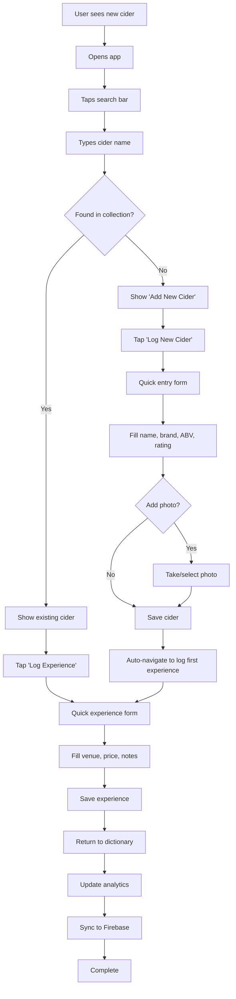
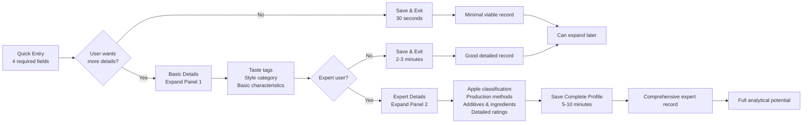

# Cider Dictionary: Comprehensive SPARC Specifications

## Table of Contents
1. [System Requirements & Constraints](#1-system-requirements--constraints)
2. [Detailed Feature Specifications](#2-detailed-feature-specifications)
3. [Technical Architecture Details](#3-technical-architecture-details)
4. [Data Flow and Integration Specifications](#4-data-flow-and-integration-specifications)
5. [Quality Assurance Specifications](#5-quality-assurance-specifications)
6. [User Experience Specifications](#6-user-experience-specifications)

---

## 1. System Requirements & Constraints

### 1.1 Functional Requirements

#### FR-001: Cider Collection Management
**Priority**: Critical
**Description**: The system shall enable users to create, view, edit, and delete cider master records with progressive disclosure of information complexity.

**Acceptance Criteria**:
- Users can create a cider record with only name, brand, ABV, and rating (30-second entry)
- Users can optionally expand to add detailed characteristics across 15+ categories
- System prevents duplicate cider entries with intelligent name matching
- All cider data persists locally and syncs to Firebase when online

#### FR-002: Experience Logging
**Priority**: Critical
**Description**: The system shall allow users to log each drinking experience with venue, price, and contextual information.

**Acceptance Criteria**:
- Users can log experiences in under 30 seconds via quick entry form
- System auto-captures GPS location and timestamp
- Price per ml automatically calculated and displayed
- Experience data links to existing cider master records

#### FR-003: Search and Discovery
**Priority**: High
**Description**: The system shall provide instant search capabilities to identify if a cider has been previously tried.

**Acceptance Criteria**:
- Search returns results within 200ms for collections up to 100 ciders
- Fuzzy matching handles spelling variations and partial names
- Search includes cider name, brand, and taste tags
- Results highlight matched terms for clarity

#### FR-004: Collection Analytics
**Priority**: High
**Description**: The system shall provide comprehensive analytics on cider collection, venue patterns, and spending habits.

**Acceptance Criteria**:
- Collection completeness percentage based on unique characteristics
- Venue analysis showing most/least expensive locations
- Interactive map with heat map visualization of visit frequency
- Rankings for best value, highest rated, and most expensive ciders

#### FR-005: Progress Tracking
**Priority**: Medium
**Description**: The system shall track user progress toward comprehensive cider collection goals.

**Acceptance Criteria**:
- Dynamic completeness calculation based on user's own collection characteristics
- Achievement badges for reaching collection milestones
- Gap analysis showing missing cider styles and characteristics
- Visual progress indicators with clear next steps

### 1.2 Non-Functional Requirements

#### NFR-001: Performance
**Target**: Sub-200ms response time for 95% of user interactions
**Measurement**: Performance monitoring via Firebase Performance
**Constraints**:
- App startup time < 3 seconds on mid-range devices
- Search results display within 200ms
- Image loading with progressive enhancement
- Smooth 60fps animations on all interactions

#### NFR-002: Scalability
**Target**: Support up to 100 ciders with 500+ experiences per user
**Measurement**: Database query performance monitoring
**Constraints**:
- Firebase Firestore optimized for personal-scale usage (staying within free tier)
- Efficient data structure design to minimize read/write operations
- Local SQLite database for offline performance

#### NFR-003: Offline Capability
**Target**: Full functionality available offline with automatic sync
**Measurement**: Offline usage analytics and sync success rates
**Constraints**:
- All core features work without internet connection
- Automatic background sync when connectivity restored
- Conflict resolution for concurrent edits
- Image upload queue with retry mechanism

#### NFR-004: Cost Optimization
**Target**: £0 monthly operating costs
**Measurement**: Firebase usage monitoring with alerts at 80% of free tier limits
**Constraints**:
- Firebase Firestore: < 50,000 reads, 20,000 writes per month
- Firebase Storage: < 5GB total storage
- Google Maps API: < 28,000 map loads per month
- Automatic cost monitoring with usage warnings

#### NFR-005: Data Privacy & Security
**Target**: Complete user data ownership and privacy
**Measurement**: Security audit compliance checklist
**Constraints**:
- All data belongs to individual user (no sharing between users)
- Firebase security rules prevent cross-user data access
- Local data encryption for sensitive information
- Optional data export in open formats (JSON, CSV)

### 1.3 Technical Constraints

#### TC-001: Platform Requirements
- **Primary Platform**: React Native 0.72+ for iOS and Android
- **Development Environment**: Expo SDK 49+ for rapid development
- **Minimum OS Support**: iOS 12+, Android API 23+ (Android 6.0)
- **Device Requirements**: 2GB RAM minimum, 1GB free storage

#### TC-002: Third-Party Dependencies
- **Firebase Services**: Firestore, Authentication, Storage (free tier only)
- **Google Maps API**: Maps SDK and Places API (free tier optimization)
- **Image Processing**: React Native Image Picker with compression
- **Local Storage**: SQLite for offline data, MMKV for preferences

#### TC-003: Development Constraints
- **Free-tier Hosting**: No paid infrastructure dependencies
- **Single Developer**: Architecture optimized for solo development and maintenance
- **Open Source Libraries**: Preference for MIT/Apache licensed dependencies
- **Minimal Maintenance**: Self-healing architecture with automatic error recovery

---

## 2. Detailed Feature Specifications

### 2.1 Progressive Disclosure Cider Entry

#### 2.1.1 Quick Entry Mode (30-Second Target)
**User Story**: As a cider enthusiast, I want to quickly log a new cider while at a pub without losing social momentum.

**Interface Specification**:
```yaml
quick_entry_form:
  required_fields:
    - cider_name: text_input
        placeholder: "Cider name"
        validation: required, min_length: 2
        duplicate_detection: true
    - brand: text_input
        placeholder: "Brand/Producer"
        validation: required
        autocomplete: previous_brands
    - abv: number_input
        placeholder: "ABV %"
        validation: required, range: 0-20
        input_type: decimal
    - overall_rating: star_rating
        scale: 1-10
        validation: required
        large_touch_targets: true

  optional_fields:
    - photo: camera_button
        text: "Add Photo (optional)"
        action: camera_or_gallery
    - quick_notes: text_area
        placeholder: "Quick notes..."
        max_length: 500
        auto_expand: true

  save_button:
    text: "Save Cider"
    position: fixed_bottom
    validation_trigger: on_tap
    success_animation: checkmark_pulse
```

**Business Logic**:
- Duplicate detection compares normalized cider name + brand
- ABV validation shows warning for values outside 3-12% range
- Auto-save draft every 10 seconds to prevent data loss
- Image upload queued for background processing

#### 2.1.2 Detailed Entry Mode (Expert Features)
**User Story**: As a cider expert, I want to document comprehensive characteristics for future analysis and recommendations.

**Progressive Disclosure Levels**:

**Level 1: Basic Classification (Expandable Panel)**
```yaml
basic_details:
  taste_tags:
    type: multi_select_chips
    options: [dry, sweet, tart, sharp, crisp, smooth, refreshing, fruity, citrus, floral]
    selection_limit: none
    quick_select: most_common_combinations

  style_category:
    type: single_select_dropdown
    options: [traditional_english, modern_craft, heritage, international, fruit_cider]
    help_text: "General style classification"

  basic_characteristics:
    sweetness: [bone_dry, dry, off_dry, medium, sweet]
    carbonation: [still, light_sparkling, sparkling, highly_carbonated]
    clarity: [crystal_clear, clear, hazy, cloudy, opaque]
```

**Level 2: Expert Classification (Second Expansion)**
```yaml
expert_details:
  apple_classification:
    categories: [bittersweet, bittersharp, sweet, sharp, culinary, unknown]
    varieties: free_text_with_common_suggestions
    help_modal: long_ashton_classification_guide

  production_methods:
    fermentation: [wild, cultured_yeast, mixed, unknown]
    special_processes: [keeved, pet_nat, barrel_aged, ice_cider, other]

  additives:
    fruit_additions: multi_select_with_custom
    hops: multi_select_with_character_notes
    spices_botanicals: free_text_tags
    wood_aging: barrel_type_and_history

  detailed_ratings:
    appearance: 1-10_scale
    aroma: 1-10_scale
    taste: 1-10_scale
    mouthfeel: 1-10_scale
```

**Validation Rules**:
- Any combination of fields can be saved (no required fields in advanced sections)
- Smart defaults based on style selection
- Contextual help tooltips for technical terms
- Warning prompts for unusual combinations (e.g., "Ice cider with 12% ABV is unusual")

### 2.2 Experience Logging Workflow

#### 2.2.1 Quick Re-try Logging
**User Story**: As a repeat cider drinker, I want to quickly log another experience with a cider I've tried before.

**Workflow Specification**:
```yaml
quick_log_workflow:
  entry_points:
    - swipe_right_on_cider_card: reveals_log_button
    - tap_log_experience_button: from_cider_detail_page
    - search_and_select: from_main_search_bar

  form_layout:
    cider_header:
      display: mini_card_with_photo
      info: [name, brand, previous_experiences_count]
      style: glassmorphism_background

    required_inputs:
      venue_name:
        type: searchable_dropdown
        data_source: [recent_venues, all_previous_venues, manual_entry]
        spell_check: enabled
        consolidation: automatic_venue_matching

      price:
        type: currency_input
        validation: positive_numbers_only
        format: auto_currency_formatting
        linked_calculation: price_per_ml_display

      container_size:
        type: number_input_with_units
        units: ml
        presets: [275, 330, 440, 500, 568]
        validation: range_50_2000ml

    optional_inputs:
      experience_notes:
        type: expandable_text_area
        placeholder: "How was this experience?"
        max_length: 1000
        auto_save: every_10_seconds

      rating_adjustment:
        type: optional_rating_update
        help_text: "Update overall rating based on this experience?"
        averaging_note: "Will average with previous ratings"

  save_behavior:
    validation: real_time_with_visual_feedback
    location_capture: automatic_gps_with_manual_fallback
    timestamp: auto_set_with_manual_adjustment
    success_feedback: brief_success_animation
    return_navigation: back_to_previous_screen
```

#### 2.2.2 New Cider Discovery Workflow
**User Story**: As a cider explorer, I want to efficiently determine if a cider is new to my collection and log it appropriately.

**Discovery Decision Tree**:
```yaml
discovery_workflow:
  step_1_search:
    action: user_searches_cider_name
    search_behavior:
      fuzzy_matching: enabled
      search_fields: [name, brand, alternative_names]
      results_display: instant_as_you_type

  step_2_decision:
    found_in_collection:
      action: redirect_to_quick_log_experience
      display: "Found! Log new experience?"

    not_found:
      action: redirect_to_new_cider_entry
      display: "New discovery! Add to collection?"
      pre_fill: search_term_as_cider_name

    similar_found:
      action: show_disambiguation
      display: similar_ciders_with_differences
      options: [this_is_same_cider, this_is_different_cider]

  step_3_execution:
    new_cider_path:
      pre_fill_data: [search_term, current_location]
      focus: cider_name_field
      help_text: "Add basic info now, details later"

    existing_cider_path:
      pre_fill_data: [selected_cider, current_location]
      focus: venue_name_field
      help_text: "Quick experience logging"
```

### 2.3 Search and Filtering System

#### 2.3.1 Intelligent Search
**Performance Requirement**: Results within 200ms for 100-cider collections

**Search Implementation**:
```yaml
search_specification:
  search_algorithm:
    primary: exact_match_prioritization
    secondary: fuzzy_matching_with_levenshtein_distance
    tertiary: partial_word_matching

  searchable_fields:
    high_priority: [cider_name, brand]
    medium_priority: [taste_tags, traditional_style]
    low_priority: [apple_varieties, venue_names]

  search_features:
    auto_suggestions: based_on_user_collection
    recent_searches: last_10_searches_stored
    search_shortcuts: quick_filters_chips

  result_display:
    instant_results: update_as_user_types
    highlighting: matched_terms_highlighted
    result_ranking: relevance_score_based
    no_results_handling: helpful_suggestions
```

#### 2.3.2 Advanced Filtering
**User Story**: As a collection analyst, I want to filter my ciders by multiple characteristics to find patterns.

**Filter Categories**:
```yaml
filtering_system:
  quick_filters:
    rating_ranges: [9-10, 7-8, 5-6, below_5]
    price_ranges: [under_4, 4-7, over_7, unknown]
    style_categories: [traditional, modern, fruit, heritage]
    times_tried: [once, 2-3_times, 4+_times]

  advanced_filters:
    characteristics:
      abv_range: slider_input_3_to_12_percent
      sweetness: multi_select_checkboxes
      carbonation: multi_select_checkboxes
      clarity: multi_select_checkboxes

    production:
      apple_categories: long_ashton_classification
      fermentation_type: [wild, cultured, mixed]
      special_processes: multi_select_tags

    experience_data:
      venue_types: supermarket_vs_pub_vs_restaurant
      date_ranges: last_month_year_all_time
      location_radius: map_based_selection

  filter_behavior:
    combination_logic: AND_between_categories_OR_within_categories
    real_time_updates: filter_count_updates_instantly
    filter_memory: remembers_last_used_filters
    clear_all: one_tap_reset_button
```

### 2.4 Analytics and Insights

#### 2.4.1 Collection Analytics Dashboard
**User Story**: As a data-driven cider enthusiast, I want insights into my collection patterns and preferences.

**Analytics Modules**:
```yaml
analytics_dashboard:
  overview_statistics:
    total_ciders: count_with_growth_indicator
    total_experiences: count_with_frequency_analysis
    average_rating: weighted_by_experience_count
    total_spent: currency_with_monthly_trends
    collection_completeness: percentage_with_progress_bar

  rankings_section:
    best_overall: top_10_by_rating
    worst_overall: bottom_5_with_improvement_suggestions
    best_value: rating_divided_by_average_price
    most_expensive: highest_average_price_per_ml
    most_frequent: highest_experience_count

  trend_analysis:
    rating_trends: monthly_average_ratings_chart
    spending_patterns: monthly_spending_bar_chart
    discovery_rate: new_ciders_per_month_line_chart
    venue_preferences: pie_chart_venue_type_distribution

  achievement_tracking:
    style_completeness: matrix_view_of_categories_tried
    milestone_badges: unlocked_and_progress_toward_next
    streaks: longest_logging_streak_current_streak
```

#### 2.4.2 Venue Analysis
**User Story**: As a cost-conscious cider drinker, I want to identify the best value venues and track my spending patterns.

**Venue Analytics Specification**:
```yaml
venue_analytics:
  ranking_tables:
    most_expensive:
      metric: average_price_per_ml
      display: venue_name_with_type_icon
      additional_info: [visit_count, cider_variety_count]

    best_value:
      metric: highest_rated_ciders_for_price
      calculation: (average_cider_rating * visit_count) / average_price
      display: value_score_with_explanation

    most_visited:
      metric: total_visit_count
      additional_info: [total_spent, favorite_cider_at_venue]

    best_variety:
      metric: unique_ciders_available
      filter: minimum_2_visits_for_fairness

  spending_analysis:
    by_venue_type:
      chart_type: horizontal_bar_chart
      data: [pubs, supermarkets, restaurants, specialty_shops]
      metrics: [average_price, total_spent, visit_frequency]

    price_distribution:
      chart_type: histogram
      bins: price_ranges_in_1_pound_increments
      overlay: normal_distribution_curve

    monthly_trends:
      chart_type: stacked_area_chart
      breakdown: spending_by_venue_type_over_time
      interaction: tap_to_drill_down_to_specific_month
```

#### 2.4.3 Interactive Mapping
**User Story**: As a location-aware cider tracker, I want to visualize my cider experiences geographically and discover patterns.

**Map Visualization Specification**:
```yaml
interactive_map:
  base_map:
    provider: google_maps_sdk
    style: custom_styled_map_optimized_for_markers
    default_zoom: user_location_with_all_venues_visible
    controls: [zoom, location_centering, layer_toggles]

  venue_markers:
    clustering:
      enabled: true
      cluster_radius: 50_pixels
      cluster_styling: venue_count_with_color_coding

    marker_types:
      pubs: beer_mug_icon_amber_color
      supermarkets: shopping_cart_icon_blue_color
      restaurants: fork_knife_icon_green_color
      specialty: wine_glass_icon_purple_color

    marker_sizing:
      base_size: 24px
      scaling_factor: visit_count_influences_size
      max_size: 40px

  heat_map_overlay:
    visit_frequency:
      color_coding:
        red_hot: 5_plus_visits
        orange_warm: 3_to_4_visits
        yellow_medium: 2_visits
        blue_cool: 1_visit
      opacity: 70_percent_for_subtle_overlay

  interaction_behaviors:
    marker_tap:
      action: show_venue_detail_bottom_sheet
      animation: bounce_and_expand

    cluster_tap:
      action: zoom_to_show_individual_markers
      animation: smooth_zoom_transition

    map_drag:
      behavior: update_visible_venue_list
      debouncing: 500ms_delay_for_performance

  venue_detail_sheet:
    slide_animation: bottom_sheet_with_backdrop_blur
    content:
      venue_header: [name, type, total_visits]
      cider_list: all_ciders_tried_here_with_ratings
      pricing_summary: [cheapest, most_expensive, average]
      visit_timeline: chronological_list_of_experiences
    actions:
      - log_new_experience_at_venue
      - get_directions_to_venue
      - view_all_similar_venue_type
```

### 2.5 Collection Progress Tracking

#### 2.5.1 Dynamic Completeness Calculation
**User Story**: As a completionist, I want to track my progress toward trying every type of cider characteristic in my personal collection.

**Completeness Algorithm**:
```yaml
completeness_calculation:
  data_collection:
    scan_user_collection: extract_all_characteristics_from_every_cider
    characteristic_categories:
      - traditional_styles
      - apple_categories
      - sweetness_levels
      - carbonation_types
      - clarity_levels
      - color_variations
      - fermentation_methods
      - special_processes
      - fruit_additions
      - production_scales

  uniqueness_calculation:
    method: set_based_deduplication
    example: [dry, sweet, dry, tart] becomes [dry, sweet, tart]
    total_unique: count_of_unique_characteristics_found

  percentage_formula:
    numerator: unique_characteristics_in_user_collection
    denominator: total_characteristics_found_across_user_ciders
    result: (unique / total) * 100

  dynamic_growth:
    behavior: percentage_increases_as_collection_diversifies
    example: "Adding fruit cider increases total possible characteristics"

  progress_display:
    main_percentage: large_circular_progress_indicator
    breakdown_view: category_by_category_completion_rates
    next_steps: suggestions_for_missing_characteristics
```

#### 2.5.2 Achievement System
**User Story**: As a motivated collector, I want to earn achievements that guide my cider exploration journey.

**Achievement Categories**:
```yaml
achievement_system:
  milestone_badges:
    collection_size:
      - first_five: "Getting Started" (5 ciders)
      - first_twenty: "Building Collection" (20 ciders)
      - fifty_club: "Serious Collector" (50 ciders)
      - century_club: "Cider Centurion" (100 ciders)

    experience_tracking:
      - dedicated_logger: "Log experiences for 7 days straight"
      - social_drinker: "Log 10 pub experiences"
      - home_enthusiast: "Log 10 home experiences"
      - budget_tracker: "Log prices for 25 experiences"

    style_exploration:
      - four_corners: "Try all 4 Long Ashton apple categories"
      - traditional_explorer: "Try 5 different traditional styles"
      - modern_adventurer: "Try 5 modern/craft ciders"
      - fruit_explorer: "Try 5 ciders with fruit additions"

    analytical_achievements:
      - price_conscious: "Find 3 ciders under £3/pint"
      - luxury_seeker: "Try 3 ciders over £8/pint"
      - rating_expert: "Rate 25 ciders across full 1-10 scale"
      - venue_explorer: "Try ciders at 10 different venues"

  progress_tracking:
    visual_indicators: progress_bars_toward_next_achievement
    unlock_animations: celebration_with_haptic_feedback
    sharing_options: social_media_achievement_sharing
    badge_collection: persistent_display_of_earned_badges

  guidance_system:
    next_achievement_hints: "Try a fruit cider to work toward Fruit Explorer"
    personalized_suggestions: based_on_current_collection_gaps
    achievement_difficulty: mix_of_easy_medium_hard_achievements
```

---

## 3. Technical Architecture Details

### 3.1 Firebase-First Architecture Design

#### 3.1.1 Database Schema Optimization
**Design Principle**: Single source of truth with offline-first capabilities

**Firestore Collection Structure**:
```typescript
// Optimized for ~100 ciders, staying within Firebase free tier
interface FirestoreSchema {
  // Collection: users/{userId}
  users: {
    [userId: string]: {
      email: string;
      displayName?: string;
      preferences: UserPreferences;
      createdAt: FirebaseTimestamp;
      lastActiveAt: FirebaseTimestamp;
      // Stats for quick access without aggregation queries
      stats: {
        totalCiders: number;
        totalExperiences: number;
        averageRating: number;
        totalSpent: number;
        lastUpdated: FirebaseTimestamp;
      };
    };
  };

  // Collection: ciders/{ciderId}
  // Subcollection: ciders/{ciderId}/experiences/{experienceId}
  ciders: {
    [ciderId: string]: {
      userId: string; // Security rule enforcement

      // Core data (required)
      name: string;
      brand: string;
      abv: number;
      overallRating: number;

      // Progressive disclosure data (all optional)
      tasteTags?: string[];
      traditionalStyle?: string;
      // ... all other detailed characteristics

      // Calculated fields (updated via Cloud Functions)
      calculatedFields: {
        averagePrice: number;
        pricePerMl: number;
        timesTried: number;
        valueRating: number; // rating / average price
        firstTriedDate: FirebaseTimestamp;
        lastTriedDate: FirebaseTimestamp;
      };

      // Metadata
      createdAt: FirebaseTimestamp;
      updatedAt: FirebaseTimestamp;

      // Experiences subcollection
      experiences: {
        [experienceId: string]: ExperienceLog;
      };
    };
  };

  // Collection: venues/{venueId} (aggregated for analytics)
  venues: {
    [venueId: string]: {
      userId: string;
      name: string;
      normalizedName: string; // For consolidation
      type: VenueType;
      location: FirebaseGeoPoint;
      address?: string;

      // Analytics (updated via Cloud Functions)
      analytics: {
        visitCount: number;
        uniqueCidersCount: number;
        averagePrice: number;
        priceRange: { min: number; max: number; };
        totalSpent: number;
      };

      createdAt: FirebaseTimestamp;
      updatedAt: FirebaseTimestamp;
    };
  };
}
```

**Firebase Security Rules**:
```javascript
rules_version = '2';
service cloud.firestore {
  match /databases/{database}/documents {
    // Users can only access their own data
    match /users/{userId} {
      allow read, write: if request.auth != null && request.auth.uid == userId;
    }

    match /ciders/{ciderId} {
      allow read, write: if request.auth != null &&
        resource.data.userId == request.auth.uid;

      // Experiences subcollection
      match /experiences/{experienceId} {
        allow read, write: if request.auth != null &&
          get(/databases/$(database)/documents/ciders/$(ciderId)).data.userId == request.auth.uid;
      }
    }

    match /venues/{venueId} {
      allow read, write: if request.auth != null &&
        resource.data.userId == request.auth.uid;
    }
  }
}
```

#### 3.1.2 Offline-First Sync Strategy
**Approach**: Leverage Firebase's built-in offline persistence with custom conflict resolution

**Sync Implementation**:
```typescript
class FirebaseOfflineManager {
  private firestore: FirebaseFirestoreTypes.Module;
  private localDatabase: SQLiteDatabase;

  constructor() {
    // Enable offline persistence
    this.firestore = firestore();
    this.firestore.settings({
      persistence: true,
      cacheSizeBytes: firestore.CACHE_SIZE_UNLIMITED
    });
  }

  async enableOfflineFirst(): Promise<void> {
    try {
      // Pre-load user's collection for offline access
      await this.preloadUserCollection();

      // Set up real-time listeners with offline support
      this.setupRealtimeListeners();

      // Configure background sync
      this.setupBackgroundSync();

    } catch (error) {
      console.error('Offline setup failed:', error);
    }
  }

  private async preloadUserCollection(): Promise<void> {
    const userId = auth().currentUser?.uid;
    if (!userId) return;

    // Load all ciders with experiences
    const cidersSnapshot = await this.firestore
      .collection('ciders')
      .where('userId', '==', userId)
      .get({ source: 'server' }); // Force server fetch for complete data

    // Cache in local SQLite for instant offline access
    await this.cacheCollectionLocally(cidersSnapshot.docs);
  }

  private setupRealtimeListeners(): void {
    const userId = auth().currentUser?.uid;
    if (!userId) return;

    // Listen for cider changes
    this.firestore
      .collection('ciders')
      .where('userId', '==', userId)
      .onSnapshot(
        { includeMetadataChanges: true },
        this.handleCiderUpdates.bind(this),
        this.handleSyncError.bind(this)
      );
  }

  private async handleCiderUpdates(
    snapshot: FirebaseFirestoreTypes.QuerySnapshot
  ): Promise<void> {
    for (const change of snapshot.docChanges()) {
      const cider = change.doc.data() as CiderMasterRecord;

      switch (change.type) {
        case 'added':
        case 'modified':
          await this.updateLocalCider(cider);
          break;
        case 'removed':
          await this.removeLocalCider(change.doc.id);
          break;
      }
    }

    // Update UI
    this.notifyUIOfChanges();
  }
}
```

### 3.2 React Native Component Architecture

#### 3.2.1 Component Hierarchy Design
**Principle**: Reusable, composable components with clear separation of concerns

**Component Structure**:
```typescript
// Core component architecture
interface ComponentArchitecture {
  // Atomic components (design system)
  atoms: {
    Button: ButtonProps;
    Input: InputProps;
    Text: TextProps;
    Image: ImageProps;
    Icon: IconProps;
  };

  // Molecule components (specific functionality)
  molecules: {
    SearchBar: SearchBarProps;
    RatingInput: RatingInputProps;
    PriceInput: PriceInputProps;
    VenueSelector: VenueSelectorProps;
    TagSelector: TagSelectorProps;
  };

  // Organism components (complex UI sections)
  organisms: {
    CiderCard: CiderCardProps;
    CiderForm: CiderFormProps;
    ExperienceForm: ExperienceFormProps;
    AnalyticsDashboard: AnalyticsDashboardProps;
    MapView: MapViewProps;
  };

  // Template components (page layouts)
  templates: {
    ListTemplate: ListTemplateProps;
    DetailTemplate: DetailTemplateProps;
    FormTemplate: FormTemplateProps;
  };

  // Page components (complete screens)
  pages: {
    DictionaryScreen: DictionaryScreenProps;
    CiderDetailScreen: CiderDetailScreenProps;
    AnalyticsScreen: AnalyticsScreenProps;
  };
}
```

**Example: CiderCard Component**:
```typescript
interface CiderCardProps {
  cider: CiderMasterRecord;
  onPress: (cider: CiderMasterRecord) => void;
  onSwipeRight?: (cider: CiderMasterRecord) => void;
  showDetails?: boolean;
  size?: 'small' | 'medium' | 'large';
}

const CiderCard: React.FC<CiderCardProps> = ({
  cider,
  onPress,
  onSwipeRight,
  showDetails = false,
  size = 'medium'
}) => {
  const [imageLoaded, setImageLoaded] = useState(false);
  const scaleAnim = useSharedValue(1);
  const translateX = useSharedValue(0);

  // Gesture handlers
  const panGesture = Gesture.Pan()
    .onUpdate((event) => {
      translateX.value = Math.max(0, event.translationX);
    })
    .onEnd((event) => {
      if (event.translationX > 100 && onSwipeRight) {
        runOnJS(onSwipeRight)(cider);
      }
      translateX.value = withSpring(0);
    });

  const tapGesture = Gesture.Tap()
    .onBegin(() => {
      scaleAnim.value = withSpring(0.95);
    })
    .onFinalize(() => {
      scaleAnim.value = withSpring(1);
      runOnJS(onPress)(cider);
    });

  const composedGestures = Gesture.Simultaneous(panGesture, tapGesture);

  const animatedStyle = useAnimatedStyle(() => ({
    transform: [
      { scale: scaleAnim.value },
      { translateX: translateX.value }
    ],
  }));

  const cardStyle = getCardStyle(size);

  return (
    <GestureDetector gesture={composedGestures}>
      <Animated.View style={[cardStyle.container, animatedStyle]}>
        {/* Hero Image with Progressive Loading */}
        <View style={cardStyle.imageContainer}>
          {!imageLoaded && <SkeletonPlaceholder style={cardStyle.imageSkeleton} />}
          <Image
            source={{ uri: cider.imageUrl }}
            style={cardStyle.image}
            onLoad={() => setImageLoaded(true)}
            placeholder={require('../../assets/cider-placeholder.png')}
          />

          {/* Overlay Information */}
          <LinearGradient
            colors={['transparent', 'rgba(0,0,0,0.7)']}
            style={cardStyle.overlay}
          >
            <View style={cardStyle.overlayContent}>
              <Text style={cardStyle.ciderName}>{cider.name}</Text>
              <Text style={cardStyle.brandName}>{cider.brand}</Text>
              {showDetails && (
                <View style={cardStyle.details}>
                  <Text style={cardStyle.abv}>{cider.abv}% ABV</Text>
                  <RatingDisplay rating={cider.overallRating} size="small" />
                </View>
              )}
            </View>
          </LinearGradient>

          {/* Corner Badges */}
          <View style={cardStyle.badges}>
            <Badge count={cider.calculatedFields.timesTried} type="visits" />
            <RatingBadge rating={cider.overallRating} />
          </View>
        </View>

        {/* Price Indicator Bar */}
        <PriceIndicator price={cider.calculatedFields.averagePrice} />

        {/* Swipe Action Hint */}
        {translateX.value > 50 && (
          <Animated.View style={cardStyle.swipeHint}>
            <Icon name="plus-circle" size={24} color="#28A745" />
            <Text style={cardStyle.swipeText}>Log Experience</Text>
          </Animated.View>
        )}
      </Animated.View>
    </GestureDetector>
  );
};
```

#### 3.2.2 State Management with Zustand
**Approach**: Lightweight state management with Firebase integration

**Store Architecture**:
```typescript
// Main application stores
interface AppStores {
  ciderStore: CiderStore;
  experienceStore: ExperienceStore;
  userStore: UserStore;
  syncStore: SyncStore;
  uiStore: UIStore;
}

// Cider store example
interface CiderStore {
  // State
  ciders: CiderMasterRecord[];
  filteredCiders: CiderMasterRecord[];
  selectedCider: CiderMasterRecord | null;
  loading: boolean;
  error: string | null;
  searchQuery: string;
  activeFilters: FilterState;

  // Actions
  loadCiders: () => Promise<void>;
  addCider: (cider: Omit<CiderMasterRecord, 'id'>) => Promise<void>;
  updateCider: (id: string, updates: Partial<CiderMasterRecord>) => Promise<void>;
  deleteCider: (id: string) => Promise<void>;
  searchCiders: (query: string) => void;
  applyFilters: (filters: FilterState) => void;
  selectCider: (cider: CiderMasterRecord) => void;
  clearSelection: () => void;
}

const useCiderStore = create<CiderStore>((set, get) => ({
  // Initial state
  ciders: [],
  filteredCiders: [],
  selectedCider: null,
  loading: false,
  error: null,
  searchQuery: '',
  activeFilters: getDefaultFilters(),

  // Load ciders from Firebase/local cache
  loadCiders: async () => {
    set({ loading: true, error: null });

    try {
      // Try local cache first for instant loading
      const localCiders = await CiderService.getLocalCiders();
      if (localCiders.length > 0) {
        set({ ciders: localCiders, filteredCiders: localCiders });
      }

      // Then sync with Firebase
      const remoteCiders = await CiderService.syncWithFirebase();
      set({
        ciders: remoteCiders,
        filteredCiders: remoteCiders,
        loading: false
      });

    } catch (error) {
      set({ error: error.message, loading: false });
    }
  },

  // Add new cider
  addCider: async (ciderData) => {
    try {
      const newCider = await CiderService.createCider(ciderData);
      const currentCiders = get().ciders;
      const updatedCiders = [...currentCiders, newCider];

      set({
        ciders: updatedCiders,
        filteredCiders: updatedCiders
      });

      // Apply current search/filters
      get().searchCiders(get().searchQuery);

    } catch (error) {
      set({ error: error.message });
    }
  },

  // Search implementation
  searchCiders: (query: string) => {
    set({ searchQuery: query });

    const { ciders, activeFilters } = get();

    let filtered = ciders;

    // Apply search query
    if (query.trim()) {
      filtered = filtered.filter(cider =>
        cider.name.toLowerCase().includes(query.toLowerCase()) ||
        cider.brand.toLowerCase().includes(query.toLowerCase()) ||
        cider.tasteTags?.some(tag =>
          tag.toLowerCase().includes(query.toLowerCase())
        )
      );
    }

    // Apply active filters
    filtered = applyFiltersToResults(filtered, activeFilters);

    set({ filteredCiders: filtered });
  },

  // Filter implementation
  applyFilters: (filters: FilterState) => {
    set({ activeFilters: filters });

    // Re-run search with new filters
    get().searchCiders(get().searchQuery);
  }
}));
```

### 3.3 Performance Optimization Strategy

#### 3.3.1 Memory Management
**Target**: Smooth performance with 100+ ciders and 500+ experiences

**Optimization Techniques**:
```typescript
// Virtualized list implementation for large collections
import { FlashList } from '@shopify/flash-list';

const CiderDictionary: React.FC = () => {
  const { filteredCiders, loadCiders } = useCiderStore();
  const [refreshing, setRefreshing] = useState(false);

  // Memoized render function
  const renderCiderCard = useCallback(({ item, index }: {
    item: CiderMasterRecord;
    index: number;
  }) => (
    <CiderCard
      key={item.id}
      cider={item}
      onPress={handleCiderPress}
      onSwipeRight={handleSwipeRight}
      size="medium"
    />
  ), [handleCiderPress, handleSwipeRight]);

  // Optimized key extractor
  const keyExtractor = useCallback((item: CiderMasterRecord) => item.id, []);

  // Memoized item layout
  const getItemLayout = useCallback((data: any, index: number) => ({
    length: CARD_HEIGHT,
    offset: CARD_HEIGHT * index,
    index,
  }), []);

  return (
    <FlashList
      data={filteredCiders}
      renderItem={renderCiderCard}
      keyExtractor={keyExtractor}
      estimatedItemSize={CARD_HEIGHT}
      numColumns={2}
      // Performance optimizations
      removeClippedSubviews={true}
      windowSize={10}
      maxToRenderPerBatch={10}
      updateCellsBatchingPeriod={100}
      initialNumToRender={6}
      // Pull to refresh
      refreshing={refreshing}
      onRefresh={handleRefresh}
      // Loading states
      ListEmptyComponent={EmptyStateComponent}
      ListFooterComponent={LoadingFooterComponent}
    />
  );
};
```

#### 3.3.2 Image Optimization
**Strategy**: Progressive loading with automatic compression and caching

**Implementation**:
```typescript
class ImageOptimizer {
  private static cache = new Map<string, string>();

  static async optimizeAndCache(
    imageUri: string,
    quality: number = 0.7
  ): Promise<string> {
    // Check cache first
    const cached = this.cache.get(imageUri);
    if (cached) return cached;

    try {
      // Compress image
      const compressedImage = await ImageManipulator.manipulateAsync(
        imageUri,
        [{ resize: { width: 800 } }], // Max width 800px
        {
          compress: quality,
          format: ImageManipulator.SaveFormat.JPEG,
          base64: false
        }
      );

      // Cache result
      this.cache.set(imageUri, compressedImage.uri);

      return compressedImage.uri;

    } catch (error) {
      console.error('Image optimization failed:', error);
      return imageUri; // Fallback to original
    }
  }

  static async uploadOptimizedImage(
    localUri: string,
    firebasePath: string
  ): Promise<string> {
    // Optimize before upload
    const optimizedUri = await this.optimizeAndCache(localUri, 0.8);

    // Upload to Firebase Storage
    const reference = storage().ref(firebasePath);
    await reference.putFile(optimizedUri);

    return await reference.getDownloadURL();
  }
}

// Progressive image component
const ProgressiveImage: React.FC<{
  source: { uri: string };
  placeholder: any;
  style: any;
  onLoad?: () => void;
}> = ({ source, placeholder, style, onLoad }) => {
  const [loaded, setLoaded] = useState(false);
  const [error, setError] = useState(false);
  const fadeAnim = useSharedValue(0);

  const handleLoad = useCallback(() => {
    setLoaded(true);
    fadeAnim.value = withTiming(1, { duration: 300 });
    onLoad?.();
  }, [fadeAnim, onLoad]);

  const handleError = useCallback(() => {
    setError(true);
  }, []);

  const imageStyle = useAnimatedStyle(() => ({
    opacity: fadeAnim.value,
  }));

  return (
    <View style={style}>
      {/* Placeholder/skeleton */}
      {!loaded && !error && (
        <Image source={placeholder} style={style} />
      )}

      {/* Actual image */}
      {!error && (
        <Animated.Image
          source={source}
          style={[style, imageStyle]}
          onLoad={handleLoad}
          onError={handleError}
          fadeDuration={0} // Disable default fade to use custom animation
        />
      )}

      {/* Error fallback */}
      {error && (
        <Image source={placeholder} style={style} />
      )}
    </View>
  );
};
```

---

## 4. Data Flow and Integration Specifications

### 4.1 User Workflow Diagrams

#### 4.1.1 Quick Cider Entry Workflow


#### 4.1.2 Progressive Disclosure Data Entry


### 4.2 Data Validation Rules

#### 4.2.1 Real-time Validation System
```typescript
interface ValidationSystem {
  // Field-level validation
  validators: {
    ciderName: (value: string, existingCiders: CiderMasterRecord[]) => ValidationResult;
    brand: (value: string) => ValidationResult;
    abv: (value: number) => ValidationResult;
    price: (value: number) => ValidationResult;
    rating: (value: number, scale: '1-5' | '1-10') => ValidationResult;
    venue: (value: string) => ValidationResult;
  };

  // Cross-field validation
  businessRules: {
    duplicateDetection: (name: string, brand: string) => DuplicateCheckResult;
    priceReasonableness: (price: number, venue: VenueType) => ReasonablenessCheck;
    abvStyleConsistency: (abv: number, style: string) => ConsistencyCheck;
  };

  // Data integrity checks
  integrityChecks: {
    experienceOrphanCheck: (ciderId: string) => boolean;
    venueConsolidation: (venueName: string) => string;
    characteristicCombinationValidation: (characteristics: any) => ValidationResult;
  };
}

// Implementation examples
const validateCiderName = (
  value: string,
  existingCiders: CiderMasterRecord[]
): ValidationResult => {
  const errors: string[] = [];
  const warnings: string[] = [];

  // Required field check
  if (!value.trim()) {
    errors.push('Cider name is required');
  }

  // Length validation
  if (value.length < 2) {
    errors.push('Cider name must be at least 2 characters');
  }

  if (value.length > 100) {
    errors.push('Cider name must be less than 100 characters');
  }

  // Duplicate detection
  const normalizedInput = normalizeString(value);
  const duplicates = existingCiders.filter(cider =>
    normalizeString(cider.name) === normalizedInput
  );

  if (duplicates.length > 0) {
    errors.push('This cider already exists in your collection');
  }

  // Similar name warning
  const similar = existingCiders.filter(cider =>
    calculateSimilarity(normalizeString(cider.name), normalizedInput) > 0.8
  );

  if (similar.length > 0) {
    warnings.push(`Similar cider found: "${similar[0].name}"`);
  }

  return {
    isValid: errors.length === 0,
    errors,
    warnings,
    suggestions: similar.map(s => s.name)
  };
};

const validateABV = (value: number): ValidationResult => {
  const errors: string[] = [];
  const warnings: string[] = [];

  if (value < 0) {
    errors.push('ABV cannot be negative');
  }

  if (value > 20) {
    errors.push('ABV over 20% is not valid for cider');
  }

  if (value < 2) {
    warnings.push('ABV under 2% is very low for cider');
  }

  if (value > 12) {
    warnings.push('ABV over 12% is unusually high for cider');
  }

  return {
    isValid: errors.length === 0,
    errors,
    warnings,
    suggestions: value > 12 ? ['Consider checking if this is actually cider'] : []
  };
};

const validatePrice = (value: number, venueType?: VenueType): ValidationResult => {
  const errors: string[] = [];
  const warnings: string[] = [];

  if (value < 0) {
    errors.push('Price cannot be negative');
  }

  if (value > 50) {
    warnings.push('Price over £50 is very expensive for cider');
  }

  // Context-aware validation
  if (venueType === 'Supermarket' && value > 10) {
    warnings.push('This price seems high for a supermarket');
  }

  if (venueType === 'Pub' && value < 2) {
    warnings.push('This price seems low for a pub');
  }

  return {
    isValid: errors.length === 0,
    errors,
    warnings,
    suggestions: []
  };
};
```

#### 4.2.2 Venue Consolidation System
```typescript
class VenueConsolidator {
  private static normalizations = new Map([
    // Major UK supermarket chains
    ['tesco', ['tesco extra', 'tesco superstore', 'tesco express', 'tesco metro']],
    ['sainsbury\'s', ['sainsburys', 'sainsbury\'s local', 'sainsbury\'s superstore']],
    ['asda', ['asda superstore', 'asda supermarket', 'asda living']],
    ['morrisons', ['morrisons supermarket', 'morrisons daily']],
    ['waitrose', ['waitrose & partners', 'little waitrose']],
    ['marks & spencer', ['m&s', 'marks and spencer', 'marks & spencer food']],

    // Common pub chains
    ['wetherspoons', ['wetherspoon', 'j d wetherspoon', 'the moon under water']],
    ['greene king', ['hungry horse', 'flaming grill']],

    // Generic consolidation
    ['the [name] pub', ['[name] pub', '[name] inn', '[name] tavern']]
  ]);

  static consolidateVenueName(input: string): ConsolidationResult {
    const normalized = input.toLowerCase().trim();

    // Check exact matches first
    for (const [canonical, variations] of this.normalizations) {
      if (variations.some(variation => normalized.includes(variation))) {
        return {
          consolidatedName: canonical,
          originalName: input,
          wasConsolidated: true,
          confidence: 0.95
        };
      }
    }

    // Fuzzy matching for common typos
    const fuzzyMatches = this.findFuzzyMatches(normalized);
    if (fuzzyMatches.length > 0) {
      return {
        consolidatedName: fuzzyMatches[0].canonical,
        originalName: input,
        wasConsolidated: true,
        confidence: fuzzyMatches[0].confidence,
        suggestions: fuzzyMatches.map(m => m.canonical)
      };
    }

    return {
      consolidatedName: input.trim(),
      originalName: input,
      wasConsolidated: false,
      confidence: 1.0
    };
  }

  private static findFuzzyMatches(input: string): FuzzyMatch[] {
    const matches: FuzzyMatch[] = [];

    for (const [canonical, variations] of this.normalizations) {
      for (const variation of variations) {
        const similarity = calculateLevenshteinSimilarity(input, variation);
        if (similarity > 0.85) {
          matches.push({
            canonical,
            variation,
            confidence: similarity
          });
        }
      }
    }

    return matches.sort((a, b) => b.confidence - a.confidence);
  }
}
```

### 4.3 API Integration Patterns

#### 4.3.1 Firebase Integration Layer
```typescript
class FirebaseService {
  private firestore: FirebaseFirestoreTypes.Module;
  private storage: FirebaseStorageTypes.Module;
  private auth: FirebaseAuthTypes.Module;

  constructor() {
    this.firestore = firestore();
    this.storage = storage();
    this.auth = auth();
  }

  // Cider CRUD operations
  async createCider(ciderData: Omit<CiderMasterRecord, 'id'>): Promise<CiderMasterRecord> {
    try {
      const docRef = await this.firestore.collection('ciders').add({
        ...ciderData,
        userId: this.auth.currentUser?.uid,
        createdAt: firestore.FieldValue.serverTimestamp(),
        updatedAt: firestore.FieldValue.serverTimestamp(),
        calculatedFields: {
          timesTried: 0,
          averagePrice: 0,
          pricePerMl: 0,
          valueRating: 0
        }
      });

      const doc = await docRef.get();
      return { id: doc.id, ...doc.data() } as CiderMasterRecord;

    } catch (error) {
      console.error('Failed to create cider:', error);
      throw new Error('Could not save cider. Please try again.');
    }
  }

  async getCiders(): Promise<CiderMasterRecord[]> {
    try {
      const userId = this.auth.currentUser?.uid;
      if (!userId) throw new Error('User not authenticated');

      const snapshot = await this.firestore
        .collection('ciders')
        .where('userId', '==', userId)
        .orderBy('updatedAt', 'desc')
        .get();

      return snapshot.docs.map(doc => ({
        id: doc.id,
        ...doc.data()
      })) as CiderMasterRecord[];

    } catch (error) {
      console.error('Failed to fetch ciders:', error);
      throw new Error('Could not load your cider collection.');
    }
  }

  // Experience logging with automatic calculations
  async logExperience(experienceData: Omit<ExperienceLog, 'id'>): Promise<void> {
    const batch = this.firestore.batch();

    try {
      // Add experience
      const experienceRef = this.firestore
        .collection('ciders')
        .doc(experienceData.ciderId)
        .collection('experiences')
        .doc();

      batch.set(experienceRef, {
        ...experienceData,
        pricePerMl: experienceData.price / experienceData.containerSize,
        createdAt: firestore.FieldValue.serverTimestamp()
      });

      // Update cider calculated fields
      const ciderRef = this.firestore.collection('ciders').doc(experienceData.ciderId);
      batch.update(ciderRef, {
        'calculatedFields.timesTried': firestore.FieldValue.increment(1),
        'calculatedFields.lastTriedDate': firestore.FieldValue.serverTimestamp(),
        updatedAt: firestore.FieldValue.serverTimestamp()
      });

      // Update venue analytics
      await this.updateVenueAnalytics(experienceData.venue, experienceData.price);

      await batch.commit();

    } catch (error) {
      console.error('Failed to log experience:', error);
      throw new Error('Could not save experience. Please try again.');
    }
  }

  // Real-time listeners
  setupCiderListener(callback: (ciders: CiderMasterRecord[]) => void): () => void {
    const userId = this.auth.currentUser?.uid;
    if (!userId) return () => {};

    return this.firestore
      .collection('ciders')
      .where('userId', '==', userId)
      .onSnapshot(
        { includeMetadataChanges: true },
        (snapshot) => {
          const ciders = snapshot.docs.map(doc => ({
            id: doc.id,
            ...doc.data()
          })) as CiderMasterRecord[];

          callback(ciders);
        },
        (error) => {
          console.error('Cider listener error:', error);
        }
      );
  }
}
```

#### 4.3.2 Google Maps Integration
```typescript
class GoogleMapsService {
  private apiKey: string;

  constructor(apiKey: string) {
    this.apiKey = apiKey;
  }

  // Venue search and autocomplete
  async searchVenues(query: string, location?: LatLng): Promise<VenueSearchResult[]> {
    try {
      const params = new URLSearchParams({
        input: query,
        inputtype: 'textquery',
        fields: 'place_id,name,formatted_address,geometry,types',
        key: this.apiKey
      });

      if (location) {
        params.append('locationbias', `circle:2000@${location.latitude},${location.longitude}`);
      }

      const response = await fetch(
        `https://maps.googleapis.com/maps/api/place/findplacefromtext/json?${params}`
      );

      const data = await response.json();

      return data.candidates.map((place: any) => ({
        placeId: place.place_id,
        name: place.name,
        address: place.formatted_address,
        location: {
          latitude: place.geometry.location.lat,
          longitude: place.geometry.location.lng
        },
        types: place.types,
        venueType: this.inferVenueType(place.types)
      }));

    } catch (error) {
      console.error('Venue search failed:', error);
      return [];
    }
  }

  // Reverse geocoding for automatic venue detection
  async getVenueFromCoordinates(location: LatLng): Promise<VenueSearchResult | null> {
    try {
      const response = await fetch(
        `https://maps.googleapis.com/maps/api/geocode/json?latlng=${location.latitude},${location.longitude}&key=${this.apiKey}`
      );

      const data = await response.json();

      if (data.results && data.results.length > 0) {
        const place = data.results[0];
        return {
          placeId: place.place_id,
          name: this.extractVenueName(place),
          address: place.formatted_address,
          location,
          types: place.types,
          venueType: this.inferVenueType(place.types)
        };
      }

      return null;

    } catch (error) {
      console.error('Reverse geocoding failed:', error);
      return null;
    }
  }

  private inferVenueType(googleTypes: string[]): VenueType {
    const typeMapping = {
      'bar': 'Bar',
      'restaurant': 'Restaurant',
      'meal_takeaway': 'Restaurant',
      'supermarket': 'Supermarket',
      'grocery_or_supermarket': 'Supermarket',
      'liquor_store': 'Off-License',
      'establishment': 'Other'
    };

    for (const type of googleTypes) {
      if (typeMapping[type]) {
        return typeMapping[type] as VenueType;
      }
    }

    return 'Other';
  }

  private extractVenueName(place: any): string {
    // Try to get the most specific name
    return place.name ||
           place.formatted_address.split(',')[0] ||
           'Unknown Venue';
  }
}
```

### 4.4 Offline Sync Behavior

#### 4.4.1 Conflict Resolution Strategy
```typescript
interface ConflictResolution {
  strategy: 'last-writer-wins' | 'merge-fields' | 'user-prompt';
  implementation: ConflictResolver;
}

class ConflictResolver {
  static resolveCiderConflict(
    localCider: CiderMasterRecord,
    remoteCider: CiderMasterRecord
  ): CiderMasterRecord {
    // Merge strategy: Local changes take precedence for user-editable fields
    const resolved: CiderMasterRecord = {
      ...remoteCider,

      // User-editable fields: Local wins
      name: localCider.name,
      brand: localCider.brand,
      abv: localCider.abv,
      overallRating: localCider.overallRating,
      tasteTags: localCider.tasteTags || remoteCider.tasteTags,
      notes: localCider.notes || remoteCider.notes,

      // Calculated fields: Merge or recalculate
      calculatedFields: this.mergeCalculatedFields(
        localCider.calculatedFields,
        remoteCider.calculatedFields
      ),

      // Metadata: Latest timestamp wins
      updatedAt: Math.max(
        localCider.updatedAt.toMillis(),
        remoteCider.updatedAt.toMillis()
      )
    };

    return resolved;
  }

  static resolveExperienceConflicts(
    localExperiences: ExperienceLog[],
    remoteExperiences: ExperienceLog[]
  ): ExperienceLog[] {
    // Experiences are append-only, so merge both lists
    const allExperiences = [...localExperiences, ...remoteExperiences];

    // Deduplicate by ID
    const uniqueExperiences = allExperiences.reduce((acc, exp) => {
      acc.set(exp.id, exp);
      return acc;
    }, new Map<string, ExperienceLog>());

    return Array.from(uniqueExperiences.values())
      .sort((a, b) => b.date.toMillis() - a.date.toMillis());
  }

  private static mergeCalculatedFields(
    local: CalculatedFields,
    remote: CalculatedFields
  ): CalculatedFields {
    // Calculated fields should be recalculated rather than merged
    // Return the one with more recent update or higher experience count
    return local.timesTried >= remote.timesTried ? local : remote;
  }
}
```

#### 4.4.2 Background Sync Implementation
```typescript
class BackgroundSyncManager {
  private syncInterval: NodeJS.Timeout | null = null;
  private isOnline: boolean = true;
  private pendingOperations: SyncOperation[] = [];

  constructor() {
    this.setupNetworkListener();
    this.setupAppStateListener();
  }

  startPeriodicSync(): void {
    // Sync every 5 minutes when app is active
    this.syncInterval = setInterval(async () => {
      if (this.isOnline) {
        await this.performSync();
      }
    }, 5 * 60 * 1000);
  }

  stopPeriodicSync(): void {
    if (this.syncInterval) {
      clearInterval(this.syncInterval);
      this.syncInterval = null;
    }
  }

  async performSync(): Promise<SyncResult> {
    try {
      const result: SyncResult = {
        cidersUploaded: 0,
        experiencesUploaded: 0,
        cidersDownloaded: 0,
        experiencesDownloaded: 0,
        conflicts: 0,
        errors: []
      };

      // Upload pending local changes
      await this.uploadPendingChanges(result);

      // Download remote changes
      await this.downloadRemoteChanges(result);

      // Process any conflicts
      await this.resolveConflicts(result);

      // Clean up successful operations
      await this.cleanupCompletedOperations();

      return result;

    } catch (error) {
      console.error('Sync failed:', error);
      throw error;
    }
  }

  private async uploadPendingChanges(result: SyncResult): Promise<void> {
    const pendingCiders = await this.getPendingCiders();
    const pendingExperiences = await this.getPendingExperiences();

    // Upload ciders
    for (const cider of pendingCiders) {
      try {
        await FirebaseService.getInstance().updateCider(cider.id, cider);
        await this.markAsSynced('cider', cider.id);
        result.cidersUploaded++;
      } catch (error) {
        result.errors.push(`Failed to upload cider ${cider.name}: ${error.message}`);
      }
    }

    // Upload experiences
    for (const experience of pendingExperiences) {
      try {
        await FirebaseService.getInstance().createExperience(experience);
        await this.markAsSynced('experience', experience.id);
        result.experiencesUploaded++;
      } catch (error) {
        result.errors.push(`Failed to upload experience: ${error.message}`);
      }
    }
  }

  private async downloadRemoteChanges(result: SyncResult): Promise<void> {
    // Get last sync timestamp
    const lastSync = await this.getLastSyncTimestamp();

    // Download ciders modified since last sync
    const remoteCiders = await FirebaseService.getInstance()
      .getCidersModifiedSince(lastSync);

    for (const remoteCider of remoteCiders) {
      const localCider = await this.getLocalCider(remoteCider.id);

      if (localCider) {
        // Check for conflicts
        if (this.hasConflict(localCider, remoteCider)) {
          const resolved = ConflictResolver.resolveCiderConflict(localCider, remoteCider);
          await this.updateLocalCider(resolved);
          result.conflicts++;
        } else {
          await this.updateLocalCider(remoteCider);
        }
      } else {
        await this.createLocalCider(remoteCider);
      }

      result.cidersDownloaded++;
    }

    // Update last sync timestamp
    await this.updateLastSyncTimestamp();
  }

  private setupNetworkListener(): void {
    NetInfo.addEventListener(state => {
      const wasOnline = this.isOnline;
      this.isOnline = state.isConnected ?? false;

      // If we just came back online, trigger sync
      if (!wasOnline && this.isOnline) {
        this.performSync().catch(console.error);
      }
    });
  }

  private setupAppStateListener(): void {
    AppState.addEventListener('change', (nextAppState) => {
      if (nextAppState === 'active' && this.isOnline) {
        // Sync when app becomes active
        this.performSync().catch(console.error);
      }
    });
  }
}
```

---

## 5. Quality Assurance Specifications

### 5.1 Testing Strategy and Test Cases

#### 5.1.1 Unit Testing Framework
**Testing Library**: Jest with React Native Testing Library
**Coverage Target**: 80% code coverage minimum
**Test Categories**: Unit, Integration, E2E

**Unit Test Examples**:
```typescript
// Business logic testing
describe('CiderValidation', () => {
  describe('validateCiderName', () => {
    it('should accept valid cider names', () => {
      const result = validateCiderName('Aspall Premier Cru', []);
      expect(result.isValid).toBe(true);
      expect(result.errors).toHaveLength(0);
    });

    it('should reject empty cider names', () => {
      const result = validateCiderName('', []);
      expect(result.isValid).toBe(false);
      expect(result.errors).toContain('Cider name is required');
    });

    it('should detect duplicate cider names', () => {
      const existingCiders = [
        { name: 'Westons Old Rosie', brand: 'Westons' }
      ] as CiderMasterRecord[];

      const result = validateCiderName('Westons Old Rosie', existingCiders);
      expect(result.isValid).toBe(false);
      expect(result.errors).toContain('This cider already exists in your collection');
    });

    it('should warn about similar cider names', () => {
      const existingCiders = [
        { name: 'Aspall Premier Cru', brand: 'Aspall' }
      ] as CiderMasterRecord[];

      const result = validateCiderName('Aspall Premier Cru Dry', existingCiders);
      expect(result.warnings).toContain('Similar cider found: "Aspall Premier Cru"');
    });
  });

  describe('validateABV', () => {
    it('should accept normal ABV values', () => {
      const result = validateABV(5.5);
      expect(result.isValid).toBe(true);
      expect(result.warnings).toHaveLength(0);
    });

    it('should reject negative ABV values', () => {
      const result = validateABV(-1);
      expect(result.isValid).toBe(false);
      expect(result.errors).toContain('ABV cannot be negative');
    });

    it('should warn about unusually high ABV', () => {
      const result = validateABV(15);
      expect(result.isValid).toBe(true);
      expect(result.warnings).toContain('ABV over 12% is unusually high for cider');
    });
  });
});

// Component testing
describe('CiderCard', () => {
  const mockCider: CiderMasterRecord = {
    id: '1',
    name: 'Test Cider',
    brand: 'Test Brand',
    abv: 5.0,
    overallRating: 8,
    calculatedFields: {
      timesTried: 3,
      averagePrice: 4.50,
      pricePerMl: 0.008
    }
  };

  it('renders cider information correctly', () => {
    const onPress = jest.fn();
    const { getByText } = render(
      <CiderCard cider={mockCider} onPress={onPress} />
    );

    expect(getByText('Test Cider')).toBeTruthy();
    expect(getByText('Test Brand')).toBeTruthy();
    expect(getByText('5.0% ABV')).toBeTruthy();
  });

  it('calls onPress when tapped', () => {
    const onPress = jest.fn();
    const { getByTestId } = render(
      <CiderCard cider={mockCider} onPress={onPress} />
    );

    fireEvent.press(getByTestId('cider-card'));
    expect(onPress).toHaveBeenCalledWith(mockCider);
  });

  it('displays rating stars correctly', () => {
    const { getByTestId } = render(
      <CiderCard cider={mockCider} onPress={jest.fn()} />
    );

    const ratingDisplay = getByTestId('rating-display');
    expect(ratingDisplay.props.rating).toBe(8);
  });
});
```

#### 5.1.2 Integration Testing
**Focus Areas**: Firebase integration, offline sync, data consistency

**Integration Test Examples**:
```typescript
describe('Firebase Integration', () => {
  beforeEach(async () => {
    // Setup test Firebase project
    await clearFirestoreData();
    await authenticateTestUser();
  });

  afterEach(async () => {
    await clearFirestoreData();
  });

  describe('Cider CRUD Operations', () => {
    it('should create and retrieve cider', async () => {
      const ciderData = {
        name: 'Test Cider',
        brand: 'Test Brand',
        abv: 5.0,
        overallRating: 8
      };

      // Create cider
      const createdCider = await FirebaseService.createCider(ciderData);
      expect(createdCider.id).toBeDefined();
      expect(createdCider.name).toBe(ciderData.name);

      // Retrieve cider
      const retrievedCiders = await FirebaseService.getCiders();
      expect(retrievedCiders).toHaveLength(1);
      expect(retrievedCiders[0].id).toBe(createdCider.id);
    });

    it('should handle concurrent updates correctly', async () => {
      const cider = await FirebaseService.createCider({
        name: 'Test Cider',
        brand: 'Test Brand',
        abv: 5.0,
        overallRating: 8
      });

      // Simulate concurrent updates
      const update1 = FirebaseService.updateCider(cider.id, { overallRating: 9 });
      const update2 = FirebaseService.updateCider(cider.id, { notes: 'Great cider!' });

      await Promise.all([update1, update2]);

      const updatedCider = await FirebaseService.getCider(cider.id);
      expect(updatedCider.overallRating).toBe(9);
      expect(updatedCider.notes).toBe('Great cider!');
    });
  });

  describe('Experience Logging', () => {
    it('should log experience and update cider statistics', async () => {
      const cider = await FirebaseService.createCider({
        name: 'Test Cider',
        brand: 'Test Brand',
        abv: 5.0,
        overallRating: 8
      });

      await FirebaseService.logExperience({
        ciderId: cider.id,
        venue: {
          name: 'Test Pub',
          type: 'Pub',
          location: { latitude: 51.5074, longitude: -0.1278 }
        },
        price: 4.50,
        containerSize: 568,
        notes: 'Enjoyed this!'
      });

      const updatedCider = await FirebaseService.getCider(cider.id);
      expect(updatedCider.calculatedFields.timesTried).toBe(1);
      expect(updatedCider.calculatedFields.averagePrice).toBe(4.50);
    });
  });
});

describe('Offline Sync', () => {
  it('should queue operations when offline', async () => {
    // Simulate offline state
    await NetworkSimulator.goOffline();

    const ciderData = {
      name: 'Offline Cider',
      brand: 'Test Brand',
      abv: 5.0,
      overallRating: 7
    };

    // Create cider while offline
    const cider = await CiderService.createCider(ciderData);

    // Verify it's stored locally
    const localCiders = await LocalDatabase.getCiders();
    expect(localCiders).toHaveLength(1);
    expect(localCiders[0].syncStatus).toBe('pending');

    // Go back online and sync
    await NetworkSimulator.goOnline();
    await SyncManager.performSync();

    // Verify it's synced to Firebase
    const remoteCiders = await FirebaseService.getCiders();
    expect(remoteCiders).toHaveLength(1);
    expect(remoteCiders[0].name).toBe(ciderData.name);
  });
});
```

#### 5.1.3 End-to-End Testing
**Framework**: Detox for React Native E2E testing
**Test Scenarios**: Critical user journeys

**E2E Test Examples**:
```typescript
describe('Cider Dictionary E2E', () => {
  beforeEach(async () => {
    await device.reloadReactNative();
    await element(by.id('login-button')).tap();
  });

  describe('Quick Cider Entry Flow', () => {
    it('should complete new cider entry in under 60 seconds', async () => {
      const startTime = Date.now();

      // Navigate to add cider
      await element(by.id('add-cider-fab')).tap();

      // Fill required fields
      await element(by.id('cider-name-input')).typeText('E2E Test Cider');
      await element(by.id('brand-input')).typeText('Test Brand');
      await element(by.id('abv-input')).typeText('5.5');

      // Set rating
      await element(by.id('rating-star-8')).tap();

      // Save cider
      await element(by.id('save-cider-button')).tap();

      // Verify success
      await expect(element(by.text('E2E Test Cider'))).toBeVisible();

      const duration = Date.now() - startTime;
      expect(duration).toBeLessThan(60000); // Under 60 seconds
    });

    it('should handle duplicate cider detection', async () => {
      // First, create a cider
      await element(by.id('add-cider-fab')).tap();
      await element(by.id('cider-name-input')).typeText('Duplicate Test');
      await element(by.id('brand-input')).typeText('Test Brand');
      await element(by.id('abv-input')).typeText('5.0');
      await element(by.id('rating-star-7')).tap();
      await element(by.id('save-cider-button')).tap();

      // Try to create duplicate
      await element(by.id('add-cider-fab')).tap();
      await element(by.id('cider-name-input')).typeText('Duplicate Test');
      await element(by.id('brand-input')).typeText('Test Brand');

      // Verify error message appears
      await expect(element(by.text('This cider already exists in your collection'))).toBeVisible();
    });
  });

  describe('Search and Discovery Flow', () => {
    it('should find existing cider quickly', async () => {
      // Pre-populate some ciders
      await createTestCiders();

      // Search for cider
      await element(by.id('search-bar')).typeText('Test Cider');

      // Verify results appear quickly
      await expect(element(by.text('Test Cider 1'))).toBeVisible();
      await expect(element(by.text('Test Cider 2'))).toBeVisible();

      // Tap result to view details
      await element(by.text('Test Cider 1')).tap();

      // Verify detail page loads
      await expect(element(by.id('cider-detail-screen'))).toBeVisible();
    });
  });

  describe('Experience Logging Flow', () => {
    it('should log experience for existing cider', async () => {
      await createTestCiders();

      // Find and tap cider
      await element(by.text('Test Cider 1')).tap();

      // Log experience
      await element(by.id('log-experience-button')).tap();

      // Fill experience form
      await element(by.id('venue-input')).typeText('Test Pub');
      await element(by.id('price-input')).typeText('4.50');
      await element(by.id('notes-input')).typeText('Great experience!');

      // Save experience
      await element(by.id('save-experience-button')).tap();

      // Verify success
      await expect(element(by.text('Experience logged successfully'))).toBeVisible();
    });
  });

  describe('Offline Functionality', () => {
    it('should work without internet connection', async () => {
      // Enable airplane mode
      await device.setLocation(52.5200, 13.4050);
      await device.setURLBlacklist(['.*']); // Block all network requests

      // Try to create cider offline
      await element(by.id('add-cider-fab')).tap();
      await element(by.id('cider-name-input')).typeText('Offline Cider');
      await element(by.id('brand-input')).typeText('Test Brand');
      await element(by.id('abv-input')).typeText('5.0');
      await element(by.id('rating-star-6')).tap();
      await element(by.id('save-cider-button')).tap();

      // Verify cider appears in list
      await expect(element(by.text('Offline Cider'))).toBeVisible();

      // Verify offline indicator
      await expect(element(by.id('offline-indicator'))).toBeVisible();

      // Re-enable network
      await device.setURLBlacklist([]);

      // Wait for sync
      await waitFor(element(by.id('sync-complete-indicator')))
        .toBeVisible()
        .withTimeout(10000);
    });
  });
});
```

### 5.2 Validation Criteria for Each Feature

#### 5.2.1 Quick Entry Validation Criteria
```yaml
quick_entry_validation:
  performance_criteria:
    form_load_time: < 500ms
    field_validation_response: < 100ms
    save_operation_time: < 2000ms
    duplicate_detection_time: < 200ms

  usability_criteria:
    required_fields_only: [name, brand, abv, rating]
    field_completion_hints: visible_validation_state
    error_messages: clear_actionable_text
    auto_save_draft: every_10_seconds

  data_quality_criteria:
    duplicate_prevention: 99%_accuracy
    abv_validation: 0-20%_range_enforced
    rating_validation: 1-10_scale_enforced
    name_normalization: consistent_formatting

  accessibility_criteria:
    screen_reader_support: all_fields_labeled
    touch_target_size: minimum_44px
    color_contrast: wcag_aa_compliant
    keyboard_navigation: full_support
```

#### 5.2.2 Search Functionality Validation
```yaml
search_validation:
  performance_criteria:
    search_response_time: < 200ms_for_100_ciders
    fuzzy_match_accuracy: > 85%_relevant_results
    autocomplete_suggestions: < 100ms_delay

  accuracy_criteria:
    exact_match_priority: 100%_precision
    partial_match_relevance: > 90%_user_satisfaction
    typo_tolerance: 2_character_errors

  user_experience_criteria:
    instant_results: no_search_button_required
    result_highlighting: matched_terms_emphasized
    no_results_handling: helpful_suggestions_provided

  scalability_criteria:
    collection_size_support: up_to_500_ciders
    memory_usage: < 50mb_for_search_index
    battery_impact: minimal_background_processing
```

#### 5.2.3 Analytics Accuracy Validation
```yaml
analytics_validation:
  calculation_accuracy:
    average_ratings: ±0.01_precision
    price_calculations: ±0.01_currency_precision
    percentage_calculations: ±0.1%_precision

  data_integrity:
    experience_count_accuracy: 100%_matches_actual_logs
    venue_analytics_consistency: real_time_updates
    collection_completeness: dynamic_recalculation

  performance_criteria:
    chart_rendering_time: < 1000ms
    data_aggregation_time: < 500ms
    real_time_updates: < 200ms_delay

  visual_accuracy:
    chart_data_representation: 100%_accurate
    ranking_order_correctness: verified_against_raw_data
    trend_line_accuracy: statistical_significance
```

### 5.3 Performance Benchmarks

#### 5.3.1 Application Performance Targets
```yaml
performance_benchmarks:
  app_startup:
    cold_start: < 3000ms
    warm_start: < 1000ms
    hot_start: < 500ms

  screen_transitions:
    navigation_animation: 60fps_maintained
    modal_presentation: < 300ms
    tab_switching: < 200ms

  data_operations:
    local_database_query: < 50ms
    firebase_sync: < 2000ms
    image_loading: progressive_with_placeholder

  memory_usage:
    baseline_memory: < 100mb
    peak_memory: < 200mb
    memory_leaks: zero_tolerance

  battery_usage:
    gps_tracking: minimal_impact_when_not_active
    background_sync: < 5%_battery_per_day
    screen_brightness: automatic_adjustment_support
```

#### 5.3.2 Scalability Benchmarks
```yaml
scalability_benchmarks:
  collection_size_targets:
    small_collection: 1-25_ciders_instant_performance
    medium_collection: 26-75_ciders_sub_200ms_operations
    large_collection: 76-100_ciders_sub_500ms_operations

  experience_volume:
    light_user: 1-2_experiences_per_week
    moderate_user: 3-5_experiences_per_week
    heavy_user: 6+_experiences_per_week

  concurrent_operations:
    offline_queue_size: up_to_50_pending_operations
    sync_batch_size: 10_operations_per_batch
    conflict_resolution: automatic_for_90%_of_cases

  data_growth:
    yearly_data_growth: 50-100_new_ciders
    storage_efficiency: < 1mb_per_100_ciders
    sync_efficiency: incremental_updates_only
```

### 5.4 Security Considerations

#### 5.4.1 Data Protection Standards
```yaml
security_requirements:
  authentication:
    firebase_auth: required_for_all_features
    session_management: automatic_token_refresh
    logout_security: complete_local_data_clear

  data_encryption:
    data_in_transit: tls_1_3_minimum
    data_at_rest: firebase_default_encryption
    local_storage: device_keychain_encryption

  access_control:
    user_isolation: complete_data_separation
    firebase_rules: strict_userid_enforcement
    api_security: authenticated_requests_only

  privacy_protection:
    location_data: user_consent_required
    photo_metadata: stripped_before_upload
    analytics_data: anonymized_usage_only

  vulnerability_management:
    dependency_scanning: automated_security_updates
    code_analysis: static_analysis_in_ci
    penetration_testing: annual_security_audit
```

#### 5.4.2 Firebase Security Rules
```javascript
// Comprehensive Firebase Security Rules
rules_version = '2';
service cloud.firestore {
  match /databases/{database}/documents {
    // User profile access
    match /users/{userId} {
      allow read, write: if request.auth != null
        && request.auth.uid == userId
        && validateUserData(request.resource.data);
    }

    // Cider collection access
    match /ciders/{ciderId} {
      allow read, write: if request.auth != null
        && (resource == null || resource.data.userId == request.auth.uid)
        && request.resource.data.userId == request.auth.uid
        && validateCiderData(request.resource.data);

      // Experience subcollection
      match /experiences/{experienceId} {
        allow read, write: if request.auth != null
          && get(/databases/$(database)/documents/ciders/$(ciderId)).data.userId == request.auth.uid
          && validateExperienceData(request.resource.data);
      }
    }

    // Venue analytics access
    match /venues/{venueId} {
      allow read, write: if request.auth != null
        && resource.data.userId == request.auth.uid
        && validateVenueData(request.resource.data);
    }

    // Validation functions
    function validateUserData(data) {
      return data.keys().hasAll(['email', 'createdAt'])
        && data.email is string
        && data.email.matches('.*@.*\\..*');
    }

    function validateCiderData(data) {
      return data.keys().hasAll(['name', 'brand', 'abv', 'overallRating', 'userId'])
        && data.name is string
        && data.name.size() > 0
        && data.abv is number
        && data.abv >= 0
        && data.abv <= 20
        && data.overallRating is number
        && data.overallRating >= 1
        && data.overallRating <= 10;
    }

    function validateExperienceData(data) {
      return data.keys().hasAll(['venue', 'price', 'containerSize', 'date'])
        && data.price is number
        && data.price >= 0
        && data.containerSize is number
        && data.containerSize > 0;
    }
  }
}

service firebase.storage {
  match /b/{bucket}/o {
    match /users/{userId}/ciders/{ciderId}/{filename} {
      allow read, write: if request.auth != null
        && request.auth.uid == userId
        && filename.matches('.*\\.(jpg|jpeg|png|webp)')
        && request.resource.size < 5 * 1024 * 1024; // 5MB limit
    }
  }
}
```

### 5.5 Deployment and Maintenance Procedures

#### 5.5.1 Deployment Pipeline
```yaml
deployment_pipeline:
  development:
    environment: expo_development_client
    testing: unit_and_integration_tests
    code_quality: eslint_prettier_typescript

  staging:
    environment: expo_preview_builds
    testing: e2e_test_suite
    performance: lighthouse_mobile_audit
    security: dependency_vulnerability_scan

  production:
    ios_deployment:
      platform: app_store_connect
      review_process: apple_app_review
      rollout: phased_release_100%

    android_deployment:
      platform: google_play_console
      review_process: google_play_review
      rollout: staged_rollout_10_50_100%

  post_deployment:
    monitoring: firebase_crashlytics
    analytics: firebase_analytics
    performance: firebase_performance_monitoring
```

#### 5.5.2 Maintenance Procedures
```yaml
maintenance_procedures:
  regular_maintenance:
    frequency: monthly
    tasks:
      - dependency_updates
      - security_patch_application
      - performance_optimization_review
      - user_feedback_analysis

  database_maintenance:
    frequency: quarterly
    tasks:
      - data_integrity_verification
      - cleanup_orphaned_records
      - index_optimization
      - storage_usage_review

  security_maintenance:
    frequency: bi_annually
    tasks:
      - security_audit
      - penetration_testing
      - access_control_review
      - encryption_key_rotation

  disaster_recovery:
    backup_strategy: firebase_automatic_backups
    recovery_procedure: documented_step_by_step_process
    testing: annual_disaster_recovery_drill
    rto_target: < 24_hours
    rpo_target: < 1_hour
```

---

## 6. User Experience Specifications

### 6.1 Detailed User Journeys for Each Workflow

#### 6.1.1 New User Onboarding Journey
```yaml
onboarding_journey:
  duration: 3-5_minutes
  goal: first_cider_logged_successfully

  step_1_welcome:
    duration: 30_seconds
    content:
      - welcome_message: "Welcome to your personal cider dictionary!"
      - value_proposition: "Track every cider you try, discover patterns, and never forget a great find"
      - privacy_assurance: "Your data is private and stays with you"
    actions:
      - primary_cta: "Get Started"
      - secondary_cta: "Learn More"

  step_2_permissions:
    duration: 30_seconds
    content:
      - location_permission: "Allow location access to automatically detect venues"
      - camera_permission: "Allow camera access to take photos of your ciders"
      - benefit_explanation: "These help make logging faster and more accurate"
    actions:
      - grant_all: "Allow All"
      - grant_selective: "Choose Permissions"
      - skip: "Set Up Later"

  step_3_first_cider:
    duration: 2_minutes
    content:
      - guided_tutorial: "Let's log your first cider together"
      - form_guidance: "Just fill in the basics - you can add details anytime"
      - example_data: pre_filled_example_with_clear_delete_option
    actions:
      - complete_tutorial: guided_form_completion
      - skip_tutorial: "I'll figure it out myself"

  step_4_discovery:
    duration: 1_minute
    content:
      - feature_highlights: key_app_features_overview
      - navigation_tips: "Swipe right on any cider to quickly log another experience"
      - pro_tips: "Use the search bar to check if you've tried a cider before"
    actions:
      - explore_app: "Start Exploring"
      - more_tips: "Show Me More Tips"

  success_criteria:
    - user_completes_first_cider_entry
    - user_understands_core_workflow
    - user_feels_confident_to_continue_independently
```

#### 6.1.2 Pub Discovery and Quick Logging Journey
```yaml
pub_logging_journey:
  scenario: user_at_pub_with_friends
  time_pressure: high_social_context
  goal: log_cider_without_disrupting_social_time

  step_1_cider_encounter:
    context: bartender_presents_cider_list
    user_thought: "Is this cider new to me?"
    duration: 10_seconds

  step_2_quick_check:
    action: open_app_to_search_bar
    behavior: type_cider_name_while_talking_to_friends
    app_response: instant_search_results
    decision_point:
      found: proceed_to_experience_logging
      not_found: proceed_to_new_cider_entry

  step_3a_existing_cider_experience:
    duration: 30_seconds
    workflow:
      - tap_found_cider
      - auto_fills_current_location
      - enter_price: quick_number_input
      - save: one_tap_completion
    result: "Experience logged, back to conversation"

  step_3b_new_cider_discovery:
    duration: 45_seconds
    workflow:
      - tap_add_new_cider
      - pre_filled_name_from_search
      - enter_brand_abv_rating: minimal_required_fields
      - skip_photo: "Add later when less busy"
      - save_and_auto_navigate_to_experience_logging
    result: "New cider and first experience logged"

  success_criteria:
    - total_interaction_time: < 60_seconds
    - minimal_social_disruption
    - complete_data_capture
    - user_satisfaction_with_speed
```

#### 6.1.3 Home Analysis and Planning Journey
```yaml
home_analysis_journey:
  scenario: user_at_home_planning_next_cider_purchases
  time_available: relaxed_evening_session
  goal: discover_patterns_and_plan_future_experiences

  step_1_collection_review:
    duration: 5_minutes
    actions:
      - browse_cider_dictionary
      - review_recent_experiences
      - check_ratings_and_notes
    insights_gained:
      - favorite_styles_identified
      - price_sensitivity_awareness
      - venue_preferences_noted

  step_2_analytics_exploration:
    duration: 10_minutes
    tab_navigation:
      analytics_ciders:
        - review_best_and_worst_ratings
        - identify_best_value_discoveries
        - note_expensive_mistakes_to_avoid
      analytics_venues:
        - compare_pub_vs_supermarket_pricing
        - identify_best_value_venues
        - plan_venue_visits_for_variety
      analytics_map:
        - visualize_cider_geography
        - discover_unvisited_nearby_venues
        - plan_cider_exploration_routes

  step_3_progress_assessment:
    duration: 5_minutes
    progress_tab_review:
      - collection_completeness_percentage
      - achievement_progress_review
      - gap_analysis_for_missing_styles
    planning_outcomes:
      - target_styles_to_try_next
      - budget_allocation_decisions
      - venue_exploration_priorities

  step_4_detailed_cider_enhancement:
    duration: 15_minutes (optional)
    enhancement_workflow:
      - select_ciders_missing_detailed_info
      - expand_progressive_disclosure_sections
      - add_comprehensive_characteristics
      - update_photos_and_detailed_notes
    expert_mode_benefits:
      - improved_search_and_filtering
      - better_recommendation_capability
      - enhanced_collection_analysis

  success_criteria:
    - user_gains_actionable_insights
    - future_cider_decisions_informed_by_data
    - collection_enhancement_completed
    - planning_satisfaction_achieved
```

### 6.2 Accessibility Requirements

#### 6.2.1 WCAG 2.1 AA Compliance
```yaml
accessibility_compliance:
  visual_accessibility:
    color_contrast:
      normal_text: 4.5_to_1_minimum_ratio
      large_text: 3_to_1_minimum_ratio
      interactive_elements: 3_to_1_minimum_ratio

    text_scaling:
      support: up_to_200%_system_text_scaling
      layout_preservation: no_content_cutoff_or_overlap
      interaction_preservation: all_buttons_remain_accessible

    color_independence:
      requirement: no_information_conveyed_by_color_alone
      implementation: icons_and_patterns_supplement_color
      examples:
        - rating_stars_with_numerical_labels
        - price_indicators_with_text_labels
        - status_indicators_with_icons

  motor_accessibility:
    touch_targets:
      minimum_size: 44px_x_44px
      spacing: 8px_minimum_between_targets
      gesture_alternatives: tap_alternatives_for_swipe_gestures

    input_assistance:
      error_identification: clear_error_messages
      error_suggestion: actionable_correction_guidance
      input_format_help: placeholder_and_hint_text

  cognitive_accessibility:
    consistent_navigation:
      pattern: same_navigation_structure_throughout
      labeling: consistent_button_and_link_text
      timing: no_automatic_timeouts_without_warning

    clear_instructions:
      form_guidance: step_by_step_instructions
      error_recovery: clear_paths_to_fix_mistakes
      help_availability: contextual_help_always_available
```

#### 6.2.2 Screen Reader Optimization
```yaml
screen_reader_support:
  semantic_markup:
    headings: proper_h1_h2_h3_hierarchy
    landmarks: navigation_main_complementary_regions
    lists: proper_ul_ol_structure_for_collections

  descriptive_labels:
    form_fields: meaningful_labels_not_just_placeholders
    buttons: action_oriented_descriptions
    images: alt_text_describing_content_and_function

  dynamic_content:
    live_regions: announcements_for_status_changes
    focus_management: logical_focus_progression
    state_changes: clear_announcements_of_updates

  navigation_efficiency:
    skip_links: bypass_repetitive_navigation
    landmark_shortcuts: quick_navigation_to_sections
    table_headers: proper_th_scope_for_data_tables

  implementation_examples:
    cider_card:
      accessible_name: "Aspall Premier Cru, 5.5% ABV, rated 8 out of 10, tried 3 times"
      actions: "Double tap to view details, swipe right to log new experience"

    search_results:
      live_region: "Search returned 5 results for 'dry cider'"
      item_description: "Result 1 of 5: Westons Stowford Press, dry traditional cider"

    form_validation:
      error_announcement: "Error in ABV field: ABV cannot be negative"
      success_announcement: "Cider saved successfully. Returning to collection"
```

### 6.3 Error States and User Feedback

#### 6.3.1 Comprehensive Error Handling
```yaml
error_state_design:
  network_errors:
    offline_state:
      visual_indicator: subtle_offline_banner
      functionality: full_offline_mode_available
      messaging: "Working offline. Changes will sync when connected."

    sync_failure:
      visual_indicator: sync_error_icon
      user_action: retry_button_with_manual_sync
      messaging: "Sync failed. Tap to retry or continue working offline."

    connection_timeout:
      visual_indicator: loading_spinner_with_timeout_message
      user_action: retry_or_cancel_options
      messaging: "Taking longer than expected. Check your connection."

  data_validation_errors:
    real_time_validation:
      field_level: immediate_feedback_on_blur
      visual_styling: red_border_with_error_icon
      helpful_messaging: specific_actionable_guidance

    form_submission_errors:
      error_summary: list_of_all_errors_at_top
      field_highlighting: scroll_to_first_error
      retry_guidance: clear_steps_to_fix_issues

  application_errors:
    crash_recovery:
      auto_save: draft_data_preserved
      recovery_flow: return_to_last_stable_state
      user_notification: "Something went wrong. Your work has been saved."

    data_corruption:
      detection: automatic_integrity_checks
      recovery: fallback_to_cached_version
      user_communication: transparent_about_issue_and_solution
```

#### 6.3.2 Positive Feedback Systems
```yaml
positive_feedback_design:
  micro_interactions:
    button_press: subtle_scale_animation_with_haptic
    form_completion: checkmark_animation_with_success_color
    save_operations: brief_confirmation_message_with_fade

  progress_indicators:
    form_completion: progress_bar_showing_percentage
    sync_status: animated_sync_icon_with_success_state
    achievement_progress: visual_progress_toward_goals

  success_celebrations:
    first_cider_logged: congratulatory_message_with_animation
    achievement_unlocked: badge_presentation_with_confetti
    milestone_reached: special_visual_treatment

  system_feedback:
    search_results: result_count_with_performance_indicator
    data_loading: skeleton_screens_with_smooth_transitions
    background_operations: subtle_progress_indicators
```

### 6.4 Onboarding and Help System

#### 6.4.1 Progressive Onboarding Strategy
```yaml
progressive_onboarding:
  just_in_time_guidance:
    feature_discovery: tooltips_on_first_use
    complex_features: guided_tours_when_accessed
    expert_features: progressive_disclosure_hints

  contextual_help:
    form_field_help: tap_question_mark_for_explanations
    feature_explanations: slide_up_help_panels
    terminology_clarification: glossary_integration

  skill_building:
    basic_user_path: essential_features_only
    intermediate_user_path: analytics_and_insights_introduction
    expert_user_path: comprehensive_tracking_features

  onboarding_persistence:
    progress_tracking: user_advancement_through_skill_levels
    help_availability: always_accessible_help_system
    preference_memory: remember_user_guidance_preferences
```

#### 6.4.2 In-App Help System
```yaml
help_system_design:
  help_content_structure:
    getting_started:
      - logging_your_first_cider
      - understanding_the_interface
      - basic_search_and_discovery

    core_features:
      - quick_vs_detailed_entry
      - experience_logging_workflows
      - search_and_filtering_tips

    advanced_features:
      - collection_analytics_interpretation
      - progress_tracking_optimization
      - expert_classification_guidance

  help_content_format:
    text_explanations: clear_step_by_step_instructions
    visual_guides: screenshots_with_annotations
    video_tutorials: short_focused_demonstrations

  help_accessibility:
    search_functionality: find_help_by_keywords
    categorized_browsing: logical_topic_organization
    contextual_links: relevant_help_from_any_screen

  help_system_integration:
    floating_help_button: available_on_complex_screens
    inline_hints: subtle_guidance_within_interface
    help_shortcuts: quick_access_to_common_questions
```

### 6.5 Mobile-Specific Considerations

#### 6.5.1 Device-Optimized Interactions
```yaml
mobile_optimization:
  touch_interactions:
    gesture_vocabulary:
      - tap: primary_selection_and_navigation
      - long_press: contextual_menus_and_shortcuts
      - swipe_right: quick_actions_on_list_items
      - pinch_zoom: map_and_photo_viewing
      - pull_down: refresh_collections_and_sync

    thumb_zone_optimization:
      primary_actions: within_easy_thumb_reach
      secondary_actions: require_deliberate_reach
      navigation_elements: bottom_of_screen_priority

  screen_size_adaptation:
    phone_portrait: single_column_optimized_layouts
    phone_landscape: adapted_dual_pane_when_beneficial
    tablet_portrait: enhanced_layouts_with_sidebar
    tablet_landscape: full_desktop_like_experience

  hardware_integration:
    camera_integration:
      quick_photo_capture: optimized_camera_interface
      photo_editing: basic_crop_and_rotate
      photo_compression: automatic_optimization_for_storage

    gps_integration:
      location_accuracy: best_available_without_battery_drain
      venue_detection: automatic_with_manual_override
      privacy_respect: location_use_clearly_communicated

    haptic_feedback:
      confirmation_haptics: subtle_feedback_for_actions
      error_haptics: distinct_pattern_for_errors
      success_haptics: satisfying_completion_feedback
```

#### 6.5.2 Battery and Performance Optimization
```yaml
mobile_performance:
  battery_conservation:
    background_activity: minimal_processing_when_inactive
    location_services: intelligent_usage_based_on_context
    network_requests: batched_and_optimized
    screen_brightness: respect_auto_brightness_settings

  memory_management:
    image_loading: lazy_loading_with_placeholder
    list_virtualization: render_only_visible_items
    cache_management: intelligent_cleanup_of_unused_data

  network_efficiency:
    offline_first: prioritize_cached_data
    sync_optimization: delta_updates_only
    image_optimization: automatic_compression_and_resizing
    request_batching: combine_multiple_operations

  thermal_management:
    cpu_intensive_operations: background_thread_processing
    camera_usage: efficient_photo_capture_and_processing
    animation_optimization: 60fps_target_with_graceful_degradation
```

---

## Conclusion

This comprehensive SPARC specification provides a complete blueprint for developing the Cider Dictionary mobile application. The specification emphasizes:

### Key Design Principles Achieved

1. **Simplicity First**: 30-second cider entry with optional detail expansion
2. **Firebase-First**: Single source of truth with automatic offline persistence
3. **Progressive Disclosure**: Core → Basic → Expert information levels
4. **Free Forever**: Optimized for Firebase/Google free tiers
5. **Collection Focus**: Systematic characteristic tracking for completeness

### Implementation Readiness

The specification provides:
- Detailed technical architecture with code examples
- Comprehensive user experience guidelines
- Complete testing and validation strategies
- Security and performance requirements
- Deployment and maintenance procedures

### Success Metrics

The application will be considered successful when:
- Users can consistently log ciders in under 30 seconds
- Collection completeness tracking motivates continued engagement
- Analytics provide actionable insights for cider discovery
- The app remains free to operate within tier limits
- User satisfaction with the balance of simplicity and depth

This specification serves as the definitive guide for building a personal cider journaling application that transforms the user into the ultimate cider connoisseur while maintaining the simplicity needed for daily use.